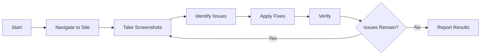

# Web Design Reviewer Skill

Automated visual inspection and design fix capability for the CookBook Hugo website.

## 📋 Quick Links

- **[SKILL.md](SKILL.md)** - Main skill documentation and workflow
- **[references/framework-fixes.md](references/framework-fixes.md)** - Hugo + Tailwind fix patterns
- **[references/cookbook-checklist.md](references/cookbook-checklist.md)** - Visual inspection checklist

## 🎯 Purpose

This skill enables AI agents to:
- Visually inspect the CookBook website for design issues
- Identify layout problems, responsive issues, accessibility concerns
- Apply fixes directly to Hugo templates and CSS files
- Verify fixes work correctly across all viewports

## 🚀 Quick Start

### Prerequisites
```bash
# Start Hugo server
hugo server -D
```

Site will be available at: `http://localhost:1313/CookBook/`

### Usage Examples

**Review entire site:**
> "Review the website design"

**Check specific component:**
> "Check the recipe cards on the homepage"

**Fix specific issue:**
> "Fix the card images - they're not square"

**Check responsive:**
> "Test the mobile layout"

## 🔧 Tech Stack

This skill is specifically tailored for:
- **Hugo** - Static site generator
- **Tailwind CSS v4** - Utility-first CSS framework
- **DaisyUI** - Tailwind component library
- **Polish language** - i18n via `i18n/pl.yaml`

## 📁 Key Files Managed

| File | Purpose |
|------|---------|
| `layouts/_default/single.html` | Recipe pages |
| `layouts/index.html` | Homepage |
| `layouts/partials/summary.html` | Recipe cards |
| `assets/css/main.css` | Tailwind CSS |
| `static/css/custom.css` | Legacy styles |

## ⚡ Critical Conventions

1. **Asset URLs**: Always use `{{ partial "asset-url.html" "/path" }}`
2. **Card Images**: Must be square (aspect-ratio: 1/1)
3. **Hero Images**: Must NOT be lazy-loaded (LCP priority)
4. **Base Path**: Site served under `/CookBook/`

## 🎨 CookBook-Specific Features

- Recipe cards with square images
- FODMAP badge indicators
- Rating system (stars)
- Video modals (YouTube)
- Nutritional macros display
- Draft recipe hiding

## 📊 Issue Priority Levels

| Priority | Examples | Action |
|----------|----------|--------|
| **P1** | Broken URLs, layout overflow, missing images | Fix immediately |
| **P2** | Visual inconsistencies, broken features | Fix next |
| **P3** | Minor styling polish | Fix if time permits |

## 🧪 Testing

After fixes, verify with:
```bash
# Local testing
hugo server -D

# Production build
npm run build

# Search tests
npm run test:search:v7
```

## 📖 Documentation

See [SKILL.md](SKILL.md) for complete workflow documentation including:
- Information gathering phase
- Visual inspection checklist
- Issue fixing strategies
- Re-verification steps
- Troubleshooting guide

## 🔄 Workflow Summary



## 🛠️ Maintenance

Update this skill when:
- New Hugo layouts added
- New DaisyUI components used
- New recipe features introduced
- Asset handling changes

## 📚 Related Skills

- **[convert-recipe-format](../convert-recipe-format/)** - Convert recipes to Hugo format

---

**Skill Version**: 1.0.0  
**Last Updated**: January 31, 2026  
**Status**: Active
