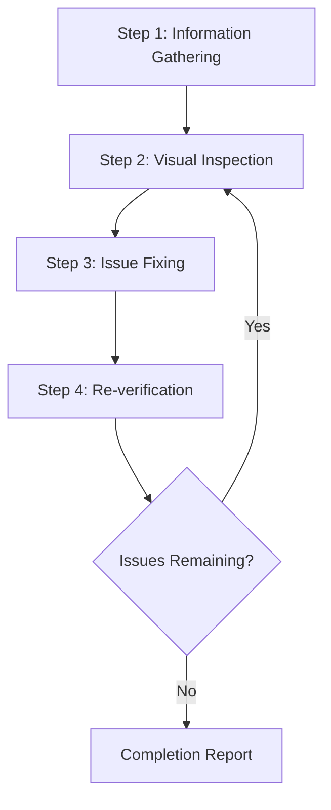
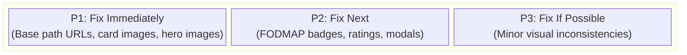
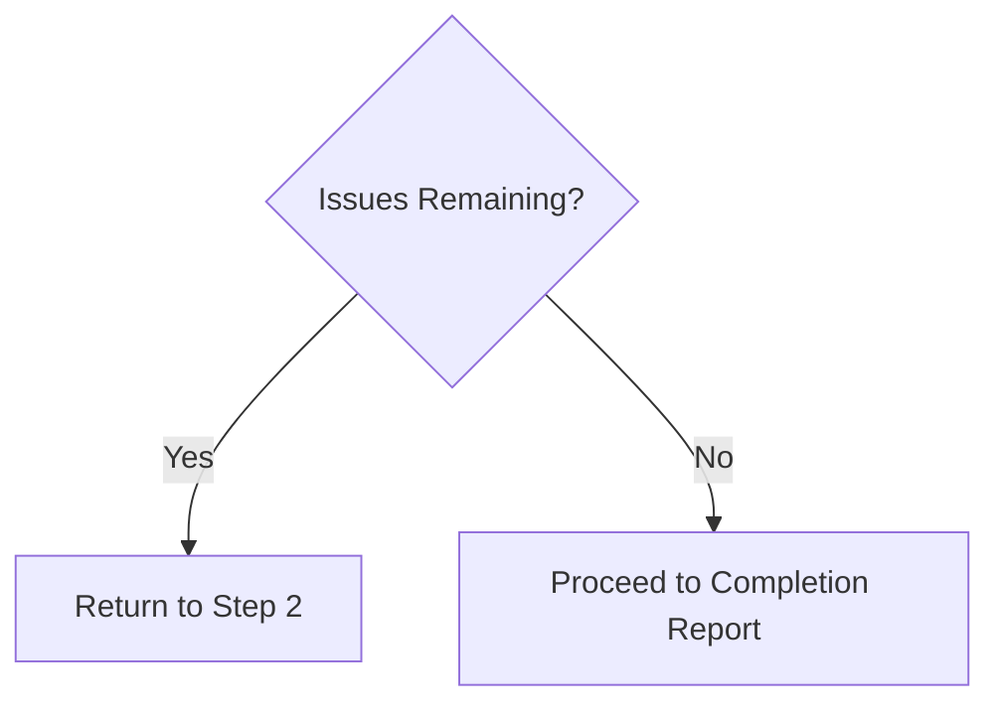

# Web Design Reviewer

This skill enables visual inspection and validation of website design quality, identifying and fixing issues at the source code level.

**Quick Reference**: See [cookbook-checklist.md](references/cookbook-checklist.md) for a comprehensive visual inspection checklist specific to this project.

## Scope of Application

This skill is specifically tailored for the **CookBook Hugo project**:

- **Framework**: Hugo static site generator
- **Styling**: Tailwind CSS v4 + DaisyUI
- **Language**: Polish (i18n via `i18n/pl.yaml`)
- **Deployment**: GitHub Pages under `/CookBook/` base path
- **Content**: Recipe pages with hero images, cards, statistics, FODMAP info
- **Key Features**: Fuse.js search, video modals, rating system, Decap CMS admin

## Prerequisites

### Required

1. **Target website must be running**
   - Local Hugo server: `http://localhost:1313/CookBook/` (via `hugo server -D`)
   - Production: GitHub Pages (for read-only reviews)
   - Note: Site is served under `/CookBook/` base path

2. **Browser automation must be available**
   - Screenshot capture
   - Page navigation
   - DOM information retrieval

3. **Access to source code (when making fixes)**
   - Project must exist within the workspace

## Workflow Overview



---

## Step 1: Information Gathering Phase

### 1.1 URL Confirmation

**Default URL for CookBook project**: `http://localhost:1313/CookBook/`

If Hugo server is not running, instruct user to start it:

```bash
hugo server -D
```

The site will be available at: `http://localhost:1313/CookBook/`

**Note**: The `/CookBook/` base path is critical for proper asset loading.

### 1.2 Hugo CookBook Project Structure

The project structure is known and fixed:

| Component | Location | Purpose |
|-----------|----------|------|
| **Templates** | `layouts/` | Hugo HTML templates |
| **Partials** | `layouts/partials/` | Reusable components |
| **Styles** | `assets/css/main.css` | Tailwind v4 + DaisyUI |
| **Legacy Styles** | `static/css/custom.css` | Legacy Bulma utilities |
| **Content** | `content/` | Recipe markdown files |
| **Config** | `hugo.toml` | Site configuration |
| **i18n** | `i18n/pl.yaml` | Polish translations |
| **Scripts** | `static/js/` | JavaScript (search, modals, etc.) |

### 1.3 Key Layouts and Partials

```
layouts/
├── _default/
│   ├── baseof.html       → Base template (site shell)
│   └── single.html       → Recipe page (hero, stats, content)
├── index.html            → Home page (filtered grid)
├── index.json           → Search index for Fuse.js
├── partials/
│   ├── head.html         → Meta, assets, JSON-LD
│   ├── summary.html      → Recipe cards (square images, badges)
│   ├── asset-url.html    → CRITICAL: URL helper for /CookBook prefix
│   └── searchResults.html → Search results template
└── [collections]/        → Category-specific templates
```

### 1.4 CookBook Styling System

| Method | Location | Usage | Priority |
|--------|----------|-------|----------|
| **Tailwind v4** | `assets/css/main.css` | Primary styling system | 1st |
| **DaisyUI** | Via Tailwind | Component classes | 1st |
| **Inline Classes** | HTML templates | Tailwind utility classes in `.html` files | 1st |
| **Legacy CSS** | `static/css/custom.css` | Legacy Bulma utilities, custom classes | 2nd |
| **Custom Classes** | Various | `.recipe-hero*`, `.media-badge`, etc. | 2nd |

**Critical Convention**: Always use `{{ partial "asset-url.html" "/path" }}` for asset URLs to handle `/CookBook` prefix and cache-busting.

---

## Step 2: Visual Inspection Phase

### 2.1 Page Traversal

1. Navigate to the specified URL
2. Capture screenshots
3. Retrieve DOM structure/snapshot (if possible)
4. If additional pages exist, traverse through navigation

### 2.2 Inspection Items

#### CookBook-Specific Checks

| Issue | Description | Severity |
|-------|-------------|----------|
| Card Image Aspect Ratio | Recipe cards must use `aspect-ratio: 1/1` with `object-fit: cover` | High |
| Base Path URLs | All asset URLs must use `{{ partial "asset-url.html" }}` for `/CookBook` prefix | High |
| Square Card Images | Recipe cards (`.summary.html`) must display square images consistently | High |
| Hero Image Priority | Hero images in `single.html` must not be lazy-loaded (LCP priority) | High |
| FODMAP Badge Display | FODMAP status badges must be clearly visible on cards | Medium |
| Rating System Display | Recipe ratings must display correctly | Medium |
| Video Modal Functionality | YouTube video modals must open/close correctly | Medium |
| Draft Recipe Hiding | Draft recipes must be hidden via `[data-draft="true"]` selector | Medium |
| Polish i18n | All UI text must use proper Polish translations from `i18n/pl.yaml` | Medium |
| Macro Display | Calories, protein, fat, carbs must be visible in recipe cards | Low |

#### Layout Issues

| Issue | Description | Severity |
|-------|-------------|----------|
| Element Overflow | Content overflows from parent element or viewport | High |
| Element Overlap | Unintended overlapping of elements | High |
| Alignment Issues | Grid or flex alignment problems | Medium |
| Inconsistent Spacing | Padding/margin inconsistencies | Medium |
| Text Clipping | Long text not handled properly | Medium |

#### Responsive Issues

| Issue | Description | Severity |
|-------|-------------|----------|
| Non-mobile Friendly | Layout breaks on small screens | High |
| Breakpoint Issues | Unnatural transitions when screen size changes | Medium |
| Touch Targets | Buttons too small on mobile | Medium |

#### Accessibility Issues

| Issue | Description | Severity |
|-------|-------------|----------|
| Insufficient Contrast | Low contrast ratio between text and background | High |
| No Focus State | Cannot determine state during keyboard navigation | High |
| Missing alt Text | No alternative text for images | Medium |

#### Visual Consistency

| Issue | Description | Severity |
|-------|-------------|----------|
| Font Inconsistency | Mixed font families | Medium |
| Color Inconsistency | Non-unified brand colors | Medium |
| Spacing Inconsistency | Non-uniform spacing between similar elements | Low |

### 2.3 Viewport Testing (Responsive)

Test at the following viewports:

| Name | Width | Representative Device |
|------|-------|----------------------|
| Mobile | 375px | iPhone SE/12 mini |
| Tablet | 768px | iPad |
| Desktop | 1280px | Standard PC |
| Wide | 1920px | Large display |

---

## Step 3: Issue Fixing Phase

### 3.1 Issue Prioritization



### 3.2 CookBook-Specific Fix Locations

Identify source files from problematic elements:

| Issue Type | Primary Fix Location | Secondary Locations |
|------------|---------------------|--------------------|
| **Recipe Cards** | `layouts/partials/summary.html` | `static/css/custom.css` |
| **Card Images** | `layouts/partials/summary.html` | `assets/css/main.css` |
| **Hero Images** | `layouts/_default/single.html` | `assets/css/main.css` |
| **Page Layout** | `layouts/_default/baseof.html` | `assets/css/main.css` |
| **Home Grid** | `layouts/index.html` | `assets/css/main.css` |
| **Navigation** | `layouts/partials/navbar.html` | `static/js/navbar.js` |
| **Search UI** | `layouts/partials/searchResults.html` | `static/js/[search].js` |
| **Video Modals** | `layouts/_default/single.html` | `static/js/share-recipe.js` |
| **Badges/Stats** | `layouts/partials/summary.html`, `layouts/_default/single.html` | `static/css/custom.css` |
| **Tailwind Utilities** | `assets/css/main.css` | N/A |
| **Legacy Styles** | `static/css/custom.css` | N/A |

**Critical Rules**:
1. ✅ Always use `{{ partial "asset-url.html" "/path" }}` for URLs
2. ✅ Maintain `aspect-ratio: 1/1` for recipe card images
3. ✅ Hero images must NOT be lazy-loaded (LCP optimization)
4. ✅ Use Tailwind v4 utilities first, fall back to custom CSS only if needed
5. ✅ Check Polish translations in `i18n/pl.yaml` for UI text

### 3.3 Applying Fixes

#### Framework-specific Fix Guidelines

See [references/framework-fixes.md](references/framework-fixes.md) for details.

#### Fix Principles

1. **Minimal Changes**: Only make the minimum changes necessary to resolve the issue
2. **Respect Existing Patterns**: Follow existing code style in the project
3. **Avoid Breaking Changes**: Be careful not to affect other areas
4. **Add Comments**: Add comments to explain the reason for fixes where appropriate

---

## Step 4: Re-verification Phase

### 4.1 Post-fix Confirmation

1. Reload browser (or wait for development server HMR)
2. Capture screenshots of fixed areas
3. Compare before and after

### 4.2 Regression Testing

- Verify that fixes haven't affected other areas
- Confirm responsive display is not broken

### 4.3 Iteration Decision



**Iteration Limit**: If more than 3 fix attempts are needed for a specific issue, consult the user

---

## Output Format

### Review Results Report

```markdown
# Web Design Review Results

## Summary

| Item | Value |
|------|-------|
| Target URL | {URL} |
| Framework | {Detected framework} |
| Styling | {CSS / Tailwind / etc.} |
| Tested Viewports | Desktop, Mobile |
| Issues Detected | {N} |
| Issues Fixed | {M} |

## Detected Issues

### [P1] {Issue Title}

- **Page**: {Page path}
- **Element**: {Selector or description}
- **Issue**: {Detailed description of the issue}
- **Fixed File**: `{File path}`
- **Fix Details**: {Description of changes}
- **Screenshot**: Before/After

### [P2] {Issue Title}
...

## Unfixed Issues (if any)

### {Issue Title}
- **Reason**: {Why it was not fixed/could not be fixed}
- **Recommended Action**: {Recommendations for user}

## Recommendations

- {Suggestions for future improvements}
```

---

## Required Capabilities

| Capability | Description | Required |
|------------|-------------|----------|
| Web Page Navigation | Access URLs, page transitions | ✅ |
| Screenshot Capture | Page image capture | ✅ |
| Image Analysis | Visual issue detection | ✅ |
| DOM Retrieval | Page structure retrieval | Recommended |
| File Read/Write | Source code reading and editing | Required for fixes |
| Code Search | Code search within project | Required for fixes |

---

## Reference Implementation

### Implementation with Playwright MCP

[Playwright MCP](https://github.com/microsoft/playwright-mcp) is recommended as the reference implementation for this skill.

| Capability | Playwright MCP Tool | Purpose |
|------------|---------------------|---------|
| Navigation | `browser_navigate` | Access URLs |
| Snapshot | `browser_snapshot` | Retrieve DOM structure |
| Screenshot | `browser_take_screenshot` | Images for visual inspection |
| Click | `browser_click` | Interact with interactive elements |
| Resize | `browser_resize` | Responsive testing |
| Console | `browser_console_messages` | Detect JS errors |

#### Configuration Example (MCP Server)

```json
{
  "mcpServers": {
    "playwright": {
      "command": "npx",
      "args": ["-y", "@playwright/mcp@latest", "--caps=vision"]
    }
  }
}
```

### Other Compatible Browser Automation Tools

| Tool | Features |
|------|----------|
| Selenium | Broad browser support, multi-language support |
| Puppeteer | Chrome/Chromium focused, Node.js |
| Cypress | Easy integration with E2E testing |
| WebDriver BiDi | Standardized next-generation protocol |

The same workflow can be implemented with these tools. As long as they provide the necessary capabilities (navigation, screenshot, DOM retrieval), the choice of tool is flexible.

---

## Best Practices

### DO (Recommended)

- ✅ Always save screenshots before making fixes
- ✅ Fix one issue at a time and verify each
- ✅ Use `{{ partial "asset-url.html" }}` for all asset URLs
- ✅ Maintain `aspect-ratio: 1/1` for recipe card images
- ✅ Avoid lazy-loading hero images (LCP priority)
- ✅ Use Tailwind v4 utilities first before custom CSS
- ✅ Check Polish translations exist in `i18n/pl.yaml`
- ✅ Test responsive behavior at mobile/tablet/desktop sizes
- ✅ Verify changes with `hugo server -D` before committing
- ✅ Run `npm run build` to ensure Tailwind processes correctly

### DON'T (Not Recommended)

- ❌ Hardcode `/CookBook` base path (use asset-url partial)
- ❌ Break existing card image aspect ratios
- ❌ Add lazy-loading to hero images
- ❌ Create new CSS files without checking existing patterns
- ❌ Ignore DaisyUI component classes when available
- ❌ Skip testing on mobile viewports
- ❌ Ignoring design systems or brand guidelines
- ❌ Fixes that ignore performance
- ❌ Fixing multiple issues at once (difficult to verify)

---

## Troubleshooting

### Hugo CookBook Specific Issues

#### Problem: Asset URLs showing 404 errors

1. Verify `{{ partial "asset-url.html" }}` is used
2. Check `hugo.toml` for correct `baseURL` with `/CookBook/`
3. Ensure assets are in correct directories (`static/` or `assets/`)
4. Clear browser cache and rebuild with `npm run build`

#### Problem: Tailwind styles not applying

1. Check `assets/css/main.css` has `@import "tailwindcss";`
2. Verify Hugo is processing the CSS: look for `resources/_gen/assets/css/`
3. Run `npm run build` to regenerate styles
4. Check browser console for CSS loading errors
5. Ensure classes are valid Tailwind v4 utilities

#### Problem: Recipe card images not square

1. Check `layouts/partials/summary.html` template
2. Verify `aspect-square` or `aspect-ratio: 1/1` is applied
3. Check parent container doesn't have conflicting constraints
4. Ensure `object-cover` class is present on ``

#### Problem: Changes not visible after editing templates

1. Hugo server auto-reloads - wait 1-2 seconds
2. Hard refresh browser (Ctrl+F5)
3. Check for Hugo build errors in terminal
4. Restart Hugo server: stop and run `hugo server -D`

#### Problem: DaisyUI components not styled

1. Verify DaisyUI is configured in `assets/css/main.css`
2. Check component class names match DaisyUI docs
3. Ensure Tailwind is processing the CSS correctly
4. Look for JavaScript conflicts if interactive components fail

#### Problem: Polish translations not showing

1. Check key exists in `i18n/pl.yaml`
2. Verify template uses `{{ i18n "keyName" }}`
3. Ensure `hugo.toml` has `defaultContentLanguage = "pl"`
4. Rebuild site with `hugo server -D`

### General Issues

#### Problem: Style files not found

1. Styles are in `assets/css/main.css` (Tailwind) or `static/css/custom.css` (legacy)
2. Templates are in `layouts/` directory
3. Use `grep_search` to find specific class names or styles

#### Problem: Fixes not reflected

1. Hugo server auto-reloads, but sometimes needs manual restart
2. Clear browser cache (Ctrl+Shift+R or Cmd+Shift+R)
3. Check Hugo terminal for build errors
4. Rebuild: `npm run build` to ensure Tailwind processes correctly

#### Problem: Fixes affecting other areas

1. Rollback changes in template files
2. Use more specific Tailwind classes or Hugo conditionals
3. Test multiple recipe types (with/without images, FODMAP, ratings)
4. Check responsive behavior at all breakpoints
2. Clear browser cache
3. Rebuild if project requires build
4. Check CSS specificity issues

### Problem: Fixes affecting other areas

1. Rollback changes
2. Use more specific selectors
3. Consider using CSS Modules or scoped styles
4. Consult user to confirm impact scope