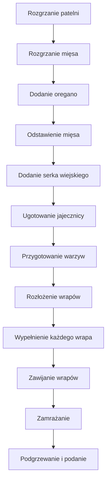

---

## 1️⃣ Wstęp  
Witajcie w kolejnym odcinku **policznej szamy**!  
Co raz, gdy wstaję, wpadam w wątek: *„Co zjeść na śniadanie?”*  
Przedstawiam **wrap z jajecznicą, wieprzowiną i serkiem wiejskim** – posiłek, który odmienia poranki.  
Osiem porcji na raz, czyli *jedno śniadanie na każdy dzień tygodnia + nadwyżka*.  
Szybko, w 30–35 minut, z 5 głównych składników – i gotowe!

---

## 2️⃣ Składniki (na 8 porcji)

| **Składnik** | **Ilość** | **Uwaga** |
|--------------|-----------|-----------|
| **Wieprzowina (mielona)** | 800 g | 100 g na porcję |
| **Jajka** | 16 sztuk | 2 na porcję |
| **Serek wiejski** | 400 g (2 kubki po 200 g) | Tworzy sos |
| **Olej rzepakowy** | 20 ml | Do smażenia |
| **Oregano, suchy** | 2 łyżki stołowe | |
| **Papryka czerwona** | 2 sztuki | Najlepiej duża, szara (złota skórka) |
| **Cebula czerwona** | 1/2 sztuki (połowa) | w kostkę |
| **Sałatka mix / rukola** | według smaku | Dodatkowy szczyptę koloru |
| **Wrapy pełnoziarniste** | 8 | 1 na porcję |
| **(opcjonalnie) Kremowy ser biały** | – | Jeśli lubisz dodatkowy sos |
| **Mleko (do sosu)** | – | – |
| **Worek do zamrażania / folia bakierowa** | – | Do przechowywania |

> **Produkty polecane:**  
> - **Szama Tuning** (sos z mieszanki przypraw) – jeśli szukasz gotowego aromatu.  
> - **Szama** – dla wyrazistej, naturalnej przyprawy.

---

## 3️⃣ Przygotowanie mięsa  

1. **Rozgrzewamy patelnię** i wlewamy **20 ml oleju rzepakowego**.  
2. **Dodajemy 800 g wieprzowiny** i smażymy do złotego rumieńca (≈ 12–15 min).  
3. W trakcie smażenia wprowadzamy **2 łyżki oregano** i **pieprz** do smaku.  
4. Kiedy mięso ma ładny rumienny kolor, wyjmujemy je z patelni i odstawiamy na chwilę.

---

## 4️⃣ Serek wiejski + sos  

- **Serek wiejski** w **2 kubkach po 200 g** (łącznie 400 g).  
- Rozkładamy go na dnie mięsa – tworzy delikatny sos.  
- **Serek** sprawia, że wrapy mają *kremową, delikatną konsystencję* w środku.

---

## 5️⃣ Jajecznica  

1. Na **patelni** rozgrzewamy małą ilość tłuszczu.  
2. **Ubijamy 2 jajka** na każdym składniku.  
3. Gdy jajka mają konsystencję podwójnego jajka (≈ 1 min), wyjmujemy i przechowujemy.

---

## 6️⃣ Warzywa  

| **Warzywo** | **Ilość** | **Przygotowanie** |
|-------------|-----------|-------------------|
| Papryka czerwona | 2 sztuki | 1 sztuka podzielona na mniejsze kawałki, 1 na każdą porcję |
| Cebula czerwona | 1/2 sztuki | Pokrojona w drobną kostkę (tzw. “kosteczki”) |
| Sałatka mix / rukola | według smaku | Przygotowana wcześniej, w sekcji “Na dnie” |

---

## 7️⃣ Wrapowanie  

### Krok po kroku (na jednej przykładowej porcji)

1. **Rozkładamy 1 wrap** (pełnoziarnisty – bardziej sprężysty niż pszenne).  
2. **Na dół**:  
   - 100 g wieprzowiny  
   - 2 jajka (jajecznica)  
   - Mała ilość czerwonej cebuli  
   - Papryka (na górze)  
   - Sałatka mix (na dole, w środku)  
3. **Zawijamy wrap**:  
   - Łączymy dolny róg sałatki, trzymając mięso i jajecznicę w czystości.  
   - **Dociskamy** wierzch papryki, a następnie kompresujemy, zawijając boki.  
   - **Zamykamy** „na górę” (podczas podgrzewania w airfryerze).  

**Tip:**  
- Jeśli nie chcesz się brudzić papryką, użyj sałatki jako „pasy ochronnej” przy zawiązywaniu.  

---

## 8️⃣ Przechowywanie  

### Lody i zamrażarka  

- **Lodówka**: 1–2 wrapy (na kolejne dni).  
- **Zamrażarka**: pozostałe 6–7 wrapów.  
- **Zawijamy** wrapy w **folię bakierową** lub specjalne woreczki do zamrażania.  
- **Papier do pieczenia** – możesz użyć, ale pamiętaj, że przepuszcza powietrze; dlatego w papierze zawsze zamykamy w pojemniku.

### Diagram przepływu przygotowania (mermaid)

---

## 9️⃣ Podgrzewanie i podanie  

- **Airfryer**: 180 °C, 12–15 min (z zamknięciem do dołu).  
- **Patelnia**: 1–2 min, aż zewnętrzna część się przypieka, a w środku pozostanie letnia.  
- **Na zimno**: wrapy możesz zjeść tak, jak są, ale najlepiej podgrzać – *kremowość sosu i mięsa rozpalają smak*.

---

## 🔟 Podsumowanie i komentarze  

> **Kochani**, po przygotowaniu śniadankowych wrapów możecie już *po prostu podgrzać* i cieszyć się smakiem, który sprawia, że dzień zaczyna się w *dynamicznym stylu*.  
> Jeśli macie pytania, albo chcecie podzielić się doświadczeniem przy osmiokrotnym przygotowaniu, piszcie w komentarzach!  
> Do zobaczenia w kolejnym odcinku **policznej szamy** – **pożegnanie, do następnego śniadania!**