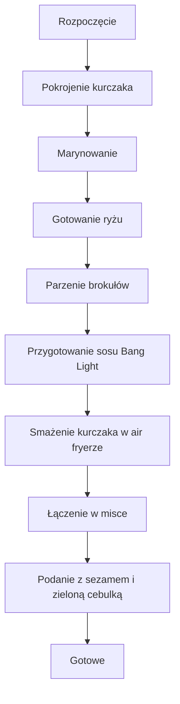

---

## 1. Składniki

| Grupa | Składnik | Ilość / Dodatkowe informacje |
|-------|----------|------------------------------|
| **Kurczak** | Mięso zuda kurczaka | Pokrojone w większe kawałki |
| **Marynata** | Sos sojowy | Zalej mięso |
| | Imbir | Bardzo, bardzo drobno poszatkowany |
| | Czosnek | Bardzo, bardzo drobno poszatkowany |
| | Pasta | (dokładny rodzaj nie podany) |
| | Białko | Jednego jajka |
| | Pieprz | Dopieprz według smaku |
| **Ryż** | – | Gotuj w wybranym sposobie |
| **Brokuł** | Zielony brokuł | Parz do pięknych różyczek (od Frosty) |
| **Sos Bang Light** | Jogurt grecki | Na bazie jogurtu greckiego |
| | Sos sweet chili | Dodaj w pożądanej ilości |
| | Srećka | Dla pikantności (dokładny skład nie podany) |
| **Dodatki** | Sezam | Posyp na koniec |
| | Zielona cebulka | Posiekana, do podania |

---

## 2. Przygotowanie Kurczaka

1. **Pokrój** mięso zuda kurczaka na większe kawałki.  
2. **Zalewaj** je sosem sojowym.  
3. **Dodaj** imbir, czosnek, pastę, białko jajka i pieprz.  
4. **Wymieszaj** dokładnie i pozostaw do **marynowania**.  
5. **Szejkuj** (smaż/obsmaż) i obtocz w panierce.  
6. **Umieść** kurczaka w **air fryerze** na **najwyższej mocy** i smaż do chrupkości.  

---

## 3. Przygotowanie Ryżu i Brokułów

- **Gotuj ryż** według ulubionej metody (na parze, w garnku, itp.).  
- **Parz brokuł** na parze, zachowując piękne różyczki, które będą al dente.

---

## 4. Sos Bang Light

1. **Weź** jogurt grecki jako bazę.  
2. **Dodaj** sos sweet chili oraz **srećkę** dla pikantności.  
3. **Wymieszaj** wszystkie składniki, aż uzyskasz jednolitą konsystencję.

---

## 5. Finalne Łączenie i Serwowanie

1. **Kurczak** w marynacie, po obtoczeniu, **prosto do po** (tu zakładamy, że „po” to „potrawy” – zachowaj oryginalną frazę).  
2. **Przełóż** smażonego kurczaka do miski.  
3. **Dodaj** ugotowany ryż i parzone brokuły.  
4. **Wymieszaj** wszystko razem (po muzyce, jeśli masz w tle – humorystyczna notatka).  
5. **Podawaj** w „boksach” (misce/talerzu), posypując sezamem i posiekaną zieloną cebulką.  
6. **Gotowe** – jesteś porobiony!

---

## 6. Diagram procesu (Mermaid)

---

**Uwaga:** Cały opis zachowuje oryginalny, swobodny ton i humorystyczne odwołania (np. „muska [muzyka]”), które dodają przepisu nieco lekkości. Wszystkie szczegóły – od drobno poszatkowanego imbiru po „srećkę” dla pikantności – zostały zachowane bez zmian.