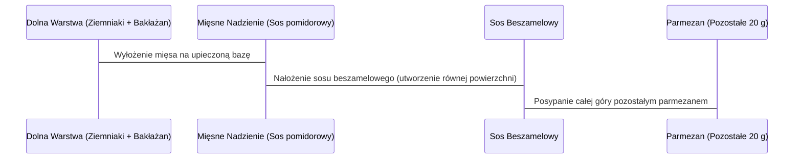

***

## Grecka Musaka (Wersja Fit) – Przepis Krok po Kroku

Musaka prezentowana w tym przepisie to jedna z ulubionych wersji autora, odpowiednio **zmodyfikowana w stronę fit**, aby zawierała mniejszą ilość tłuszczów w porównaniu do oryginalnego odpowiednika.

### 1. Wstęp i Założenia Przepisu

Musaka składa się z **trzech smakowych warstw**, które komponują się w niesamowitych smakach:

1.  **Dolna warstwa:** Pieczony ziemniak z bakłażanem.
2.  **Środkowa warstwa:** Mięsny farsz w aromatycznym sosie pomidorowym.
3.  **Górna warstwa:** Sos beszamelowy z dodatkiem parmezanu.

#### Modyfikacje Fit i Wartości Odżywcze

Aby ograniczyć zawartość tłuszczu, zastosowano następujące zmiany:

*   **Bakłażan:** Nie jest smażony na głębokim oleju.
*   **Mięso:** Używana jest chuda wieprzowina (szynka), dodatkowo odtłuszczona.

| Wartość (Na porcję) | Ilość |
| :------------------ | :---- |
| Tłuszcze            | Ponad 20 g |
| Białko              | Ponad 40 g |
| Smak                | Maksimum! |

**Czas przygotowania:** Całość nie powinna zająć dłużej niż **1,5 godziny** (łącznie z przygotowaniem składników).

**Uwaga:** Przepis jest prezentowany warstwami, ale widzowie powinni wykonywać wszystkie etapy jednocześnie. Musaka jest przygotowywana w pojemniku dzielonym na **cztery porcje**.

***

### 2. Warstwa I: Ziemniak i Bakłażan (Baza)

Pierwszym krokiem jest uruchomienie piekarnika, ponieważ ziemniaki będą zapiekane jako pierwsze.

#### A. Przygotowanie Piekarnika i Ziemniaków

1.  **Piekarnik:** Rozgrzać do **200 stopni Celsjusza** (funkcja termoobiegu).
2.  **Krojenie ziemniaków:** Pokroić w plastry o grubości **5–10 mm**.
3.  **Cebula:** Pokroić w piórka.
4.  **Mieszanie wstępne:** Wymieszać pokrojone ziemniaki i cebulę.
5.  **Oliwa:** Dodać **10 ml oliwy** i dokładnie wymieszać, aby każdy ziemniak był obtoczony.
6.  **Przyprawy:** Dodać **sporą ilość tymianku**.
7.  **Pieczenie wstępne:** Wstawić do rozgrzanego piekarnika na **30 minut**.

#### B. Przygotowanie Bakłażana

Czynności te wykonuje się zaraz po wrzuceniu ziemniaków do piekarnika.

1.  **Krojenie:** Bakłażana pokroić w plastry o grubości **5–7 mm**.
2.  **Solanie:** Wyłożyć plastry na talerz (tak, aby każdy miał swoje miejsce) i **porządnie posolić** z jednej strony.
3.  **Odwracanie:** Odwrócić i powtórzyć solenie z drugiej strony.
4.  **Odpoczynek:** Odstawić na **20–25 minut**.

> *Cel solenia: Pozbycie się nieco wody z bakłażana, co umożliwi lepsze przypieczenie w piekarniku.*

#### C. Komponowanie Dolnej Warstwy

Po upływie 30 minut pieczenia ziemniaków:

1.  **Wyciągnięcie ziemniaków:** Wyciągnąć pięknie przypieczone ziemniaki z piekarnika.
2.  **Mieszanie i doprawianie:** Przemieszać ziemniaki. **Dopiero teraz** doprawić solą, pieprzem oraz dorzucić nieco **oregano**.
3.  **Wyrównywanie:** Dokładnie wymieszać i rozłożyć w naczyniu, tworząc płaską powierzchnię dla warstwy bakłażana.
4.  **Przygotowanie bakłażana:** Wytrzeć bakłażana (z wody, która się wytrąciła).
5.  **Układanie:** Ułożyć warstwę bakłażana równo na całej powierzchni naczynia.
6.  **Oliwa w mgiełce:** Spryskać każdy kawałek bakłażana oliwą w formie mgiełki (autor używa dozownika).
    *   *Ilość oliwy:* Są to **3 g** wypryskanej oliwy na stronę.
7.  **Przyprawy:** Dodać trochę **tymianku**.
8.  **Pieczenie końcowe I:** Wstawić z powrotem do piekarnika (aż do momentu, gdy dolna część będzie gotowa, pięknie przypieczona i przyrumieniona).

***

### 3. Warstwa II: Mięsne Nadzienie (Farsz)

Mięso jest przygotowywane w trakcie, gdy dolna warstwa jest w piekarniku.

#### A. Składniki na Farsz Mięsny

| Składnik | Ilość / Uwagi |
| :------- | :------------ |
| Mięso    | **600 g** chudej szynki wieprzowej (zmielonej, dodatkowo odtłuszczonej) – na 4 porcje |
| Czosnek  | 4 ząbki (autor sugeruje, że wyszłoby 5 normalnych) |
| Cebula   | Nieduża czerwona cebula |
| Przecier | **500 g** przecieru pomidorowego |
| Przyprawy| Duża łyżeczka **oregano**, pełna łyżeczka **tymianku**, pół łyżeczki **pieprzu białego**, liście laurowe (kilka) |

#### B. Przygotowanie i Redukcja Soso

1.  **Cebula:** Pokroić w drobną kostkę.
2.  **Smażenie wstępne:** Na patelnię teflonową (dla ograniczenia tłuszczu) wlać **10 ml oliwy**. Rozgrzać.
3.  **Cebula:** Dodać cebulę i przesmażać **2 minuty**, do zeszklenia.
4.  **Czosnek i Przyprawy:** Dodać czosnek wyciśnięty przez praskę. Zaraz po dodaniu czosnku dorzucić **oregano i tymianek**. Przysmażać razem z cebulką i czosnkiem do **2 minut** (dla wydobycia aromatów).
5.  **Mięso:** Dodać całe **600 g** szynki wieprzowej.
6.  **Obsmażanie:** Na dosyć mocnym płomieniu przysmażać mięso, nie ruszając go, aż większość wody wyparuje, a mięso zmieni kolor (szary/biały, obrobiony). Zajmuje to około **5 minut**.
7.  **Rozdrabnianie:** Wymieszać całość. Grudki mięsa porozdzielać widelcem. Smażyć jeszcze **2 minuty**.
8.  **Doprawianie:** Dodać biały pieprz, świeżo mielony czarny pieprz oraz **łyżeczkę soli**.
9.  **Sos:** Dodać przecier pomidorowy i liście laurowe.
10. **Gotowanie i redukcja:** Gotować na delikatnym płomieniu, **pod przykryciem z uchyloną pokrywką**, mieszając od czasu do czasu, aż powstanie gęsta masa.
11. **Gotowość:** Mięso jest gotowe, gdy jest pięknie zredukowane i nie ma już co bulgotać na patelni.
12. **Wykończenie:** Wyłowić liście laurowe.

***

### 4. Warstwa III: Sos Beszamelowy z Parmezanem

Sos beszamelowy jest super prosty w przygotowaniu i jest doprawiany gałką muszkatołową oraz parmezanem.

#### A. Składniki na Beszamel

| Składnik | Ilość / Uwagi |
| :------- | :------------ |
| Parmezan | **40 g** zmielonego (20 g do sosu, 20 g na wierzch) |
| Przyprawy| Gałka muszkatołowa (ćwiartka/do pół łyżeczki zmielonej), sól, pieprz |
| Baza     | Masło, mąka, mleko |

#### B. Przygotowanie Soso

1.  **Masło:** Rozpuścić całe masło na dnie naczynia (na delikatnym płomieniu).
2.  **Zasmażka:** Dodać mąkę. Delikatnie przesmażać mąkę z masłem (dosłownie chwilę, **pół minuty**).
3.  **Mleko:** Wlewać mleko po trochu, w mniej więcej **5–6 partiach**. Za każdym razem mieszać do uzyskania jednolitej masy, aby nie potworzyły się grudki. Utrzymywać **minimalny płomień**.
4.  **Przyprawianie:** Dodać świeżą gałkę muszkatołową, sól i świeżo mielony czarny pieprz.
5.  **Parmezan:** Wsypać połowę zmielonego parmezanu (**20 g**).
6.  **Gotowość:** Gotować, aż zaczną tworzyć się bąbelki.
7.  **Zakończenie:** Wyłączyć palnik.

> *Komentarz autora: "O kurde, ale wypas! Beszamel gotowy."*

***

### 5. Komponowanie i Pieczenie Końcowe

W momencie, gdy beszamel jest gotowy, mięso powinno być zredukowane, a ziemniaki z bakłażanem upieczone.

#### A. Sekwencja Składania Musaki

Poniższy schemat przedstawia sekwencję składania warstw w naczyniu:

#### B. Finalne Zapiekanie

1.  **Piekarnik:** Wstawić musakę ponownie do piekarnika (temperatura **200 stopni**).
2.  **Faza I (Roztopienie):** Początkowo grzanie **góra-dół** (aby spokojnie roztopić ser i podgrzać całość).
3.  **Faza II (Zapiekanie):** Na koniec włączyć **termoobieg**.

#### C. Serwowanie

1.  **Chłodzenie:** Po wyjęciu z piekarnika należy odczekać **paręnaście minut**, aby musaka nieco ochłodziła się i lekko stężała.
    *   *Uwaga:* Musaka w naczyniu ceramicznym stygnie bardzo długo (autor sugeruje, że wymagałoby to nawet godziny).
2.  **Wyciąganie:** Ostrożnie wyciągnąć pierwszą porcję, starając się jej nie rozwalić.

> **Prezentacja:** Musaka pięknie prezentuje się we wnętrzu, z wyraźnie widocznymi warstwami.

### 6. Podsumowanie i Wnioski

**Wrażenia smakowe:**

*   "Ojejku, co tu się dzieje!"
*   Każda warstwa jest doprawiona.
*   "Każda warstwa niszczy smakowo."
*   Naprawdę coś pysznego, polecane każdemu.

**Makrosy i kalorie** na jedną porcję są standardowo prezentowane na ekranie.

**Prośba do widzów:** Łapa w górę, komentarze (kto zrobił i jak smakowało).