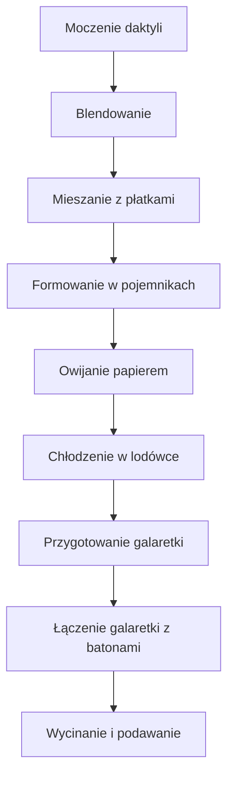

---  

# 👋 Wprowadzenie  
- **Cześć [Muzyka]**  
- **Witajcie moi drodzy w kolejnym odcinku Policzone!**  
- **Mieszamy połowę wakacji, już za nami – ale pogoda nie odpuszcza, nadal ciepło!**  
- **Dlatego postanowiłem zrobić coś… bez piekarnika, bez patelni** – **batony energetyczne** z przyzwoitą dawką białka, a co najważniejsze – całkowicie wegańskie, bo na nie nałożymy galaretkę z **Tiger**!  

---  

# 📦 Składniki – Batony  
| Składnik | Ilość | Uwagi |
|----------|-------|-------|
| **Płatki owsiane błyskawiczne** | 0,25 kg (250 g) | Wybierz szybkie, gotowe do użycia |
| **Płatki jaglane błyskawiczne** | 0,25 kg (250 g) | Dla dodatkowego chrupnięcia |
| **Masło migdałowe (orzechowe)** | 1 łyżka (ok. 15 g) | Najlepsze w tej wersji, nadaje kremowość |
| **Daktyle** | 100 g | Muszą być już posieczone na kawałki |
| **Odżywka białkowa (roślinna)** | 50 g | Zawiera 10 g białka na 1 bar |
| **Odżywka białkowa (kreatyna)** | 10 g | Dodajemy do 1 baru, by osiągnąć ~10 g białka |
| **Olej kokosowy** | 0 g | Nie potrzebny – odcinek bez piekarnika i patelni |

> **Uwaga:** Wszystkie 8 batonów zostaną podzielone na 4 pojemniki po 640 l (każdy pojemnik ma wystarczającą pojemność).

---  

# 🧰 Sprzęt  
- **Blendator** – „Ninja” (z kodem rabatowym 5 % **kaktus** – *kaktus nie mogę przestać tego jeść*)  
- **Bardzo duży garnek** – do gotowania galaretki  
- **Miska** – do mieszania i formowania  
- **Silikonowa szpatułka** – *mała, miękka, a więc lepiej wykorzystać zwykłą szpatułkę*  
- **Miara wagi** – do dokładnego odważenia składników  
- **Papier do pieczenia** – ułatwi odklejanie batonów  
- **Pojemniki** – 640 l (każdy pojemnik ma wystarczającą pojemność)  

---  

# 🍌 Przygotowanie Batonów  

## 1️⃣ Moczenie daktyli  
- **Zrób to w dużej misce** – wstaw **100 g daktyli** do wody i zostaw na **ok. 20 min**.  

## 2️⃣ Blendowanie  
- **Włóż do blendera Ninja** wszystkie podmokłe daktyle oraz resztę składników (płatki owsiane, płatki jaglane, masło orzechowe, odżywka białkowa).  
- **Blenduj na gładką masę** – *taki sam efekt, co w przepisach na lody, ale bez piekarnika!*  

## 3️⃣ Mieszanie z płatkami  
- **Wyjmij masę** z blendera do miski.  
- **Dodaj**:  
  - **Płatki jaglane błyskawiczne** – **250 g**  
  - **Płatki owsiane** – w stosunku, który odpowiada Twojej preferencji.  
- **Wymieszaj dokładnie** – użyj szpatułki silikonowej (jeśli jest zbyt miękka, lepiej wymienić na twardą! – *silicone spatula była na tyle miękka, że zaczęła się rozpuszczać*).  

## 4️⃣ Formowanie  
- **Wypełnij pojemniki** (każdy 640 l – *wystarczy, by zrobić 8 batonów*).  
- **Rozkładaj masę** równomiernie w pojemniku.  
- **Owiń** papierem do pieczenia – *zapobiega klejeniu się i ułatwia późniejsze wyjmowanie*.

---  

# 🍇 Przygotowanie Galaretki  

| Składnik | Ilość | Uwagi |
|----------|-------|-------|
| **Woda (Jana)** | **150 ml** | *Ta ilość to dokładnie 150 ml – czyli 150 metrów na plus owoce* |
| **Owoce (jagody)** | **100 g** | *Wybierz świeże lub mrożone jagody* |
| **Agar** | **45 g** | *Zawiera 100 % stężeń, co daje gęstą galaretkę* |
| **Porzeczki** | **50 g** | *Na górę – 3 porzeczki na baton* |
| **Sok z połowy cytryny** | Do smaku | *Dodaj świeżo wyciśnięty sok* |

### Krok po kroku  
1. **Wymieszaj** w małym garnku:  
   - **150 ml wody**  
   - **45 g agar**  
   - **100 g owoców**  
2. **Gotuj** na kuchence **2 minuty** – *to najkrótszy czas, ale wystarczający, by agar się rozpuścił*.  
3. **Odstaw** do **pokojowej temperatury** – *galaretka stężeje delikatnie, koloryzując się na intensywny czerwony.*  
4. **Dodaj** kilka porzeczek na wierzch – *jak krew w filmie*.

---  

# 🌀 Łączenie Galaretki z Batonami  

1. **Zachowaj batony w pojemniku** – **4 batony** po 640 l.  
2. **Na każde baton** nałóż **3 porzeczki** na wierzch – *galaretka będzie wykręcać się, niczym krew w filmie*  
3. **Krój** na batoniki i podaj do ręki – *po 250 kcal każdy!*  
4. **Odczuwaj** „moc skondensowanej energii” – *idealne do biura, podróży czy śniadania w domu*.  

---  

# 🎥 Diagram Przepływu Procesu (Mermaid)

---  

# 📊 Końcowy wynik  
- **4 batony** – każde **~250 kcal**  
- **Energia skondensowana** – „Niesamowicie”, z „moc skondensowaną energią”  
- **Szybkość przyrządzenia** – „trochę mi to zajęło, żeby wszystko połknąć”  
- **Zastosowanie** – idealne na wyjazd, w biurze, lub jako deser po południu  

---  

# 📣 Zachęta do Interakcji  
- **„Jeśli odcinek się podobał, łap w górę, pisz komentarze o tym, jak batony wyszły, jak smakowały, i zobaczymy się w kolejnym odcinku!”**  
- **„Do zobaczenia, cześć!”**