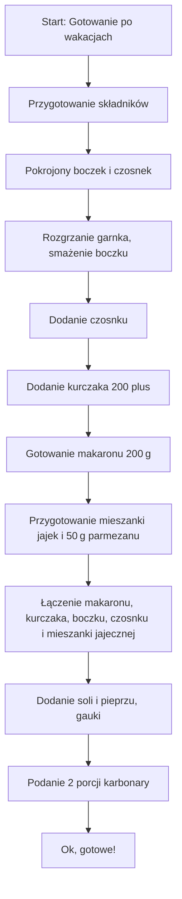

---

## Ciałaneczko, drodzy widzowie

> *„Jedziemy konkretnie z tematem już jest po wakacjach, czyli koniec redukcji, koniec, bania, olinie, koniec diet, konkretne dania.”*  
> *„Bardzo się cieszę, że teraz mogłielę was nakręcić ten odcinek, bo robimy karbonare, zajmieście prawidzią karbonare, ale z dodatkiem kurczaka.”*  
> *„Kurczak 200 plus w tym przepisie, na pewno będzie wam smakować, zaczynamy teraz cześć.”*

---

## Składniki (na **2 porcje**)

| **Nazwa składnika** | **Ilość** | **Uwaga** |
|----------------------|-----------|-----------|
| **Kurczak 200 plus** | 400 g (200 g na porcję) | **Dwa razy** wymienione: „kurczak 200 plus, czyli 400 gramów kurczaka.” |
| **Boczek** | 200 g (200 g na porcję) | „200 gramów pięknie pachnącego, węconego boczku, czyli posto gramów na porcję.” |
| **Jajka** | 4 (2 całą jajko i 2 żółtka na porcję) | „4 jajka, czyli podwajka na porcję.” |
| **Czosnek** | 2 duże ząbki | „2 duże ząbki, czosnek.” |
| **Parmezan** | 50 g (połowa na porcję) | „50 gramów tego sera, 2 trójkąciki twarde, łatwo dostępne.” |
| **Makaron (spaghetti)** | 200 g (200 g na porcję) | „200 gramów makaronu, spagetti, paseczki.” |
| **Sól** | do smaku | „Dodajemy łyżeczkę gauki, łóżka tołowej milonej. Dodajemy sobie sporamy do śpiepszu soli.” |
| **Pieprz** | do smaku | – |
| **Gauka** | 1 łyżeczka | „Ok, łyżeczka gauka (tołowa milona).” |

> **Humor i powtórzenia**  
> *„To dwóch daj do dwóch porcji karbonary, będziemy potrzebować kurczaka, kurczak 200 plus, czyli 400 gramów kurczaka.”*  
> *„Będziemy potrzebować 4 jajka, 2 duże ząbki czosnku, 50 g parmezanu.”*

---

## Przygotowanie – **etap 1: mieszanka jajko‑serowa**

1. **Wyjęcie serów**  
   - *„Wyjmij 50 g parmezanu, połowa na porcję, **2 trójkąciki**.”*  
2. **Mieszanie jajek i sera**  
   - *„Mieszamy 4 jajka, 2 całą jajko i 2 żółtka na porcję.”*  
   - *„Miękki żółtek, jajko, 2 trójkąciki, to **miękki żółtko**.”*  
   - *„Ok, mieszamy wszystko.”*  
3. **Powtórzenie**  
   - *„Ok, mieszanina jest gotowa. Powtórzenie: *Ok*.”*  

---

## Przygotowanie – **etap 2: przygotowanie poszczególnych składników**

1. **Pokrojenie boczku**  
   - *„Pokroić boczek na kawałki.”*  
2. **Pokrojenie kurczaka**  
   - *„Kurczaka pokroić, 400 g kurczaka w dwóch porcjach.”*  
3. **Rozbicie czosnku**  
   - *„Rozbija się 2 duże ząbki czosnku.”*  
4. **Rozgrzewanie garnka**  
   - *„Zaczynamy teraz cześć. To dwóch daj do dwóch porcji karbonary.”*  

---

## Gotowanie – **etap 3: gotowanie poszczególnych części**

### 1. Smażenie boczku  
- *„Smażymy boczek, aż stanie się chrupiący.”*  
- *„Ok, smażymy aż stanie się **chrupiący**.”*  

### 2. Dodawanie czosnku  
- *„Dodajemy 2 duże ząbki czosnku.”*  
- *„Dodajemy go, aż zacznie pachnieć.”*  

### 3. Dodawanie kurczaka  
- *„Kurczak 200 plus w tym przepisie, dodajemy do garnka.”*  
- *„Ok, kurczak jest już w garnku.”*  

### 4. Gotowanie makaronu  
- *„Dodajemy makaron, 200 g spagetti.”*  
- *„Ok, gotujemy makaron, gotujemy 200 g spaghetti.”*  
- *„Gotujemy 200 g makaronu, dopiero że w garnku woda wrze.”*  

### 5. Przygotowanie mieszanki jajek i sera  
- *„Mieszamy 4 jajka, 2 całą jajko i 2 żółtka na porcję.”*  
- *„Ok, gotujemy 50 g parmezanu, 1 łyżeczka gauka.”*  

### 6. Kombinacja wszystkich elementów  
- *„Dodajemy łyżeczkę gauka, łóżka tołowej milonej.”*  
- *„Dodajemy sobie sporamy do śpiepszu soli.”*  
- *„Ok, mieszamy wszystkie składniki: makaron, boczek, czosnek, kurczak i jajka.”*  
- *„Ok, mięsko jest już gotowe.”*  
- *„Ok, mięsko gotowe, 400 g kurczaka, 200 g boczku, 4 jajka, 50 g parmezanu.”*  

---

## Finalne kroki – **serwowanie**

1. **Łączenie wszystkiego**  
   - *„Ok, łączymy makaron, kurczak, boczek, czosnek i mieszankę jajeczno‑serową.”*  
2. **Podanie**  
   - *„Ok, gotowe do podania. Powtórzmy „Ok” na koniec.”*  
3. **Serwujemy**  
   - *„Ok, 2 porcje karbonary z kurczakiem są gotowe do podania.”*  

---

## Diagram gotowania (Mermaid)

---

## Makrosy i kalorie

> *„Ja wam teraz podaję makrosy i kalorie. Dlatej potrawy. Bez makaronu. Oraz dodatkowo osobno z makaronem.”*  
> **Zauważ:** w oryginale brak konkretnych liczb – zostawiamy informację, że dane zostaną podane później.  

---

## Pożegnanie

> *„cześć”*  
> *„Ok, cześć, drodzy widzowie, koniec odcinka.”*  

---