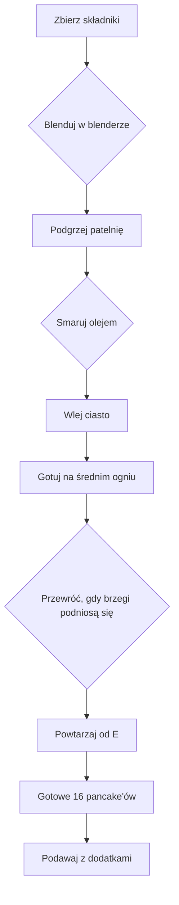

---  

## 1. Wstęp  
> **Witajcie drodzy widzowie** w kolejnym odcinku!  
> Dzisiaj robimy *zdrowe, pożywne, wysoko białkowe* **pancake'y** – *penkajksy* – z dodatkiem **serka wiejskiego**.  
> **Szybko, łatwo, prosto** – wystarczy blender lub mixer.

---

## 2. Składniki  
| **Zawartość** | **Ilość** | **Uwagi** |
|----------------|-----------|-----------|
| Płatki owsiane (błyskawiczne) | 100 g |  
| Mleko | 150 ml |  
| Serek wiejski | cały (cała puszka) |  
| Banan | 1 | całe, bez obróbki |
| Odżywka białkowa | - | według własnego gustu |
| Jajko | 1 |  
| **Dodatkowo** | |  
| Olej z pestek winogron | - | do smarowania patelni, alternatywnie spray |
| Masło, rozpuszczone | - | na podanie |
| Orzechy kokosowe (posypka) | - |  
| Płatki migdałowe, pokruszone | - |  
| Borówki (merykańskie) | - |  
| Syropy, sosy | - | wg uznania |

---

## 3. Narzędzia  
- Blender lub mixer  
- Patelnia nieprzywierająca  
- Ręczniki papierowe (do rozprowadzenia oleju)  
- Szklanka lub miseczka (do mieszania)  
- Szczypce lub łopatka (do przewracania)  

---

## 4. Przygotowanie – krok po kroku  

1. **Zbierz wszystkie składniki** i wlej je do blendera.  
2. **Blenduj** do uzyskania gładkiej masy – *banan wciąż jest w środku, czyli o **middlene*** (środek).  
3. **Podgrzej patelnię** na średnim ogniu.  
4. **Smaruj patelnię** olejem z pestek winogron – *spray* jeśli masz, albo wylej kilka kropli i rozprowadź ręcznikiem papierowym, tworząc *film oleju*.  
5. **Wlej** do patelni 3 małe placki na raz – *one nie mogą być duże, żeby fajnie przewracały*.  
6. **Obserwuj** – jak krawędzie podnoszą się, to znak, że **pancake' i jest gotowy**.  
7. **Obróć** – po sekundzie na jednej stronie, po drugiej – *minimanie się podnoszą*.  
8. **Powtarzaj** czynność aż masa się skończy.  

---

## 4. Gotowanie – diagram Mermaid  

---

## 5. Po zakończeniu gotowania  
> **Wyszło mi dokładnie 16** *pancake'ów* – *wieże* z graczy białkowych.  
> **Czysta forma** bez dodatków: w sumie cała masa (pląty owsiane + mleko + serek wiejski + banan + odżywka + jajko).  
> **Makros i kalorie**:  
> - *Tyle makrosów, tyle kalorii* – wartości podane w osobnym pliku **pchniadankiem** (śmiech na temat własnego jednego słupek).  

> **Makrosy (placeholder):**  
> | #pancake | Kalorie | Białko | Tłuszcz | Węglowodany |
> |-----------|----------|--------|----------|--------------|
> | 16 | ~? | ~? | ~? | ~? |

---

## 6. Dodatki i podawanie  
> Po usmażeniu **coś jeszcze dodaję na górę**, żeby to wyglądało *zajebistym* i *gracuszkami* białkowymi.  
> *Masło, rozpuszczone* – *rzohowe* (rożowe?), *posypka z orzechów kokosowych* i *pokruszone płatki migdałowe* – wszystko to daje **kolory i tekstury**.  
> **Owoce**: banan jest już w masie (przezbanana), a borówki (merykańskie) dodają kontrastu i *trochę kfaskowości*.  
> Syropy, sosy – *według waszego uznania*.  
> *Polać* – bo naprawdę wszystko *eleganckie*.

---

## 7. Smak i rekomendacje  
> **Smakuje to** – *pajne, czulkie, męczutkie* – *pankajksy* po prostu *polecam*.  
> **Łapa do góry** – *taki smaczek*, co zostaje w pamięci na długo.  

---

## 8. Zakończenie  
> **Do zobaczenia w kolejnym odcinku** – mam nadzieję, że wasza przygoda z **pancake'ami** będzie równie *zajebista* jak moja!  

---