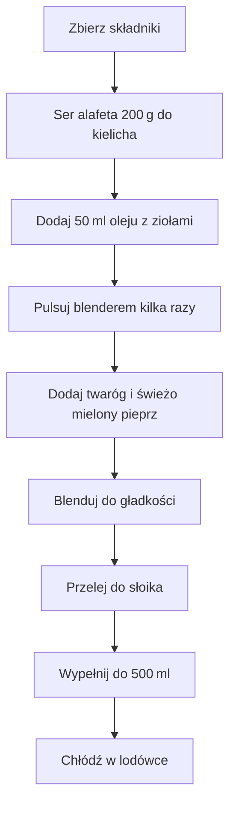

---

## Wprowadzenie  
Zaprosili cię na grilla i myślisz, co ze sobą zabrać.  
Te sosy smarowidła są bardzo proste, zachwycą znajomych i rodzinę.  
**Sosiki** mogliście już poznać we wcześniejszej rolce, jak zrobić.  
Dziś pokażę wam, jak zrobić smarowidło – pastę z suszonymi pomidorami na zgrillowany chlebek.

> **Screenshot:** *(tu wstawiamy wizualizację przepisu)*

---

## Składniki (na 500 ml słoik)  
- **Ser alafeta** – 200 g  
- **Olej z ziołami** (z tych właśnie pomidorków) – 50 ml  
- **Twaróg** – do smaku  
- **Świeżo mielony pieprz** – do smaku  

---

## Przygotowanie

1. **Przelej ser alafeta do kielicha** (będziesz w nim wszystko miksować).  
2. **Wlej 50 ml oleju z ziołami** – niesamowity boost smakowy.  
3. **Blender** – kilka pulsacyjnych ruchów, aby składniki częściowo się zblendowały.  
   *Smakowo już jest niesamowicie.*  
4. **Zrobiło mi się nieco miejsca** – dodaj twaróg i odrobinę świeżego, mielonego pieprzu.  
5. **Zamykaj i blenduj** – teraz pasta poszła jeszcze gładziej.  
6. **Wyjmij do słoika** – dopełnij, aby uzyskać 500 ml.  
7. **Zachowaj w lodówce** – po wyjęciu z lodówki pasta ma idealną konsystencję, gęstość.  

> **Uwierzcie mi, pasta smarowidło jest tak pyszna.**

---

## Diagram procesu (Mermaid)

---

## Podanie i przechowywanie  
- **Świetnie wchodzi na grillowane pieczywo.**  
- **Idealna konsystencja** – gęstość po wyjęciu z lodówki sprawia, że smarowidło pozostaje równomierne i aromatyczne.  

---

## Makro i kalorie  
> **Makro i kalorie na całość przed wami.**  
*(tutaj wstawiamy szczegółowe dane, jeśli są dostępne)*  

---