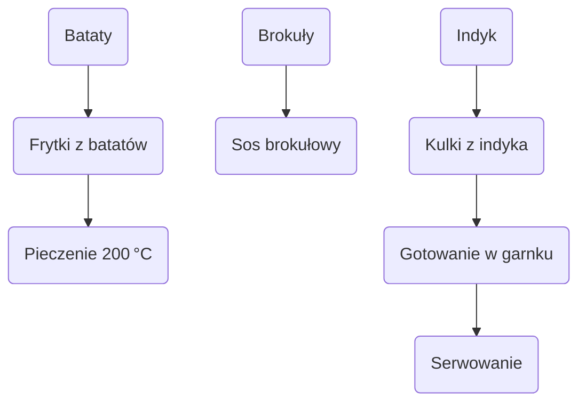

---

## 1. Wprowadzenie

- **Kanał**: „byki” – ponownie prezentuje pomysł na szybki posiłek.
- **Motyw**: Kulki z mięsa, „niespodzianki” w postaci serów, bataty zamiast klasycznych ziemniaków.
- **Cel**: Pokazać, jak łatwo można zarządzać makroskładnikami, przygotować posiłek w jednym garnku i zamrozić resztę na później.

---

## 2. Składniki

| **Składnik** | **Ilość na jedną porcję** | **Uwagi** |
|--------------|--------------------------|-----------|
| **Bataty** | 260 g (po obróbce 520 g) | Duży batat, skrojenie na frytki |
| **Oliwa z oliwek** | 10 ml (do frytek) + 20 ml (do sosu) |  |
| **Ostre papryczki** | według smaku |  |
| **Suszony rozmaryn** | według smaku |  |
| **Brokuły** | 1/2 główki (z lodówki) | Drobno krojone |
| **Indyk** | 200 g (400 g w całkowitym użyciu) | Pierś indyka, przyrządzone w kule |
| **Ser** | 20 g na kulę (różne rodzaje) | Radamer, trzedaar, ser pleśniowy (blu) |
| **Pieprz biały** | 1 łyżeczka | Pełna dawka dla pikantności |
| **Pieprz ziołowy** | 1/2 łyżeczki |  |
| **Sól** | do smaku |  |
| **Czosnek** | 2 ząbki (przez praskę) |  |
| **Mąka** | 1 łyżka | Do zagęszczenia sosu |
| **Mleko** | wg potrzeb | Do rozrzedzenia sosu |
| **Płatki chili** | opcjonalnie | Dla dodatkowej pikantności |

---

## 3. Przygotowanie frytek z batatów

1. **Obróć batat** – całego wyciągnij 520 g, następnie rozdziel na 2 części po 260 g każda.
2. **Oczyszcz** – obierz skórkę, a następnie kroj w „frytki”.
3. **Mieszaj** – w dużej misce połącz frytki z 10 ml oliwy, ostrą papryką i suszonym rozmarynem.
4. **Rozkładaj** – rozłóż równomiernie na blachę wyłożoną papierem do pieczenia, upewniając się, że nie leżą na siebie.
5. **Piecz** – w piekarniku ustaw na 200 °C (grzanie góra‑dół) na 20‑25 minut. Na koniec dodaj termoobieg na 2‑3 minuty dla chrupkości.

---

## 4. Przygotowanie sosu brokułowego

1. **Pieczenie brokułów** – w oscelonej, wężującej wody, gotuj brokuły 10‑15 minut do miękkości.
2. **Blenduj** – po ugotowaniu zmiksuj brokuły z 20 ml oliwy, 1 łyżką mąki, 2 ząbkami czosnku oraz 1 łyżeczką pieprzu białego i 1/2 łyżeczki pieprzu ziołowego.
3. **Zagęszcz** – w razie potrzeby dodaj 1 łyżkę mąki, a potem stopniowo mleko, aż uzyskasz pożądaną konsystencję (gęsty lub bardziej rzadki, jeśli wolisz grudki).
4. **Blenduj** – opcjonalnie, aby uzyskać jednorodny sos. Jeśli grudki są akceptowalne, blendowanie pomiń.
5. **Dopraw** – sprawdź smak, dodaj sól i ewentualnie płatki chili.

---

## 5. Przygotowanie kul indykowych z serową niespodzianką

1. **Mięso** – przygotuj 400 g mięsa z indyka (pierś). Otrzymujesz cztery kule po 100 g każda, z których jedna stanowi 200 g na porcję.
2. **Ser** – na każdą kulę wyłóż po 20 g kawałka seru (radamer, trzedaar, ser pleśniowy – każdy dodaje inny aromat).
3. **Formowanie** – z mięsa uformuj kulki, zachowując 20 g seru wewnątrz.
4. **Gotowanie** – po umieszczeniu w garnku pozostaw kulki na kuchence przez 4 minuty (szybkie podgrzewanie).

---

## 6. Finalne gotowanie i montaż

- **Indyk** – po formowaniu kul, gotuj w garnku na 4 minuty (lub dłużej, jeśli chcesz miękkość).
- **Frytki** – piecz razem, jak opisano w kroku 3.
- **Serwuj** – ułóż kulki na talerzu, obok chrupiących frytek, polane sosem brokułowym.
- **Zamrożenie** – podziel jedną porcję batatów na następny dzień, pakuj w szczelną pojemność i zamrażaj na kolejne dni.

---

## 7. Makroskładniki (jedna porcja)

| **Makro** | **Wartość** |
|-----------|-------------|
| Białko | 200 g mięsa + 20 g seru ≈ 240 g |
| Węglowodany | 260 g batata (średnio) |
| Tłuszcze | 30 ml oliwy + 20 ml oliwy do sosu ≈ 50 ml |
| Kalorie | Około 200 kcal na porcję (zależnie od rodzaju serów) |

> **Humor**: „Ilość tużczu kontrolujecie sobie poprzez oliwy w sosie brokułowym” – czyli po prostu dodaj tyle oliwy, ile potrzebujesz, żeby dostosować makros.

---

## 8. Mermaid – Prosty schemat przepisu

---

## 9. Wskazówki i komentarze

- **Pikantność** – nie oszczędzaj pieprzu białego, daje sporo smaku. Jeśli potrzebujesz jeszcze bardziej wyrazistego efektu, dodaj płatki chili.
- **Ser** – radamer i trzedaar dają wyjątkowy smak; ser pleśniowy (blu) wprowadza delikatny, słodkawy kontrast.
- **Zamrożanie** – frytki z batatów oraz kulki można przechowywać w lodówce lub zamrozić na kolejne dni – szybkie odgrzanie w mikrofali lub ponowne podgrzanie na patelni.

---

## 10. Podsumowanie

- **Czas**: całe przygotowanie trwa około 40‑45 minut, z wykorzystaniem jednego garnka i jednej blachy.
- **Makro‑elastyczność**: łatwo modyfikować ilość białka poprzez zmianę ilości mięsa, a także zmieniać węglowodany, jeśli wolisz pieczone ziemniaki zamiast batatów.
- **Zachęta**: „Piszcie komentarze, kto zrobił, komu smakowało. I pamiętajcie o subskrypcji!” – zachęta typowa dla kanału „byki”.

**Do zobaczenia w kolejnym odcinku!**  
Cześć!