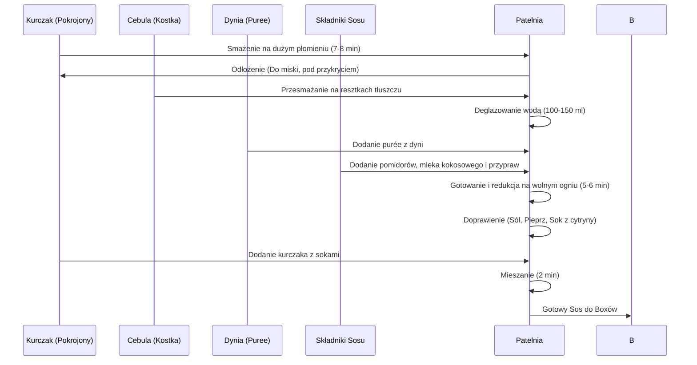

---

## TOP TEJ JESIENI: 3 LUNCH BOXY Z KURCZAKIEM I SOSEM DYNIOWYM CURRY

Witamy w kolejnym odcinku programu **Policzona Szama**. Dzisiejsza propozycja to **"Top tej jesieni"** – trzy przepyszne lunch boxy z kurczakiem, charakteryzujące się niesamowitą ilością **gęstego sosu dyniowego curry**.

Danie jest **pikantne**, obfituje w mnóstwo smaków i niesamowicie rozgrzewa, co czyni je idealnym na zimne, jesienne wieczory. Największe zalety potrawy to:

*   **Prostota:** Łatwe i szybkie wykonanie.
*   **Składniki:** Łatwo dostępne.
*   **Makro:** Rewelacyjne parametry odżywcze.

---

## SKŁADNIKI DO SKOMPONOWANIA TRZECH BOXÓW

Poniżej przedstawiono listę wszystkich składników niezbędnych do przygotowania dania.

### Źródło Białka

*   **Kurczak:** Pierś z kurczaka.

### Baza Warzywna i Płyny

*   **Dynia:** Około 1 kg dyni piżmowej (cała ilość zostanie przygotowana).
*   **Pomidory:** Puszka krojonych pomidorów.
*   **Mleczko Kokosowe:** Niewielka ilość.
*   **Cebula:** Jedna większa cebula.
*   **Oliwa:** 15 ml oliwy (do marynowania kurczaka).
*   **Woda:** Około 100–150 ml (do deglazowania).
*  **Cytryna**: sok z 1/2 cytryny

### Dodatek Węglowodanowy

Jako dodatek węglowodanowy bardzo dobrze sprawdza się w tej potrawie:

*   **Kasza Bulgur** (zalecana, "po indyjsku").
*   *Alternatywnie:* Ryż jaśminowy lub basmati.

### Przyprawy i Dodatki (Klucz do Smaku)

Odpowiednie przyprawy są kluczowe dla tego dania, zwłaszcza te, które mają za zadanie rozgrzać potrawę:

*   **Curry**
*   **Kumin**
*   **Cynamon**
*  **Gorczyca**
*   **Słodka Papryka** (dużo słodkiej papryki)
*   **Sól i Pieprz** (do smaku)
*   **Sok z cytryny** (nieco soku, na koniec)
*   **Kolendra** (świeża, na górę)
*   **Płatki chili** (do dekoracji)

> **Wskazówka:** Jeśli potrzebujesz listy zakupów, zrób zrzut ekranu listy składników.

---

## PRZYGOTOWANIE WSTĘPNE SKŁADNIKÓW

W tym samym czasie, gdy gotuje się kasza i dynia, można przyszykować pozostałe składniki.

### 1. Przygotowanie Dyni Piżmowej (Purée)

Celem jest uzyskanie miękkiej masy (purée), która trafi bezpośrednio na patelnię, aby nadać daniu niesamowitą objętość i dostarczyć węglowodanów.

| Krok | Czynność | Szczegóły |
| :--- | :--- | :--- |
| **1.** | Krojenie | Krojenie dyni w plastry. |
| **2.** | Stabilizacja | W miejscach, gdzie jest problem z utrzymaniem równowagi, warto odkroić kawałek skóry dla stabilności. |
| **3.** | Usuwanie | Usunięcie pestek. |
| **4.** | Obieranie | Odkrojenie skóry z każdego krążka. |
| **5.** | Gotowanie | Gotowanie na parze w naczyniu (razem z kaszą bulgur, umieszczone na górze) przez **około 20 minut**. |
| **6.** | Kontrola | Po dodatkowych 10 minutach (po odsączeniu kaszy) sprawdzić miękkość widelcem – powinien wchodzić jak w ugotowanego ziemniaka. |
| **7.** | Mieszanie | Przełożenie na deskę lub do miski i rozgniatanie widelcem. Tworzymy **gładką, aksamitną strukturę purée**, z możliwością pozostawienia gdzieniegdzie większych kawałków. |

### 2. Gotowanie Kaszy Bulgur

*   Woda: Lekko osolona.
*   Czas gotowania: Około **10 minut** (maks).
*   Po upływie czasu kaszę należy odcedzić, podczas gdy dynia potrzebuje jeszcze około 10 minut gotowania na parze.

### 3. Przygotowanie Kurczaka

1.  Pierś z kurczaka pokroić w **niewielką kostkę**.
2.  Przełożyć do miski.
3.  Zalać **15 ml oliwy**.
4.  Lekko dopieprzyć.
5.  Wszystko wymieszać.

### 4. Krojenie Cebuli

1.  Obranie jednej większej cebuli.
2.  Przekrojenie na pół.
3.  Wykonanie cięć wzdłuż cebuli, aby uzyskać **piękną kosteczkę**.

---

## PROCES TWORZENIA SOSU CURRY

Reszta dzieje się już na patelni.

### 1. Smażenie Kurczaka

| Krok | Działanie | Czas i Uwagi |
| :--- | :--- | :--- |
| **1.** | Rozgrzewanie | Patelnia na gaz, bez dodatkowego oleju (kurczak jest już obtoczony). Duży płomień. |
| **2.** | Smażenie (I strona) | Rozłożenie kurczaka o temperaturze pokojowej. Smażenie: **3–4 minuty**. |
| **3.** | Smażenie (II strona) | Odwrócenie/przemieszanie. Smażenie: **2–3 minuty**. |
| **4.** | Doprawianie | Można doprawić solą i nieco dodatkowego pieprzu. |
| **5.** | Odłożenie | Po niespełna **7–8 minutach** przełożyć do miski i przykryć talerzykiem, aby zachował soczystość i dochodził do siebie. |

### 2. Baza Sosu i Deglazowanie

1.  Na tę samą patelnię (na resztę tłuszczu) wyłożyć cebulę.
2.  Delikatnie przesmażyć cebulę, aby straciła surowość, zmiękła i skarmelizowała się, dając **słodycz** w potrawie.
3.  Dolać nieco wody (**około 100–150 ml**).
4.  Zagotować cebulę, zbierając wszystkie smaki z dna i ścianek patelni.

### 3. Łączenie Składników i Przyprawianie

1.  Dodać **dynię** (woda jest potrzebna, ponieważ dynia jest gęsta, aby sos miał co redukować).
2.  Dodać **pomidory** (cała pucha pomidorów z puszki).
3.  Dodać **mleko kokosowe** (odpowiednia ilość).
4.  Dodać **przyprawy**: Curry, Papryki, Cynamon z gorczycą, Kumin.
5.  Wymieszać wszystkie składniki.

### 4. Redukcja i Finalizacja

1.  Przykryć patelnię i gotować całość na **wolnym ogniu** przez około **5–6 minut**.
2.  W połowie tego czasu warto otworzyć pokrywę i przemieszać wszystko z dna patelni.
3.  **Doprawienie:** Doprawić odpowiednią ilością soli i świeżo mielonym pieprzem.
4.  **Balans smaku:** Dodać sok z **połowy cytryny** (przebije słodycz dyni).
5.  **Dodanie kurczaka:** Dodać kurczaka wraz z sokami.
6.  Zmniejszyć płomień do **minimalnego** (szkoda redukcji). Wymieszać.
7.  Gotować jeszcze **2 minuty**.

> **Ocena Smaku:** Sos jest rewelacyjny, pełen smaczków. Jest i słodycz z dyni, i pikantność, i kwasowość z cytryny.

### Schemat Procesu Gotowania

---

## KOMPONOWANIE I SERWOWANIE LUNCH BOXÓW

Po przygotowaniu dania następuje wykładanie do pojemników.

1.  **Pojemniki:** Użyto trzech szklanych pojemników o pojemności **1050 ml**.
2.  **Baza:** Pojemniki są początkowo wyłożone kaszą bulgur.
3.  **Główne Danie:** Sos z kurczakiem jest równo podzielony na **trzy części**.
4.  **Garnisz:** Na górę trafia świeża **kolendra** oraz nieco **płatków chili**.

> **Rezultat:** Tak pięknie boxy się prezentują. Trzy dni jedno danie macie z głowy.

---

## PODSUMOWANIE I OCENA

Po spróbowaniu dania autor wydaje następującą ocenę:

*   **Objętość:** Zobaczcie, cóż za objętość, pełne wypełnienie boxa.
*   **Smak:** Spora pikantność i rewelacyjne smaki, wynikające z wielu użytych przypraw.
*   **Wartość:** Jest to jedna z **najlepszych rzeczy na tym kanale** pod względem:
    *   Nakładu pracy.
    *   Użytych składników.
    *   Szybkości wykonania.
*   **Makro:** Duża objętość w połączeniu z rewelacyjnym makro sprawiają, że jest to jedna z najlepszych propozycji do lunch boxa.

Zachęta do interakcji: Łapa w górę dla tych, którym się podobało. Piszcie komentarze, jak smakowało i kto zrobił.