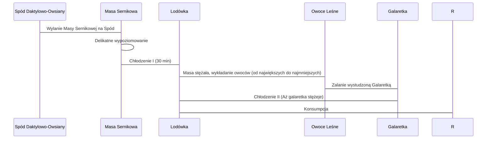

***

# FIT SERNIK Z LEŚNYMI JAGODAMI: PROSTY, SZYBKI I ORZEŹWIAJĄCY

Witajcie na kanale **Policzona Szama**! Odpowiadając na prośby o coś słodkiego z wykorzystaniem twarogu, prezentujemy dzisiejszy **fit sernik**. Jest to połączenie proste, szybkie, naturalnie i odpowiednio słodkie – na pewno nie mdłe. Dodatkowo jest kwaskowaty i orzeźwiający dzięki dużej ilości leśnych jagód.

> **Apel:** Jeśli odcinek wam się spodoba, zostawcie łapę w górę. Piszcie też komentarze, jeśli chcecie zobaczyć kolejne fit desery na kanale! Lecimy!

***

## SKŁADNIKI NA EPICKI SERNIK

Poniżej przedstawiono wszystkie składniki potrzebne do wykonania sernika, podzielone na warstwy. Zaleca się zrobienie zdjęcia ekranu (screenshota) przed wyruszeniem na zakupy.

### 1. Spód (Masa daktylowo-owsiana)

| Składnik | Ilość | Uwagi |
| :--- | :--- | :--- |
| **Daktyle suszone** (bez pestek) | 200 g | Namoczone wcześniej (15–20 minut) w gorącej wodzie, aby ułatwić miksowanie. |
| **Płatki owsiane** | 120 g | Użyto płatków błyskawicznych (uzasadnienie poniżej). |
| **Olej kokosowy** (zimnotłoczony) | 20 g | |
| **Kakao** | 2 pełne łyżeczki | |
| **Woda** | 50 ml | Używana podczas miksowania spodu. |

### 2. Masa Sernikowa

| Składnik | Ilość | Uwagi |
| :--- | :--- | :--- |
| **Twaróg chudy** | 500 g | Użyto twarogu typu „Klinka”. |
| **Nasiona chia** | 20 g | Równe 20 g. Właściwości i wartości podobne do siemienia lnianego. |
| **Mleko** | 200 ml | Do moczenia nasion chia (1–1,5 godziny wcześniej). |
| **Żelatyna** | 3 pełne łyżeczki (ok. 15 g) | Najzwyklejsza, uniwersalna (nie deserowa). |
| **Słodzidło** (Erytrytol) | 2 pełne łyżki | Można użyć stewii lub ksylitolu, pamiętając, że mogą dodać minimalne, dodatkowe kalorie. |

### 3. Warstwa Górna (Galaretka i Owoce)

*   **Galaretka:** 1 opakowanie (bez cukru), smak owoce leśne.
*   **Owoce leśne:**
    *   Maliny (pełen koszyk).
    *   Borówka.
    *   Czarna porzeczka (niesamowicie kwaskowa).
    *   Jeżyna.

***

## PRZYGOTOWANIE WSTĘPNE (PRE-PREP)

Istnieje kilka kluczowych czynności, które należy wykonać na samym początku, aby wszystkie składniki miały czas ostygnąć lub zmięknąć.

1.  **Przygotowanie Galaretki:**
    *   Galaretkę należy rozpuścić w **450 ml** gorącej wody.
    *   Rozpuszczenie jej na początku jest kluczowe, aby miała czas ostygnąć, zanim zostanie wylana na masę sernikową.

2.  **Przygotowanie Żelatyny:**
    *   Wystarczy **120 ml** gorącej, przegotowanej wody.
    *   Żelatynę należy wsypać i natychmiast dokładnie mieszać, aż się rozpuści.
    *   Pozostawić do ostygnięcia.

3.  **Moczenie Nasion Chia:**
    *   Nasiona moczymy w **200 ml mleka** 1–1,5 godziny wcześniej.
    *   W czasie moczenia należy mieszać nasiona 2–3 razy, aby zapobiec pojawieniu się grudek.

***

## SZCZEGÓŁOWY PROCES PRZYRZĄDZANIA

### 1. Przygotowanie Spodu Daktylowo-Owsianego

Proces tworzenia masy na spód wymaga użycia robota kuchennego z ostrymi nożami.

1.  **Miksowanie Składników Mokrych:** Wrzucamy daktyle (namoczone), olej kokosowy, kakao i **50 ml wody**.
    *   **Cel użycia wody:** Jest ona potrzebna, aby masa daktylowa nie była zbyt twarda oraz aby mogły ją wchłonąć płatki owsiane.
2.  **Dodanie Płatków:** Gdy daktyle są odpowiednio zmiksowane, dodajemy **płatki owsiane błyskawiczne**.
    *   **Uzasadnienie użycia płatków błyskawicznych:** W miejscach, gdzie płatki owsiane nie są gotowane ani moczone przez całą noc, używa się błyskawicznych, które mogą być spożywane na surowo bez obaw i problemów dla żołądka i jelit.
3.  **Formowanie Spodu:**
    *   Przygotowujemy formę: Ścianki należy pokryć filmem olejowym (olejem kokosowym). Spód nie wymaga dodatkowego natłuszczania, ponieważ masa już zawiera olej kokosowy, który zapewnia łatwe odklejanie.
    *   Wykładamy całą masę na spód formy. Masa zgęstniała, ponieważ płatki owsiane zaabsorbowały wilgoć.
    *   Czystymi, zwilżonymi rękami równomiernie rozkładamy i dociskamy spód sernika.
    *   **Uwaga:** Spód stwardnieje i usztywni się w lodówce, głównie dzięki zestaleniu się oleju kokosowego.

### 2. Przygotowanie Masy Sernikowej

1.  **Miksowanie Sera:** Do umytego robota wrzucamy **500 g twarogu** oraz **erytrytol** (2 łyżki) i wlewamy rozpuszczoną, wystudzoną **żelatynę**.
2.  **Proces Miksowania:** Miksujemy masę dosyć długo, aż stanie się gładziutka, a grudki twarogu praktycznie znikną (minimalne grudki są nieuniknione).
3.  **Dodanie Nasion Chia:** Wlewamy mleko z namoczonymi nasionami chia.
    *   **Kluczowa zasada:** Nasiona dodajemy na końcu i **mieszamy ręcznie** (nie miksujemy), aby nie zniszczyć ich struktury.

***

## SKŁADANIE I WYKAŃCZANIE SERNIKA

Poniższy schemat przedstawia sekwencję montażu i chłodzenia sernika.

### Detale Montażu

1.  **Poziomowanie Masy:** Po wylaniu masy sernikowej na spód, należy ją delikatnie wypoziomować.
2.  **Wstępne Chłodzenie:** Wstawiamy sernik do lodówki na **30 minut**, aby masa delikatnie stężała.
3.  **Wykładanie Owoców:**
    *   Owoce (maliny, borówki, porzeczki) należy delikatnie przepłukać.
    *   Zasada budowania: **Na bogato!** Zaczynamy od największych owoców (maliny), a następnie dodajemy borówki i porzeczki.
    *   **Uwaga:** Porzeczki często kupowane są z gałązkami i należy je ładnie poobierać.
4.  **Zalewanie:** Zalewamy całość wystudzoną galaretką. Część owoców będzie delikatnie wystawać (nie będą zatopione w całości), co jest zamierzonym efektem.
5.  **Finalne Chłodzenie:** Całość wrzucamy do lodówki i czekamy, aż galaretka stężeje.

***

## PREZENTACJA I DEGUSTACJA

Po stężeniu galaretki sernik jest gotowy.

*   **Wygląd:** Sernik prezentuje się pięknie z wyraźnymi warstwami i dużą ilością owoców.
*   **Smak:** Naprawdę przepyszny smak. Jest lekko słodkawy, ale na pewno **nie jest mdły**. Jest rześki i kwaskowaty dzięki leśnym owocom.
*   **Porcjowanie:** Cały sernik jest dzielony na **8 porcji** (1/8). Autor zaznacza, że porcja szybko może przekształcić się w 1/4 bez problemu.

### Makroskładniki i Kalorie

Dla widzów podane zostaną makroskładniki i kalorie na **1/8 całego sernika** (na jedną porcję).

> **Uwaga:** Piszcie w komentarzach, jak wam wyszło. Do zobaczenia w kolejnym odcinku!