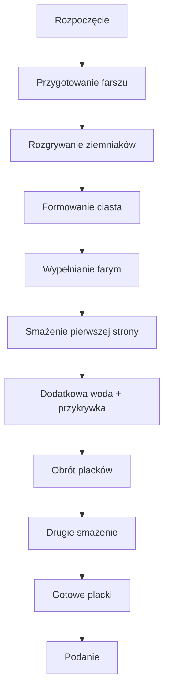

---  

## 📽️ **Wprowadzenie**  

- **Coś pysznego!**  
- Witajcie drodzy widzowie w kolejnym odcinku.  
- Dzisiaj robimy tanią, dobrą szamę: **placki ziemniaczane z twarogiem, szpinakiem i serem sałatkowym**.  
- Całość ma **bardzo dobre makros** – składniki dobrane tak, aby uzyskać ładne proporcje.  
- Ziemniaki – *rewelacyjne źródło węglowodanów*, niedoceniane przez wielu.  
- Twaróg + ser sałatkowy + szpinak – wszystko tanio, smacznie.  
- **Szybko, prosto, konkretne** – tak na kanale.

---

## 🧾 **Składniki (na 4 placki)**  

| **Składnik** | **Ilość** | **Uwagi** |
|--------------|-----------|-----------|
| Ziemniaki ugotowane | 400 g | Lekko osłonięte wodą, mogą być dwudniowe. |
| Mąka pszenna | 150 g | Do ciasta. |
| Jajko | 1 szt. |  |
| Sól | do smaku |  |
| Czarny pieprz | do smaku |  |
| Zielony angielski | szczypta (opcjonalnie) | Dodatek smaku. |
| **Farsz** | | |
| Twaróg chudy | 100 g | Kostka. |
| Ser sałatkowo‑kanapkowy typu feta | 100 g (półtłusty) | 12 % tłuszczu. |
| Mrożony szpinak | 220 g | Rozdrobniony, najbliższy 220 g. |
| Cebula | 1 średnia |  |
| Czosnek | 3 ząbki |  |
| Majeranek | do smaku |  |
| Oliwa z oliwek | 20 ml | Do smażenia. |

---

## 🔪 **Przygotowanie farszu**  

1. **Cebula i czosnek**  
   - Cebulę obieramy, kroimy w drobną kostkę.  
   - Czosnek obieramy i praskujemy bezpośrednio na patelnię z oliwą.  

2. **Smażenie**  
   - Rozgrzewamy patelnię, dodajemy 20 ml oliwy.  
   - Cebula przesmażamy do zeszklenia, aż stanie się miękka.  
   - Dodajemy czosnek, smażymy 1–2 min, dodając majeranek.  

3. **Szpinak**  
   - Dodajemy mrożony szpinak, smażymy, aż woda wyparuje.  
   - Przykrywamy, aby rozmrozić; po rozmrożeniu wyparuj wypełnioną wodę.  
   - Doprawiamy świeżo mielonym pieprzem, solą i gałką muszkatołową.  

4. **Twaróg i ser**  
   - Do miski wrzucamy twaróg i półtłusty ser feta.  
   - Mieszamy z gotowym szpinakiem.  
   - Sprawdzamy smak – ser wystarczy do słoności.  

5. **Łączenie**  
   - Wszystko dokładnie mieszamy, odstawiamy na chwilę.  

---

## 🥔 **Przygotowanie ciasta ziemniaczanego**  

1. **Ziemniaki**  
   - Gdyby nie były wcześniej ugotowane, gotujemy w osolonej wodzie.  
   - Ugniecamy ręcznie, młotkiem lub praską.  

2. **Mieszanie**  
   - Dodajemy mąkę, jajko, sól, pieprz, majeranek (opcjonalnie zielony angielski).  
   - Mieszamy aż do uzyskania kleistej masy (ok. 490 g całości).  

3. **Formowanie**  
   - Z masy formujemy kółka lub kwadraty, ok. 120 g każdy.  
   - Na szczycie kształtu delikatnie spłaszczamy brzegi, aby farym się dobrze wchłonięły.  

4. **Przygotowanie do smażenia**  
   - Na patelni rozgrzewamy minimalny płomień, olej lekko rozgrzewamy.  
   - Wkładamy pierwsze placki, zostawiamy do smażenia 2 min z przykryciem i niewielką ilością wody, aby para „rozważyła” ciasto.  

---

## 🍳 **Smażenie placków**  

1. **Pierwsza strona**  
   - Placki smażymy 2 min, dopiero wtedy dodajemy niewielką ilość wody i przykrywkę.  

2. **Druga strona**  
   - Po 2–3 minach odwracamy placki, doprowadzamy do złotego koloru (≈ 2–3 min).  

3. **Gotowość**  
   - Placki są gotowe, mają chrupiącą skórkę i miękkie wnętrze.  
   - Na zimno stężeją, więc łatwiej je sięgać i gryźć.  

---

## 🍽️ **Podanie i smak**  

- Placki są **pyszne**, idealne na ciepło i na zimno.  
- Farsz dopowiada w smaku, a całość ma **wyjątkową konsystencję**.  

---

## 📊 **Makroskładniki na jednego placka**  

| **Makro** | **Wartość** | **Uwaga** |
|-----------|-------------|-----------|
| Kalorie | 210 kcal | Przy założeniu 2 placki (po 1 port. = 2 placki). |
| Białko | 12 g |  |
| Tłuszcze | 8 g |  |
| Węglowodany | 28 g |  |

> *W porcji dwóch placków (2 placki) makroskładniki wynoszą: 420 kcal, 24 g białka, 16 g tłuszczu, 56 g węglowodanów.*

---

## 🚀 **Diagram przepływu**  

---

## 💬 **Komentarze i zaproszenie**  

- „Łapa w górę, komu się podobało, piszcie komentarze!”  
- „Na kolejny odcinek, do zobaczenia, cześć!”  

---  

**Gotowe** – zapraszam do próbowania, robienia i dzielenia się opiniami!