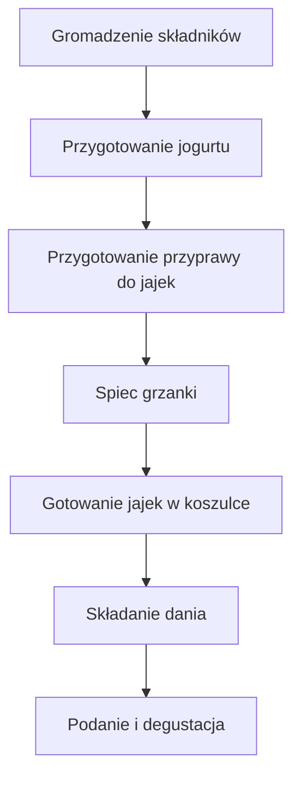

---

# 1️⃣ Wprowadzenie  
**Witam serdecznie widzów Policzonej Szamy** oraz tych, którzy dzisiaj pierwszy raz zobaczą ten odcinek na kanale!  
W tym wypadku zrobimy **jajka po turecku** – śniadaniowa potrawa, bardzo szybka, niewymagająca wielu składników.  

- Od wakacji **nie mogę się od niej odciążyć** – to prawdziwy konkurent szakszuki!  
- Na kanale przygotujemy wersję **odpowiednio zmodyfikowaną**, by dostarczyć wszystkie potrzebne makroskładniki.  
- Odcinek będzie kompletny krok po kroku – **zobaczysz, jak przygotować zawsze wychodzące jajka w koszulce**.  
- **Nie ma na co czekać** – wiem, że jesteście głodni, zaczynajmy!

---

# 2️⃣ Składniki (i kilka uwag)  
| Składnik | Ilość | Uwagi |
|----------|-------|-------|
| **Jajka** | 2 | Z lodówki, *zimne* – klucz do dobrej koszulki |
| **Skyr** | 150 g | Płynny, rozrzedzony |
| **Jogurt naturalny** | 100 g | Rozrzedza Skyr |
| **Bułka ciabatta** | 80 g (lub dowolne pieczywo) | Zgrillować, spiec; musi być twarde – *bez sztućców* |
| **Cytryna** | 1 duża | Soczysta, rozgrzany *gniotnik* |
| **Pietruszka** | garść | Do przyprawy |
| **Czosnek** | 1 ząbek (połowa) | Surowy, surowy, surowy |
| **Oliwa z czosnkiem** | 10 ml | Do przyprawy |
| **Płatki chili** | dowolna ilość | Dodaje pikantności |
| **Papryka słodka, wędzona** | do smaku | Dla smaku |
| **Sól (gruboziarnista)** | trochę | Do moździerza i przyprawy |

---

# 3️⃣ Przygotowanie **Jogurtu z Cytryną i Czosnkiem**  
1. **Mieszanka jogurtowa**  
   - W misce połącz 150 g Skyr i 100 g jogurtu naturalnego.  
   - Ustaw na bok – niech „przegryza się” smakami.  
2. **Cytryna**  
   - Rozwałkuj **dużą, soczystą** cytrynę, dociskając mocno, aby wydobyć sok.  
   - Rozdziel cytrynę na pół:  
     - *Połowa na bok* (do później).  
     - *Druga połowa* w moździerzu.  
3. **Czosnek**  
   - Użyj **połowy ząbka** (dokładnie połowa, surowy).  
   - W połączeniu z czosnkiem zostaw *ćwiartkę* na później.  
4. **Gniotzenie**  
   - W moździerzu rozgnieć cytrynę, czosnek i ćwiartkę czosnku do uzyskania **cytrynowo‑czosnkowego** puree.  
5. **Przyprawa**  
   - Dodaj 10 ml oliwy z czosnkiem, garść pietruszki, *nieco soli* – w sumie od razu *na górę*.

---

# 4️⃣ Przygotowanie **Przyprawy do Jajek**  
- W moździerzu (lub misce) połącz:  
  - *Oliwę z czosnkiem*, *pietruszkę*, *ćwiartkę czosnku* (zatrzymaną w poprzednim kroku), *sól* oraz *płatki chili* i *paprykę wędzoną*.  
- Ustaw gotową przyprawę na bok – do późniejszego doprawiania potrawy.

---

# 5️⃣ Przygotowanie **Pieczywa**  
- **Ciabatta**: 80 g, „grzanki” – **zgrilluj**, dopóki nie będą złociste i twarde.  
- **Alternatywy**: dowolna pieczywo – grzanki ciepłe, ale bez sztućców (bez widelców, łyżek, noży).  
- Na koniec wylej mały kawałek przyprawy z oliwą i czosnkiem, dodaj **słodką wędzoną paprykę** i płatki chili – i masz **ciepłe grzanki**!

---

# 6️⃣ Jajka w **Koszulce** – technika krok po kroku  
1. **Zbierz potrzebne**:  
   - **Garnik** (średni, czysty) – 1 l wody.  
   - **Cztery kroki**: gniot, odwracanie, wlew, czasomierz.  
2. **Zlewanie wody**  
   - W garnku wymieszaj wloty w *jednym obrocie na sekundę*.  
   - *Nie dopuszczaj do mocnego gotowania* – bąbelki, ale bez pęcherzyków.  
   - **Uspokój** lej: około 5 sekund po wlewie wody.  
3. **Pierwsze jajko**  
   - Wlewaj jajko **jednym szybkim ruchem** do środka garnka.  
   - Odpal **czasomierz 3 min** (można delikatnie zwiększyć płomień, żeby pojawiły się bąbelki).  
   - *Woda ma jedynie delikatnie wrzeć* – białko pozostaje zwarte.  
   - Po 3 minutach wyłóż jajko na talerz z ręcznikiem papierowym – **obcieknij**.  
4. **Drugie jajko** – powtórz **te same kroki**: wlewaj, odwracaj, wlewaj szybkim ruchem – *3 min* gotowe.  

---

# 7️⃣ Składanie Całości  
1. **Talerz**  
   - Na talerzu najpierw **jogurt** (zimny).  
2. **Grzanki**  
   - Dodaj *grzanki* jeszcze ciepłe (lub gorące).  
3. **Jajko**  
   - Nałóż jajko w koszulce – **gorące**.  
4. **Przyprawy**  
   - Polej oliwą z pietruszką i czosnkiem, dopraw solą.  
   - Na koniec posyp **papryką słodką, wędzoną** i płatkami chili.  

---

# 8️⃣ Macronutrienty (co mówię, nie podaję liczb)  
> *„Ja Wam teraz daję makro, kalorie na całą porcję”* – niestety, nie mam konkretnych liczb, więc zostawiam to na Was!  

---

# 9️⃣ Outro  
- **Piszcie komentarze** – jak smakowało, kto to zrobił, co się przydało.  
- **Łapa w górę** – subskrybujcie, dajcie łapę i do zobaczenia w kolejnym odcinku!  
- **Do zobaczenia, cześć!**  

---

## 📊 Schemat przepisu (Mermaid)  
