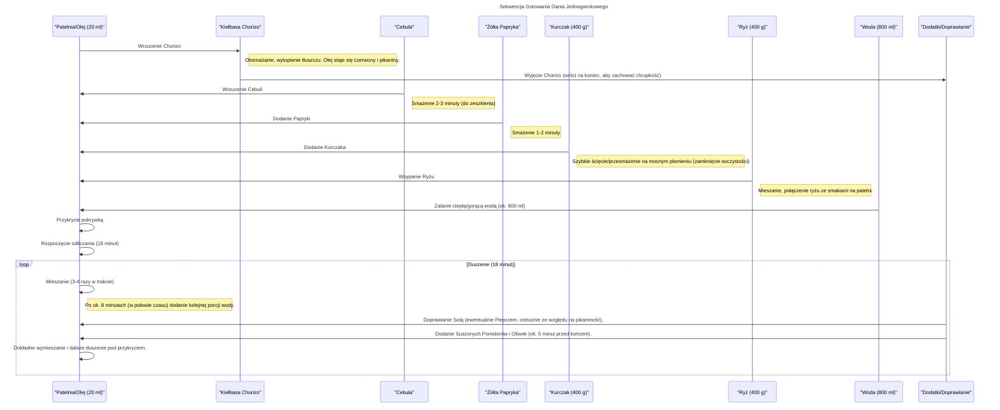

***

## JEDNOGARNKOWE DANIE Z CHORIZO I KURCZAKIEM (STYL MEAL PREP)

### I. Wprowadzenie i Koncepcja Dania

Witam serdecznie! Dzisiejszy odcinek to jeden z tych, w których kliknięcie przycisku „Lubię” nie będzie stanowić dla Was żadnego problemu. Przygotowujemy **danie jednogarnkowe**, będące połączeniem stylów: **hiszpańskiej paelli** i **jambalayi**.

Danie charakteryzuje się bardzo przyjemnym smakiem i **pikantnością**, osiągniętą przede wszystkim dzięki użyciu **kiełbasy chorizo**.

**Koncepcja "Biodro Polsce":**
Wszystkie składniki kupujecie w jednym sklepie, co zapewnia praktyczne i efektywne wykorzystanie czasu.

*   **Wzmocnienie Białka:** Dodatkowo podbijamy zawartość białka, używając **polędwicy z kurczaka**.
*   **Jakość Chorizo:** Kiełbasa chorizo ma bardzo dobry skład: **tylko mięso wieprzowe i papryka**, bez zbędnych dodatków.
*   **Trudność:** Dwie "nóżki" (niski poziom trudności).
*   **Czas Realizacji:** 17 minut roboty + 5 minut przygotowania.
*   **Rezultat:** 4 naprawdę solidne boxy.

***

### II. Składniki i Zakupy

Standardowo przedstawiam wszystkie składniki, które będą potrzebne do przygotowania tego dania. Na te 4 boxy zużyjemy praktycznie każdy produkt **w całości**, z dwoma wyjątkami:

| Produkt | Zużycie | Uwagi |
| :--- | :--- | :--- |
| **Oliwki** | Połowa słoika | Pozostała połowa na przyszłą partię. |
| **Oliwa (do smażenia)** | Połowa butelki | Pozostała połowa na przyszłą partię. |

Mając wszystko, czego potrzeba, lecimy na zakupy i zaczynamy gotowanie!

***

### III. Przygotowanie Wstępne (Mise en Place)

Przesmażamy wszystkie składniki przed rozgrzaniem patelni, aby były gotowe do wrzucania w odpowiedniej kolejności.

#### A. Obróbka Mięs i Tłuszczów

1.  **Kiełbasa Chorizo:**
    *   Kroimy połowę kiełbasy w plasterki.
    *   Drugą połowę kroimy w inny rodzaj plasterków (dla urozmaicenia tekstury).
2.  **Polędwica z Kurczaka (400 g):**
    *   Zmieniamy deskę do krojenia.
    *   Całe **400 gramów** kurczaka kroimy w **drobną kostkę**.

#### B. Obróbka Warzyw i Dodatków

1.  **Cebula:** Kroimy w **drobną kostkę**.
2.  **Żółta Papryka:** Stosujemy sprawdzoną technikę krojenia:
    *   Odkrajamy górę i dół.
    *   Rozcinamy wzdłuż.
    *   Wewnętrzne ścianki odchodzą, a nasiona są łatwe do usunięcia.
    *   Kroimy w małe paski lub kostkę.
3.  **Suszone Pomidory:** Zużywamy wszystkie pomidory, krojąc je w **kostkę**.
    *   **Olej z pomidorów (do smażenia):** Odlewamy około **20 ml** aromatycznego oleju z zalewy, na którym będziemy przyrządzać potrawę.
    *   **Olej z pomidorów (do makro):** Dodatkowo dorzucamy **15 ml** oleju, który jest na powierzchni pomidorów (wliczając go do makroskładników).
4.  **Oliwki:** Zużywamy **połowę słoika**. Każdą oliwkę kroimy na około **4 części**.

Wszystkie składniki czekają gotowe, aby trafić na patelnię.

***

### IV. Proces Gotowania – Sekwencja Jednogarnkowa

Do gotowania potrzebujemy **dużego naczynia** lub dużej patelni. Kolejność wrzucania składników jest kluczowa dla budowania smaku.

#### A. Schemat Sekwencji Gotowania

Poniższy diagram przedstawia kroki i czas gotowania:

#### B. Szczegóły Etapów

1.  **Smażenie Chorizo:**
    *   Rozgrzewamy olej i wrzucamy kawałki chorizo.
    *   Obracamy, aby kiełbasa przysmażyła się delikatnie z każdej strony, wytapiając sporą ilość tłuszczu.
    *   Powstaje aromatyczny, pikantny, czerwony olej (od papryki zawartej w kiełbasie).
    *   **Wyjęcie:** Przekładamy przysmażoną kiełbasę do osobnej miseczki. Zostanie dodana na sam koniec, aby **zachować twardość i delikatną chrupkość** (żeby nie rozgotowała się podczas duszenia ryżu).

2.  **Smażenie Warzyw i Kurczaka:**
    *   Na patelnię (z olejem po chorizo) wrzucamy **cebulę**. Smażymy 2–3 minuty (do zeszklenia, utraty surowości).
    *   Dorzuć **żółtą paprykę**. Smażymy dodatkowo 1–2 minuty.
    *   Wrzucamy **kurczaka**. Używamy dosyć **mocnego płomienia**, aby kurczak szybko się ściął i zamknął soczystość w kawałkach. (Nie martwimy się o całkowitą miękkość, ponieważ będzie duszony z ryżem).

3.  **Dodanie Ryżu i Płynu:**
    *   Po 2–3 minutach smażenia kurczaka, wsypujemy **400 gramów ryżu**.
    *   Cały czas utrzymujemy płomień pod patelnią. Mieszamy całość, aby ryż wchłonął wszystkie smaki.
    *   Wlewamy ciepłą lub gorącą wodę w ilości, która **całkowicie zakryje ryż** (u mnie było to mniej więcej **800 ml**).

4.  **Duszenie (18 Minut):**
    *   Gdy woda zacznie się gotować, przykrywamy patelnię pokrywką i zaczynamy odliczać czas.
    *   **Mieszanie:** Ryż mieszamy 3–4 razy w trakcie duszenia.
    *   **Uzupełnianie Wody:** W szybkim tempie ubywa płynu. Mniej więcej **w połowie czasu (po około 8 minutach)** należy dodać kolejną porcję wody.
    *   **Doprawianie:** Doprawiamy potrawę **solą** (ewentualnie pieprzem, choć potrawa jest już dosyć pikantna).
    *   **Dodatki:** Mniej więcej **5 minut od końca** duszenia dodajemy suszone pomidory i oliwki. Mieszamy i dalej dusimy pod przykryciem.

***

### V. Finał i Podział na Boxy

Po upływie **18 minut** wyłączamy płomień pod patelnią.

**Kontrola Konsystencji:**
*   Struktura ryżu powinna być mokra i otoczona smakami, ale na dnie nie powinno być zalegającej wody.
*   Chwilę wcześniej można spróbować ziarenek ryżu – powinien być **średnio miękki**.

**Ostatni Krok:**
Do gotowego ryżu, przy wyłączonym palniku, dorzucamy wcześniej odłożoną **kiełbasę chorizo**. Mieszamy wszystko razem.

**Ładowanie Boxów:**
*   Używamy pojemników o pojemności **1,2 litra**.
*   Rozdzielamy całość wizualnie po równo.
*   Otrzymujemy gotowe, przepyszne **4 lunch boxy**: ryż, kurczak, chorizo.

**Charakterystyka Dania:**
Danie jest **optymalnie pikantne**. Wszystkie składniki spełniają swoją rolę, ale to **kiełbasa chorizo** nadała najwięcej smaku i pikantności.

***

### VI. Podsumowanie i Wartości Odżywcze

Boxy są gotowe i sycące. Zachęcam do robienia i próbowania!

Wkrótce udostępnię makroskładniki i kalorie na jedno takie danie. Piszcie śmiało w komentarzach, jak Wam wyszło i jak smakowało.

Do zobaczenia w kolejnym odcinku! Cześć!