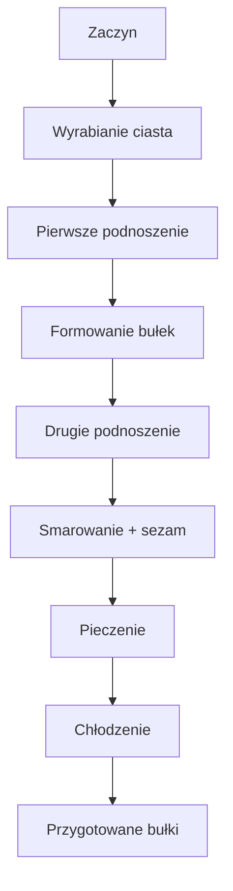

---

## 📣 Wstęp  
No witajcie moi drodzy widzowie! Ponownie pokażę Wam, jak zrobić przepyszne domowe bułki hamburgerowe krok po kroku. Niektórzy z Was mogli już je zobaczyć, kiedy robiliśmy McChickena. Piszecie do mnie, że są wyśmienite, że zawsze wychodzą maślane, puszyste. Dlatego postanowiłem wrzucić je osobno. Gdyż będziemy korzystać przy kolejnych odcinkach z burgerami. Także nie ma na co czekać, zaczynajmy!

---

## 🥖 Składniki  
Przed Wami wszystkie produkty, które są potrzebne (ilość na 4 hamburgerowe bułki):

| Składnik | Ilość | Notatka |
|----------|-------|---------|
| **Mąka** | 400 g | Typ 650 |
| **Masło** | 40 g | Przygotowane w ciepłym płynie |
| **Mleko** | 150 ml | Zimne, z lodówki |
| **Drożdże** | 25 g | Świeże (≈ 7–8 g suchych) |
| **Sól** | 5 g |  |
| **Cukier** | 10 g | Cukier brązowy |
| **Woda** | 100 ml | Ciepła, do zaczynu |

> **Wskazówka** – robimy zaczyn na ciepłym płynie: 150 ml mleka + 100 ml wody (gorącej).

---

## 🔄 Przygotowanie zaczynu  
1. **Mleko** wylatujemy z lodówki.  
2. Dodajemy 100 ml **ciepłej wody** – już mamy ciepły płyn.  
3. Do tego wlewamy **drożdże** i **cukier**.  
4. **Łyżką** odsialamy i mieszamy dokładnie, rozgnieść drożdże, by nie było grudek.  
5. Odstawiamy na **10 min** – w tym czasie możemy roztopić masło, by później wlać do ciasta w płynnej formie.

---

## 🛠️ Wyrabianie ciasta  
1. Na **michę** (lub blat) wlewamy zaczyn, **sól**, roztopione masło.  
2. **Łopatką** mieszać, dopóki ciasto nie będzie **mocno wilgotne** – im bardziej mokre, tym lepsze.  
3. Przenosimy na blat i wyrabiamy **10–15 min** bez oszukiwania.  
4. Po wyrabianiu ciasto powinno być **najlepsze** – gotowe do dalszego podziału.

---

## ⏱️ Pierwsze podnoszenie  
- Ciasto **waży** 700 g.  
- Dzielimy je na **4** części po **175 g** każda.  
- Formujemy kulki, kładziemy na blachę wyłożoną papierem do pieczenia.  
- Przykrywamy folią (z luźnym miejscem, by bułki mogły rosnąć) i pozostawiamy w ciepłym miejscu na **1 h**.

---

## ✨ Formowanie bułek i drugie podnoszenie  
1. Po godzinie ściągamy każdą podzieloną część, usuwamy nadmiar gazów.  
2. Formujemy finalne bułeczki.  
3. Ponownie przykrywamy i pozostawiamy na **30 min**.

---

## 🧈 Smarowanie i sezam  
- Do każdego bułka smarujemy **żółtko** z odrobiną mleka.  
- Każdą bułę dokładnie pokrywa, także boki.  
- Posypujemy **białe sezam** – kilka ziarenek na każdą bułę.

---

## 🔥 Pieczenie  
- **Piekarnik** rozgrzewamy: **200 °C**, grzanie góra‑dół.  
- Pieczymy, aż bułki będą **piękne** i **gorące**.  
- Po upieczeniu odczekujemy, aż **ostygną**, aby można było je pokroić.

---

## 🕵️‍♂️ Wnętrze bułki  
- Po ostudzeniu buły pokazujemy w środku:  
  - **Sprężystość**,  
  - **Duża objętość**,  
  - **Lekkość** i **pulchność**.  
- Maślany posmak wciąż wyczuwalny – świetna sprawa!

---

## 📊 Makroskładniki i kalorie  
*(Tu warto dodać dokładne dane, ale w oryginale nie podano szczegółów – pozostawiamy sekcję na przyszłość.)*

---

## 🎉 Zakończenie  
- **Makroskładniki i kalorie**: [tutaj można wprowadzić dane].  
- Zapraszam do lajkowania, zostawienia komentarza.  
- Do zobaczenia w kolejnym odcinku, cześć!  

---

## 🔄 Diagram procesu (Mermaid)  

---

**Uwaga:** Wszystkie kroki są opisane w oryginalnym, lekko żartobliwym stylu, zachowując pełną ilość informacji i szczegółów.