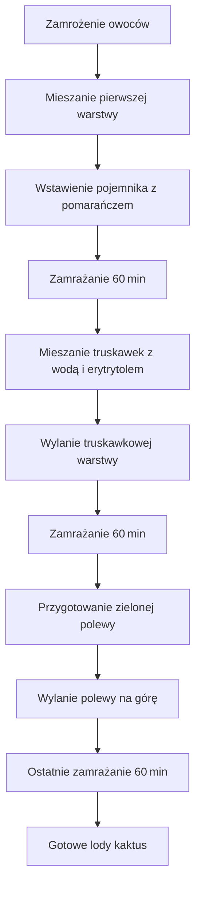

---

## 1. Wstęp  
**Witajcie moi drodzy widzowie!**  
Mam nadzieję, że jesteście gotowi na nieco ochłodzenia, nieco orzeźwienia. **Robimy dzisiaj lody niczym kaktus!**  
**Kaktus 500+** – czyli pojemność powyżej **0,5 l**.  
W tym odcinku pokażę, jak zrobić dwa pojemniki: standardowo 3 kolory:  
1. **Pomarańczowa** (ananasowo‑pomarańczowy smak)  
2. **Truskawkowa**  
3. **Zielona** z igłami kaktusa (polewa)

---

## 2. Materiały i narzędzia  

| **Nazwa**               | **Ilość**                     | **Opis**                                      |
|-------------------------|-------------------------------|----------------------------------------------|
| **Ananas**              | 300 g zamrożonego (lub z puszki) | Pokrojony w plasterki                       |
| **Truskawki**           | 200 g zamrożonego             | Pokrojone w plasterki                        |
| **Sok pomarańczowy**    | 200 ml (z 4 małych pomarańczy) | Zimny, wyjęty z lodówki                     |
| **Woda**                | 100 ml (do truskawek)         | Do rozcieńczenia                              |
| **Erytrytol**           | 10‑15 g (do truskawek)        | Do słodzenia, aby nie było grudek             |
| **Isotonic od Allnutrition** | 0,5 l płynu (1,5 miarki)  | Smak pomarańczowy, witaminy, minerały        |
| **Barwnik pomarańczowy** | -                             | Dodatek koloru, nie rozpuszcza się w tłuszczu |
| **Barwnik zielony**      | 2 łyżeczki mleka (nośnik)      | Dla zielonej polewy                          |
| **Olejek kokosowy**      | 30 ml                         | Do polewy, możesz użyć nierafinowanego        |
| **Sok z połowy cytryny** | -                             | Dodaje kwaskowatość                          |
| **Frytki**              | -                             | Do wypełnienia pochylenia pojemników         |
| **Ninja (blend)**       | -                             | Do miksowania                                |

**Uwaga:** Na kod „PoliczonaSzama” masz **10 %** rabatu na wybrane produkty!

---

## 3. Przygotowanie owoców  
1. **Zamrożenie ananasa** – wcześniej zamroź połowę ananasa, aby uzyskać **300 g** zamrożonych kawałków.  
2. **Pokrojenie** – pokrój ananas i truskawki w plasterki (jeśli używasz świeżych, możesz od razu umieścić je w zamrażarce).  
3. **Zimny sok pomarańczowy** – wyciśnij 200 ml soku z 4 małych pomarańczy, zostaw w lodówce, aby było bardzo zimne.  
4. **Humor** – *“Ooo, jakie soczyste się wydają, ładnie!”*

---

## 4. Mieszanie i zamrażanie  
### 4.1. Mieszanie pierwszej warstwy (pomarańczowa)  
- Wlej **200 ml** soku pomarańczowego do pojemnika.  
- Dodaj **Isotonic od Allnutrition** (0,5 l płynu).  
- **Wymieszaj** i „Ooo, jakie soczyste się wydają, ładnie!”  

### 4.2. Mieszanie drugiej warstwy (truskawkowa)  
- Wlej **100 ml** wody, dodaj **Erytrytol** (10‑15 g).  
- Dodaj **sok z połowy cytryny** dla kwaskowatości.  
- **Miksuj** w Ninja do uzyskania gładkiej konsystencji.

### 4.3. Przygotowanie zielonej polewy  
1. **Olejek kokosowy** – wlej 30 ml.  
2. **Barwnik zielony** – użyj barwnika spożywczego, ale najtańsze rodzaje nie rozpuszczają się w tłuszczu.  
3. **Nośnik** – wlewamy 2 łyżeczki mleka (baza biała).  
4. **Barwnik pomarańczowy** – dodaj 1‑2 kropel, mieszając z spieniaczem do mleka (mini blend).  
5. **Mieszanie** – mieszaj do uzyskania pożądanej intensywności zielonego koloru.

---

## 4. Warstwowanie lodów  

### 4.1. Warstwa 1 – pomarańczowa  
- **Zamrożenie** pojemnika (początkowe wstawienie).  
- **Frytki** używamy do wypełnienia pochylenia pojemnika, aby warstwa była pod kątem.  
- *“Zmieniamy pozycję, trzymamy rękę, a w końcu się to trzyma!”*

### 4.2. Warstwa 2 – truskawkowa  
- **Mieszanie**: 200 g truskawek + 100 ml wody + 10‑15 g erytrytolu.  
- **Zimny sok pomarańczowy** (200 ml) wstrzykiwany po zmrożeniu warstwy 1.  
- **Podtrzymanie** – jedna ręka wtrzymuje pojemnik, druga łacze polewę.

### 4.3. Polewa zielona z igłami kaktusa  
- **Igiełka** – kawałki orzeszków (w praktyce „igiełki kaktusa”).  
- **Polewa** – 30 ml oleju kokosowego + zielony barwnik (mleko jako nośnik) + barwnik pomarańczowy (do uzyskania nasycenia).  
- **Wymieszaj** w mini blendzie, aż kolor będzie **PIĘKNY ZIELONY**.  
- **Szybkie stężeżenie** – polewa od razu stężeje, bo jest bardzo zimna.

---

## 5. Finalne łączenie  
1. **Wylewanie pierwszej warstwy** – wylej pomarańczową polewę na zmrożoną warstwę.  
2. **Ujednolicenie powierzchni** – możesz podłożyć mały koreczek lub „O” z mleka, żeby uzyskać gładką linię.  
3. **Wstawienie do zamrażarki** – ostatni raz lody wstawiam do zamrażarki **≈ 60 min**, by się porządnie zmrożyły.  

---

## 6. Przegląd i degustacja  
- **Sprawdź kolejność kolorów** – żółta na dole, pomarańczowa w środku, zielona na górze.  
- **Poczuj smaki** – wyczuwalny ananas, pomarańcza, gruby kawałek polewy.  
- **Makro i kalorie** – na jedną porcję makro i kalorie w porządku.  
- **Komentuj** – jeśli odcinek się podobał, łap w górę, pisz komentarze, jak smakowało, i próbuj w domu!  

---

## 7. Podsumowanie i pożegnanie  
> **„Aaale cudowny sorbet, idealna proporcja owoców i wody! Mmm, coś pysznego! Aaale pyszny!”**  
> *Wyczuwalny ananas, pomarańcza, gruby kawałek polewy łapie makro i kalorie na jedną porcję.*  

Jeśli odcinek się podobał, łap w górę, pisz komentarze, jak smakowało, rób w domu, a ja zobaczymy się w kolejnym odcinku!  
**Do zobaczenia, cześć!**

---

## 8. Schemat procesu (Mermaid)

---