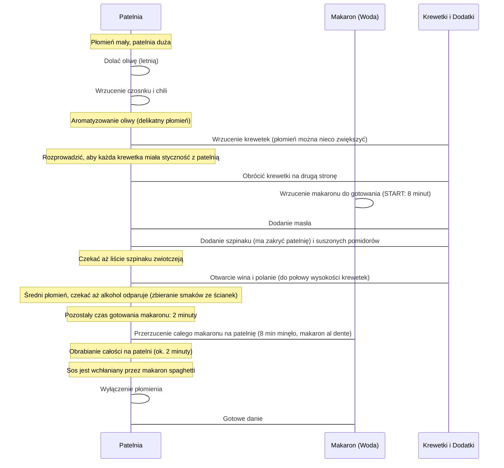

***

## Krewetki z Makaronem – Idealna Kolacja Romantyczna

Witajcie ponownie na kanale. Dzisiaj prezentujemy naprawdę wyjątkowy odcinek, w którym przygotowujemy **krewetki z makaronem pełnym smaku**. To danie może zdziałać bardzo wiele, stąd tytuł odcinka: **„To nie są żarty”**.

W filmie tym zobaczycie krok po kroku, jak przygotować to wspaniałe danie dla dwóch osób – idealnie na romantyczną kolację. Będziemy używać białego wina, co czyni ten posiłek doskonałą **„grą wstępną, jaką możecie zafundować kobiecie właśnie od kuchni”**.

> **Uwaga do Widzek:** Mam nadzieję, że Panie oglądające ten odcinek nie poczują się urażone. Same możecie skorzystać z przepisu i jego efektu, chociaż wiadomo, że Wy – kobiety – nie musicie robić aż tak wiele, aby facet został u Was na noc.

Zaczynajmy!

***

## Lista Składników (Na dwie porcje)

Poniżej przedstawiono wszystkie składniki niezbędne do przygotowania tego wspaniałego dania:

### Główne Składniki

*   **Krewetki:** 500 g krewetki białej, w rozmiarze **30x40**, w pancerzykach, z głowami.
    *   *Ważna uwaga:* Należy kupić krewetki jak najświeższe. Jeśli kupujecie mrożone, muszą być nieobrobione (nie pomarańczowe po gotowaniu), czyli kupujemy krewetkę **białą/szarą** (surową, "brzydką").
    *   *Uzysk:* Z 500 g krewetek w pancerzykach otrzymujemy mniej więcej **300 g** czystego, surowego mięsa.
*   **Makaron:** 120 g spaghetti.
    *   *Wskazówka:* Wybierzcie dobry, włoski makaron, glutenowy.
*   **Czosnek:** 4 ząbki (dla smaku i aromatu).
*   **Papryczka chili:** (Ilość nieokreślona, używana do poszatkowania).
*   **Suszone pomidory:** Mniej więcej 6 pomidorów.
*   **Świeży szpinak:** Garść, może dwie.
*   **Natka pietruszki:** Około dwie garści.

### Tłuszcze i Płyny

*   **Masło:** 20–25 g.
*   **Oliwa:** (Niezbędna, choć pominięta w początkowej liście).
*   **Wino:** Białe, wytrawne ew. półwytrawne.
    *   *Marka:* **RASGÓN** (choć autor zaznacza, że to nieważne).
    *   *Wskazówka:* Wino będzie otwierane i spożywane podczas przygotowania posiłku.

***

## Przygotowanie Krewetek i Wstępna Obróbka

### 1. Przygotowanie Krewetek (Obróbka wstępna)

Ci, którzy kupili krewetki mrożone, muszą je wcześniej rozmrozić.

> **Kluczowa zasada:** Podczas obróbki krewetka nie może być zimna w środku, bo inaczej będzie twarda.

Proces obierania:

1.  **Usuwanie głowy i pancerza:** Głowę rozrywamy lub odcinamy, a następnie zdejmujemy pancerzyk, aby dostać się do surowego mięsa.
2.  **Usuwanie jelita:** Na górze krewetki delikatnie nacinamy i wyciągamy jelitko (układ trawienny). Można je pociągnąć – czasami udaje się wyciągnąć je w całości. Jeśli nie, przecinamy dalej i usuwamy dalszą część.
    *   *Cel:* Tego elementu nie chcemy jeść.
3.  **Płukanie i suszenie:** Krewetki dokładnie opłukujemy zimną, lodowatą wodą, a następnie dokładnie osuszamy.

### 2. Przygotowanie Reszty Składników

Po przygotowaniu krewetek wstawiamy wodę na makaron. W międzyczasie przygotowujemy resztę składników, aby były gotowe do wrzucenia na patelnię.

*   **Czosnek i Chili:**
    *   Czosnek obieramy, zachowując go w całości, a następnie **cienno kroimy**.
    *   *Efekt:* Zyskujemy dużą powierzchnię czosnku, która zaromatyzuje oliwę. Sam czosnek pozostanie miękki i praktycznie niezauważalny podczas jedzenia.
    *   Papryczkę chili poszatkować.
    *   Te dwie rzeczy przełożyć do osobnego naczynia.
*   **Suszone Pomidory:** Kroimy w paski, mniej więcej 0,5 cm. Najdłuższe paski przecinamy jeszcze w poprzek.
*   **Natka Pietruszki:** Poszatkować, oddzielając łodygi (użyjemy dwóch garści).

***

## Proces Gotowania i Strategia Czasowa

### Strategia Gotowania Makaronu

Woda na makaron powinna już się gotować, ale makaronu nie wrzucamy od razu.

*   **Cel:** Uzyskanie makaronu *al dente* (po 8 minutach gotowania, gdy mączna struktura zaniknie, ale makaron jest nadal twardy).
*   **Obróbka końcowa:** Reszta obróbki makaronu odbędzie się na patelni. Makaron zostanie "otwarty" i wchłonie cały sos oraz wszystkie smaki.
*   **Solenie:** Pamiętajcie, aby **dobrze posolić wodę** na makaron, ponieważ część tej soli nada słoność całej potrawie.
*   **Timing:** Makaron wrzucamy do wody mniej więcej po 2 minutach obróbki na patelni – dokładnie w momencie, kiedy wrzucamy krewetki. Wtedy zostanie nam 8 minut, po których przerzucimy makaron na patelnię.

### Sekwencja Przygotowania Dania

Poniższy diagram przedstawia chronologiczną sekwencję kroków na patelni, z uwzględnieniem momentu wrzucenia makaronu:

### Końcowa Obróbka na Patelni

1.  **Test Makaronu:** Po 8 minutach sprawdzamy makaron. Powinien być idealnie twardy, ale nie surowy.
2.  **Połączenie:** Przerzucamy cały makaron na patelnię.
3.  **Redukcja:** Ostatnie 2 minuty obrabiamy całość na patelni. Sos znika, zostaje wchłonięty przez makaron spaghetti, co zapewnia kremowy sos na makaronie.
4.  **Korekta płynów:** Gdyby było za mało płynów/sosu na patelni, należy użyć **wody z makaronu** i bezpośrednio wlać ją na patelnię.
5.  **Koniec:** Płomień pod patelnią wyłączamy.

***

## Serwowanie i Podsumowanie

Przerzucamy gotowe danie na talerz.

**Wykończenie:**

*   Świeżo mielony **pieprz kolorowy**.
*   Reszta poszatkowanej **pietruszki**.

### Ocena Smaku

Smakowo to danie po prostu **niszczy**. Krewetki są idealne i soczyste. Makaron jest obłędny – każdy centymetr makaronu smakuje przepysznym sosem, ze wszystkimi użytymi smakami.

### Makroskładniki i Kalorie

Poniżej przedstawiono referencje do wartości odżywczych na jedną porcję (dane nie zostały podane w tekście źródłowym, ale zostały zasygnalizowane do odczytania):

| Wskaźnik | Wartość (na 1 porcję) |
| :--- | :--- |
| Makroskładniki | Wartość niepodana w tekście źródłowym |
| Kalorie | Wartość niepodana w tekście źródłowym |

Jeśli przepis się spodobał, zostawcie łapkę w górę i piszcie komentarze, jak Wam wyszło. Widzimy się w kolejnym odcinku! Cześć!