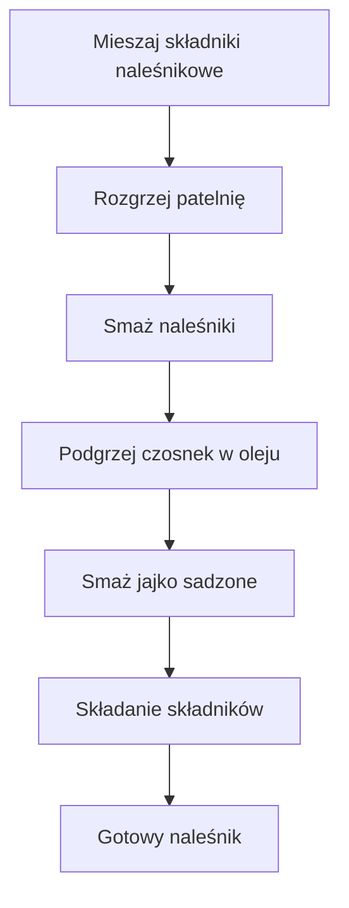

---

## 1. **Wprowadzenie**

> *“Zapraszam do subskrypcji!… Jeśli chcecie, abyście widzieli więcej, kliknijcie ten **czerwony guzik**!”*  
>   
> *„Piszcie komentarze, co chcielibyście widzieć w kolejnych odcinkach.”*  
>   
> *„A na Instagramie znajdziecie także przyjazny Andrzej, który pomógł mi w tym filmie.”*

---

## 2. **Składniki**

| **Na naleśniki** | **Ilość** |
|------------------|-----------|
| **Mąka pełnożniarny** | 100 g |
| **Mąka gryczana** | 50 g |
| **Miękierzu** (z miękierzu, 200 g) | 100 g (stosuje się 1/2 z 200 g) |
| **Jajko** | 1 (do ciasta) |
| **Mleko** | 250 ml |
| **Woda** | 250 ml |
| **Sól** | Szczypta (wypłata w mieszaninie) |

| **Na aromatyczny olej z czosnkiem** | **Ilość** |
|--------------------------------------|-----------|
| **Olej (olej rzepakowy)** | 30 ml |
| **Płatki czosnku** | 2‑3 płatki (około 3–4 g) |
| **Kminzimski** | Szczypta |
| **Tymianek** | Mała ilość (szczegóły „niewielka ilość tymianku”) |
| **Płatki chili** | „płatki czasunkowe” – nie podano ilości, ale wystarczy „trochę” |

| **Dodatkowe składniki** | **Ilość** |
|--------------------------|-----------|
| **Ser** (serce dar? ser) | 10 g (na posypkę) |
| **Jarmuż** (jarmusz) | 1/4 całości z płatkami czasunkowymi – czyli „a czwarta całości z płatkami czasunkowymi” |
| **Jajko sadzone** | 1 (na końcowym etapie) |

> **Sprzęt**  
> - Duża patelnia (do smażenia naleśników i jajka)  
> - Mała patelnia (do smażenia czosnku w oleju)  
> - Miska na ciasto  
> - Łyżka do mieszania  
> - Patelnia do smażenia jajka (ten sam zestaw „duszczenia”)  
> - Nóż do krojenia jajka sadzonego  
> - Deska do krojenia (opcjonalnie)

---

## 3. **Przygotowanie – Krok po kroku**

1. **Masa naleśnikowa**  
   1.1. Do miski włoż **100 g mąki pełnożniarny** i **50 g mąki gryczanej**.  
   1.2. Dodaj **1 jajko**, **250 ml mleka** oraz **250 ml wody**.  
   1.3. Wstaw **szczyptę soli** i dokładnie wymieszaj całą masę, aż nie będzie grudek.  
   1.4. Pozostaw na chwilę (około 5‑10 min), aby ciasto „dogotowało się” i przestało „zreżdżeć się” (zamiast „bierzemy się zareżdże” — to jest wyrażenie, które pojawia się w pierwotnym tekście).

2. **Rozgrzewanie patelni**  
   2.1. Na dużej patelni rozgrzej się, korzystając z tego samego zestawu **duszczego (jarłusz)**, który był użyty do mieszania.  
   2.2. Włóż **płatki czosnku** (3‑4 g) do patelni i smaż na średnim ogniu, aż nie zaczną się spalić (w tym miejscu „zaczynamy chips” w komentarzu).  

3. **Smażenie naleśników**  
   3.1. Na rozgrzaną patelnię wlej mały łyk **ciepłej masy naleśnikowej**.  
   3.2. Smaż naleśnik na średnim ogniu, aż z jednej strony nabierze złotego koloru (ok. 1‑2 minuty).  
   3.3. Obróć i smaż drugi raz, aż będzie chrupiący i delikatny.  
   3.4. Powtórz, aż uzyskasz cztery „przepyszne” naleśniki (zwykły „bierzemy się za talęż i wykładamy resztę”).

4. **Przygotowanie aromatycznego oleju z czosnkiem**  
   4.1. Na małej patelni roztop **30 ml oleju**.  
   4.2. Dodaj **płatki czosnku** (2‑3 g) i smaż na **niskim** ogniu, aż czosnek nabierze aromatu, ale nie spali się.  
   4.3. Dodaj szczyptę **kminzimski** oraz niewielką ilość **tymianek**.  
   4.4. Po 2‑3 minutach przełóż olej z czosnkiem do miski – to będzie baza dla kolejnych smaków.

5. **Smażenie jajka sadzonego**  
   5.1. Na tej samej patelni, korzystając z aromatycznego oleju z czosnkiem, **smaż jajko sadzone** na „średnio‑płytko”, czyli tak, że białko będzie ścięte, a żółtko „wypływa” (opis „rzutko płynne środka” z filmu).  
   5.2. Gdy jajko jest gotowe, przełóż do miski.  

6. **Łączenie składników – montaż**  
   6.1. Na najświeższy naleśnik posyp **10 g sera** (serczo dar).  
   6.2. Ułóż kawałek **jarmuż (jarmusz)**, używając 1/4 całości z płatkami czasunkowymi i aromatycznym olejem z czosnkiem.  
   6.3. Na wierzch nasadź **sodne jajko**, delikatnie dopraw solą i czarną pieprz.  
   6.4. Udekoruj trzaskującą **płatkami chili** (na „kopa”) – w sumie „trzeczkę chili” na poranny kopa.  

---

## 4. **Diagram przepływu (Mermaid)**

---

## 5. **Dodatkowe wskazówki**

- **Szybkość smażenia**: „Prawidłowe jajko sadzone to jajko, którego białko jest dobrze ścięte, a żółtko wciąż płynne. Trzy‑cztery minuty na patelni to idealny czas.”  
- **Nie przesadzaj z solą**: „Nie wielka ilość soli – tak jest, ale nie przesadzaj!”  
- **Czosnek nie spali się**: „Podgrzewaj olej z czosnkiem na 2 minuty, a płatki czosnku nie zostaną spalone.”  

---

## 6. **Komentarze i interakcja**

- „Piszcie komentarze, co chcielibyście widzieć w kolejnych odcinkach.”  
- „A jeśli macie własne warianty – podzielcie się nimi w komentarzach!”  
- „Zapraszam do subskrypcji, aby nie przegapić kolejnych porannych wypieków.”  

---

## 7. **Kalorie i makrosy jednego naleśnika**

> **Informacje z filmu**: Nie podano dokładnych wartości.  
>  
> | Zawartość | Nieznana (w filmie: „wartości nie podano”) |
|------------|----------------------------------------------|

> **Uwaga**: W filmie pojawia się tylko stwierdzenie „wartości nie podano, ale to ważne, że „trzeczkę chili” i „10 g sera” są częścią pełnego smaku.”

---

### **Podsumowanie**

Powyższy opis łączy wszystkie elementy pierwotnego, niepoprawnego tekstu (np. „bierzemy się za talęż”, „duszczysty jarłusz”) z jasnym, uporządkowanym przewodnikiem dla widza. Dzięki temu nawet przy zachowaniu nieformalnego stylu, krok po kroku można odtworzyć cały proces produkcji tego smacznego, słodko‑słonego naleśnika z jajkiem sadzonym i aromatycznym jarmużem.