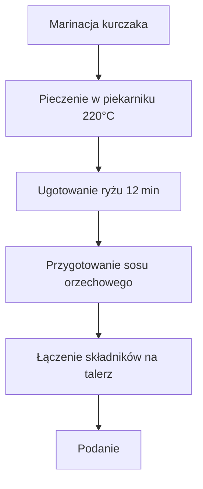

---  

## 1. Wprowadzenie  
**Witajcie moi drodzy widzowie** w kolejnym przepysznym odcinku **Policzonej Szamy**!  
Dziś robimy **grillowanego kurczaka z sosem orzechowym** – kurczak odpowiednio zamarynowany, zgrillowany we własnym domowym piekarniku, i oczywiście epicki sos orzechowy.  

> Całe danie w tajskich klimatach, a sos to coś świetnego!  
> Naprawdę warto! Nawet polecam osobom, które nie przepadają za masłem orzechowym – bo jest tam mnóstwo, mnóstwo smaków!  

Standardowo, jak to na kanale, prosto, szybko i konkretnie:  
- **Zobaczycie, jak zrobić dwie porcje**  
- **I to, co najważniejsze, za co lubicie ten kanał**  
- Oprócz rewelacyjnej potrawy dostajecie super makrosy  

Wiem, że ślinka leci – nie ma na co czekać, zaczynajmy!  

---  

## 2. Składniki (na 2 porcje)  

| **Składnik** | **Ilość** |
|--------------|-----------|
| **Pierś z kurczaka** | 300 g (150 g na porcję) |
| **Ryż basmati lub jaśminowy** | 80 g na porcję (160 g łącznie) |
| **Jogurt naturalny** | 100 g (w przeliczeniu na marynatę) |
| **Sos sojowy** | 20 g |
| **Papryczka chili** | 1 (na koniec) |
| **Kolendra** | odrobina (do dekoracji) |
| **Czosnek** | 1 ząbek |
| **Imbir** | 0,5 łyżeczki świeżego (lub 0,5 łyżeczki mielonego) |
| **Masło orzechowe (orzechy nerkowca)** | 50 g |
| **Miód** | 20 g |
| **Limonka** | 1 (polowa do sosu, druga połowa do dekoracji) |
| **Mleczko kokosowe** | 50 ml |
| **Płatki chili** | odrobinę (do smaku) |
| **Pieprz świeżo mielony** | do smaku |

> **Ważne**: Nie ma tłuszczu do smażenia – cała wartość tłuszczu pochodzi z sosu orzechowego. Kurczaka pieczemy w piekarniku w marynacie, a węglowodany są niskotłuszczowe.

---  

## 3. Przygotowanie  

### 3.1. Marynata do kurczaka  
1. **Przygotuj miskę** i wrzuć:  
   - 2 łyżki sosu sojowego (≈15 ml)  
   - 40 g jogurtu naturalnego  
   - obrobiony ząbek czosnku (wciskany)  
   - 0,5 łyżeczki świeżego imbiru (lub 0,5 łyżeczki mielonego)  
   - odrobinę pieprzu świeżo mielonego  
2. **Rozmixuj** wszystkie składniki, aby uzyskać jednolitą marynatę.  
3. **Rozłóż** pierś z kurczaka na patyczkach do szaszłyków, formując długie paski z zygzakami.  
4. **Obłóż** mięso marynatą, dokładnie wymieszaj, aby wszystkie kawałki były pokryte.  
5. **Odstaw** na bok – najlepiej na godzinę wcześniej, żeby mięso dobrze zamarynowało się i ogrzało do temperatury pokojowej.

### 3.2. Gotowanie ryżu  
- **Ugotuj** ryż jaśminowy w lekko osolonej wodzie przez 12 minut.  

### 3.3. Pieczenie kurczaka  
1. **Rozgrzej** piekarnik do **220 °C** (termoobieg).  
2. **Ułóż** szaszłyki z kurczaka na blasze i wstaw do piekarnika.  
3. **Piecz** przez **12 minut** – powinno być pięknie zarumienione i chrupiące na zewnątrz.  

---  

## 4. Sos orzechowy  

| **Etap** | **Opis** |
|----------|----------|
| **Mieszanie** | Połącz: masło orzechowe, miód, mleczko kokosowe, sok z połowy limonki, sos sojowy, płatki chili oraz papryczkę chili. |
| **Podgrzewanie** | Podgrzewaj mieszankę na małym ogniu, mieszając dokładnie, aby uzyskać jednolitą konsystencję (beżowo-brązową). |
| **Dostosowanie smaku** | Dodaj dodatkowe płatki chili (jeśli lubisz ostrzejszy sos). |
| **Końcowy touch** | Dodaj sok z **polowy limonki**, dokładnie wymieszaj i wyłącz ogień. |

---  

## 5. Platerowanie  

1. **Rozdziel** ugotowany ryż na dwa talerze.  
2. **Wykładaj** na każdy talerz po jednym szaszłykowo-grzanym kawałku kurczaka.  
3. **Zdekoruj**:  
   - **Mix sałat** i duże ilości kiełków słonecznika na wierzch ryżu.  
   - **Kilka liści kolendry** (dosłownie).  
   - **Chili w cienkich plasterkach** (na wierzch ryżu).  
   - **Kawałki orzeszków nerkowca** na wierzch kurczaka (opcjonalnie).  

4. **Podaj** **dwóch małych miseczek dipowych** z przygotowanym sosem orzechowym (konsystencja już lekko zgęstniała).  
5. **Sok z połowy limonki** wykorzystaj także do dekoracji – dłoń i pociągnij w ćwiartki do dania.  

---  

## 6. Makro i kalorie  
> **Kurczak, ojejku!**  
> Najlepsza część odcinka – **makrosy i kalorie** na jedną porcję (pokażemy je później, jeśli odcinek się podobał).  

---  

## 7. Zakończenie  
- **Łapa w górę**, jeśli odcinek się podobał!  
- **Piszcie komentarze** – kto zrobił, komu wyszło, jak smakowało.  
- **Do zobaczenia** w kolejnym odcinku, cześć!  

---  

## 8. Diagram przepisu (Mermaid)  

---  

**Łapa w górę** – jeśli odcinek się podobał, zostawiamy komentarze i do zobaczenia w kolejnej odsłonie!