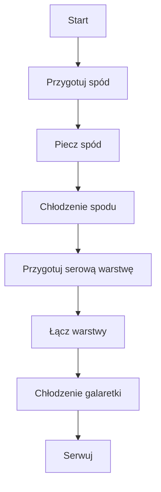

---  

## 🎉 WSTĘP  
Witajcie moi drodzy widzowie! Co dziś będziemy piec? **Ciasto leśne, ale fit** – bez cukru, z zielonym spodem, serową warstwą z kokosem i górną warstwą z malinową galaretką. Nie wchodzimy na cukiernicze zawody, tylko pokazujemy, jak zrobić pyszne, zdrowe ciasto, które nie zaburzy twojego kalorycznego balansu.  

---

## 🥄 SKŁADNIKI  

| Część | Składnik | Ilość |
|-------|----------|-------|
| **Spód** | Szpinak świeży | 100 g |
|  | Masło | 20 g |
|  | Jajka (po 2-3) | – |
|  | Mąka (typ tortowy) | 150 g |
|  | Proszek do pieczenia | 2 łyżeczki (≈10 g) |
|  | Żelatyna (do ciasta?) | – |
| **Serowa warstwa** | Twaróg | 200–250 g |
|  | Kokos wiórki | 30–50 g |
|  | Żelatyna | 15 g |
|  | Gorąca woda | 0,5 l |
|  | Woda (do rozpuszczenia żelatyny) | 100 ml |
| **Galaretka** | Maliny mrożone | 250 g |
|  | Żelatyna | 15 g |
|  | Gorąca woda | 0,5 l |
| **Dodatkowe** | Papier do pieczenia | – |
|  | Folia spożywcza | – |
|  | Formę (24 cm średnicy) | – |

> **Ważne:** Nie wchodź w cukiernicze zawody – to tylko 200 kcal na kawałek, a nie “pół metra w górę” wymiary.

---

## 🔧 KROK PO KROKU

### 1️⃣ Przygotowanie spodu  
1. **Rozgrzej piekarnik** na **175 °C** (tzw. „nigdy nie góra-dół”).  
2. **Blenduj** 100 g świeżego szpinaku z 20 g roztopionego masła, aż uzyskasz jednolitą, gładką pastę.  
3. **Mieszaj szybko**: w misce rozbij jajka (temperatura pokojowa), dodaj pastę szpinkową, a potem mąkę (150 g) oraz proszek do pieczenia (2 łyżeczki).  
4. **Napowietrzaj** – miksuj aż składniki będą lekkie i powietrza.  
5. **Wlej** ciasto do 24 cm formy wyłożonej papierem do pieczenia i wyrównaj powierzchnię.  
6. **Piecz** **ok. 20–25 min** (czas zależy od piekarnika).  

> *Uwaga:* Nie „zabijaj” jajka – połącz je delikatnie, a potem miksuj z pozostałymi składnikami.

### 2️⃣ Chłodzenie i cięcie spodu  
1. **Ostudź** ciasto w formie – po upieczeniu pozostaw do całkowitego ostygnięcia.  
2. Po **ok. 5 min** możesz delikatnie podnieść spód (wsyp trochę formy do brzegów, by nie wypadł).  

### 3️⃣ Przygotowanie serowej warstwy  
1. **Twaróg** rozgnieć i wymieszaj z **kokosem** oraz **wiórkami**.  
2. **Rozpuść** 15 g żelatyny w 100 ml gorącej wody (0,5 l).  
3. **Wymieszaj** żelatynę z twarogiem – powtarzaj aż składniki się połączą.  

### 4️⃣ Malinowa galaretka (górna warstwa)  
1. **Rozpuść** 15 g żelatyny w 0,5 l gorącej wody.  
2. **Dodaj** 250 g mrożonych malin – *przeciągnij, zamieszaj* i obserwuj, jak temperatura roztworu się obniża.  
3. **Szybko** przelej do formy – uważaj, aby galaretka nie „ochłodziła” się zbyt długo.  

> *Mini‑czas:* Na **3 minuty** po przelewie można włożyć formę do lodówki na kilka godzin (wieczorem – całą noc).

### 5️⃣ Łączenie warstw  
1. **Po ostudzeniu spodu** wsyp lekko **folię spożywczą** na górę formy, aby galaretka nie przyklejała się do brzegów.  
2. **Nałóż** serową warstwę na spód, a potem **galaretkę** z malinami na wierzch.  

---

## ❄️ CHŁODZENIE  
- **Zimny w lodówce**: minimalnie 3 h (no, **głównie** w lodówce), idealnie w ciągu nocy.  
- **Wypisz** ciasto, by nie „przylegało” do formy – wsyp trochę metry lub kropelki na ściany formy.  

---

## 🍽️ PODAWANIE  
1. **Odstaw** ciasto w lodówce kilka godzin.  
2. **Wyjmij** z formy i **kryj** w formie, by utrzymać kształt.  
3. **Krój** w **jedną ósmą** części – to jedną porcję!  
4. **Serwuj** na talerzu: spód biszkoptowy, delikatny twarogowy kokosowy sernik i kwaskowa galaretka z malinami.  

> *Pamiętaj*: to **mniej niż 200 kcal** na kawałek, więc nie musisz się czuć winien za słodkość!  

---

## ✨ UWAGI Z HUMORU  
- **„No to zaczynamy”** i **„ok”** w każdej części – bo w gotowaniu liczy się dobre nastawienie.  
- **„Łapka w górę”** i **„piszcie komentarze”** – bo gotowanie to też społeczność.  
- **„Macro”** na widelec? Nie, to tylko żart z miarą – ale zawsze warto spróbować!  

---

## 📢 ZAJMOWANIE  
Jeśli ciasto wydało się wam smaczne – dajcie łapkę w górę, napiszcie komentarz i subskrybujcie kanał! Spotkamy się w kolejnym odcinku. Do zobaczenia!  

---  

### 🎬 Diagram przepływu (Mermaid)

