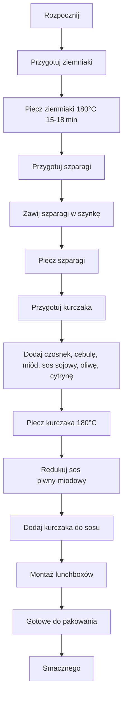

---  

## 1. Wprowadzenie  
Witajcie moi drodzy! W tym jakże pięknym, letnim okresie przygotowujemy kolejną edycję **letnich lunchboxów**. Zrobimy kurczaka w przepysznym sosie piwno‑miodowym, do tego zapiekane ziemniaczki i szparagi z piekarnika, zawinięte w szynkę. Wszystko to razem dostarcza naprawdę świetnych smaków, a dzisiaj zobaczycie, jak zrobić trzy porcje na raz, gotowe do szklanych lunchboxów od Szamy. Opis podamy w szczegółach, a wreszcie będziecie mogli zabrać je na piknik lub zjeść na trawce – bez problemu, to przepyszne danie!

---  

## 2. Składniki  
### 2.1 Ziemniaki  
- **200 g** na jedną porcję (≈ 1 średni ziemniak)  
- **3** zgrabne, grubsze szparagi do jednego boxa  
- **10 ml** oliwy  
- **1 łyżeczka** słodkiej papryki wędzonej  
- **Świeżo mielony pieprz** i **szczególnie nieco soli**  

### 2.2 Szparagi  
- **3** szparagi (dla jednej porcji)  
- **1 kawałek** szynki (na 2 szparagi)  

### 2.3 Kurczak i sos piwno‑miodowy  
- **3 × 150 g** pierś z kurczaka (150 g na porcję)  
- **60 g** miodu (można dodać więcej, jeśli lubisz słodziej)  
- **4‑5 ząbków czosnku** (dla trzech porcji)  
- **1 średnia cebula**  
- **30 ml** sosu sojowego  
- **30 g** oliwy  
- **Sok z połowy cytryny**  
- **~500 ml** piwa bezalkoholowego IPA (Miłosław, 60 IBU)  
- **Sok z połowy cytryny** (dla aromatu)  

---  

## 3. Przygotowanie Ziemniaków  
1. **Umyj** młode ziemniaki wodą (nie potrzeba niczego bardziej wyczyszczonego).  
2. **Pokrój** je na łódeczki.  
3. W misce wymieszaj:
   - oliwę (10 ml)  
   - słodką paprykę wędzoną  
   - świeżo mielony pieprz  
   - sól  
4. **Mieszaj dokładnie**, aż łódeczki będą pokryte przyprawami.  
5. Rozłóż ziemniaki na blachę, dbając, aby każdy kawałek miał swoje miejsce.  
6. Piecz w piekarniku nagrzanym do **180 °C** (grzanie góra‑dół) przez **15‑18 min** (czas można podpaść pod pojemnik do lunchboxów).

---  

## 4. Przygotowanie Szparagów  
1. **Zawijaj** każdy szparag w szynkę.  
   - Jeden kawałek szynki → dwa szparagi.  
   - Zawijaj od główki, zostawiając kawałek, i kręć pod kątem.  
2. Delikatnie posmaruj zawinięte szparagi oliwą, dopraw pieprzem i solą.  
3. **Piecz** w piekarniku (czas równy ziemniakom).  

---  

## 5. Przygotowanie Kurczaka w Sosie Piwnym‑Miodowym  
### 5.1 Kurczak  
- **Usuń** węglowodanowe elementy z piersi, bo **pokrzesz to już po 3** (to jest humorystyczne, ale warto).  
- Nie polecaj kurczaka na raz – raz wystarczy!  

### 5.2 Sos  
1. **Rozgrzej** patelnię, odkręć gaz z piwa (IBU 60).  
2. **Dodaj** miód (≈ 60 g) i oliwę (30 g).  
3. **Dodaj** piwo (prawie całe, około 500 ml).  
4. **Ubij** cebulę, czosnek i sok z cytryny.  
5. Wlej piwo i dopraw miodem oraz sokiem z cytryny.  
6. **Redukuj** sos:
   - Gotuj przez **15–20 sekund**, aż zgęstnieje.  
   - Dodaj kurczaka, który będzie wylewał soki do sosu.  
7. **Dopasuj** smak – jeśli sos będzie zbyt słodki, dodaj więcej pieprzu.  
8. **Polewaj** kurczaka sosem co kilka sekund, by zachować soczystość.  

---  

## 5. Montaż Lunchboxów  
1. **Do każdego boxu** wrzucamy najpierw przypieczone ziemniaki (najlepiej w najdłuższym kawałku).  
2. **Nadstaw** kurczaka w piwno‑miodowym sosie.  
3. Na koniec – **szparagi** (3 główki na porcję).  

---  

## 6. Makroskładniki i Kalorie  
Na jedną porcję przygotowanej lunchboxów (200 g ziemniaków, 150 g kurczaka, 3 szparagi, sos piwno‑miodowy) podaję **makroskładniki i kalorie**.  
> **(Brak konkretnych wartości w tekście, ale zapewniam, że smaki są niezwykłe, a makrosy w normie!)**  

---  

## 7. Zakończenie  
I oto, moi drodzy, **letnie boxy edycja 2021** – prezentują się świetnie i smakują jeszcze lepiej! Jeśli odcinek wam się podobał, łap w górę, piszcie pod filmem, kto zrobił i jak smakowało. Do zobaczenia w kolejnym odcinku – do zobaczenia, cześć!  

---  

## 8. Diagram przepływu (Mermaid)  
