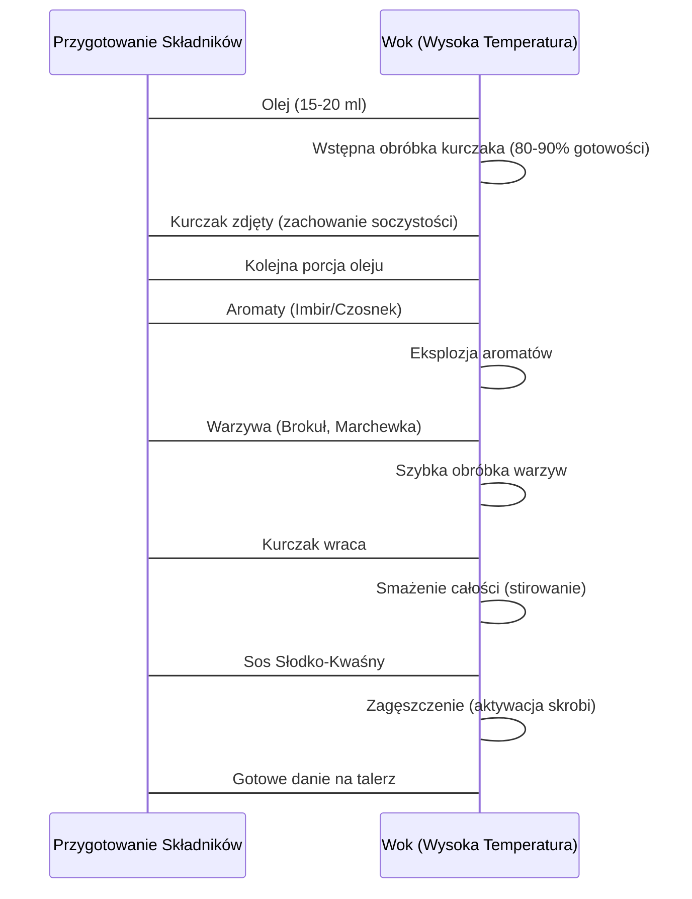

***

# Słodko-Kwaśny Kurczak Stir-Fry (Wersja Policzona Szama)

Witajcie drodzy widzowie! Ja jestem **Mateusz**, a to jest kanał **Policzona Szama**. Dziś prezentujemy przepis na pysznego, słodko-kwaśnego kurczaka w wersji stir-fry – danie niesamowicie aromatyczne i orientalne.

## I. Filozofia Gotowania Stir-Fry

Jest to danie, które przygotowuję bardzo często, ponieważ jest **niesamowite smakowo, proste, bez udziwnień** i robi się je tak szybko, jak ugotowanie worka ryżu.

Całość przygotowujemy w oryginalnym woku. Choć niewielu z Was posiada rakietowy palnik gazowy do trenowania przedramienia, chiński wok w domu jest najlepszym sposobem na orientalną szamę, w której jest magia.

### Metoda Stir-Fry

Metoda ta polega na:
1.  **Stir** (mieszać).
2.  **Fry** (smażyć).

Wszystko odbywa się **szybko, w wysokiej temperaturze**, co pozwala na obróbkę warzyw i zatrzymanie w nich tego, co najcenniejsze.

### Wymagania Wstępne

Wszystkie składniki należy **wcześniej przygotować** (pokroić, odmierzyć, wymieszać sos), zanim w ogóle podgrzejemy naszą patelnię.

### Sekwencja Obróbki w Woku

Kolejność obróbki składników ma kluczowe znaczenie dla budowania smaku i soczystości:

**Zadanie Sosu:** Sos ma za zadanie nie tylko upłynnić posiłek, ale również **zebrać wszystkie wytworzone smaki ze ścianek woka**, aby trafiły finalnie na talerz.

> **Wskazówka:** Chiński ręcznie kuty wok ze stali węglowej oraz wszystkie orientalne składniki użyte do dania zostaną podlinkowane w opisie pod filmem.

***

## II. Przygotowanie Składników Stałych

Zaczynamy od przygotowania kurczaka i warzyw.

### 1. Kurczak (Wersja 200+)

*   **Ilość:** 200 g piersi z kurczaka.
*   **Krojenie:** W drobną kostkę.
*   **Marynata:** Przerzucić do miski i zalać **jedną łyżką ciemnego sosu sojowego**.
*   **Temperatura:** Ważne, aby pierś miała **temperaturę pokojową** w momencie wrzucania jej na wok.

### 2. Warzywa i Krojenie

Zmieniamy deskę, myjemy nóż i zabieramy się za warzywa (kolejność od końca ich pojawiania się w woku):

| Warzywo | Technika Krojenia | Uwagi |
| :--- | :--- | :--- |
| **Marchewka** | Przeciąć z boku (dla stabilnej podstawy), pokroić w plasterki, a następnie w **zapałki**. | Przesunąć na bok. |
| **Brokuł** | Pokroić w podobne **słupki** jak marchewka. | |

### 3. Aromaty i Zioła

Aromaty dzielimy na dwie części: do wstępnego smażenia w woku oraz do sosu.

*   **Imbir:** Kawałek spory, mniej więcej **2,5 x 2,5 cm**. Obrać i szatkować. Ilość tę dzielimy później na połowę (paczka aromatów do woka i składnik sosu).
*   **Czosnek:** Obrać, poszatkować w drobną kostkę. Dodać do tej części imbiru, która wleci na wok.
*   **Natka Pietruszki:** Garść. Poszatkować (użyta jako zioło/aromat).

***

## III. Przygotowanie Sosu Słodko-Kwaśnego

Imbir, który ma trafić do sosu, przerzucamy do miski, w której będziemy go szykować.

**Wszystkie Składniki Sosu:**

| Rola w Smaku | Składnik | Ilość / Charakterystyka |
| :--- | :--- | :--- |
| **Kwaskowatość** | Imbir | Część poszatkowanej porcji. |
| **Kwaskowatość/Słodycz** | Sok z pomarańczy | Cały sok z jednej pomarańczy. |
| **Kwaskowatość** | Sok z limonki | Sok z połowy limonki. |
| **Kwaskowatość (Dodatkowy kop)** | Ocet ryżowy | **1 łyżeczka** (potrawa będzie mocno kwaśna). |
| **Słodycz/Słoność** | Ciemny sos sojowy | **2 pełne łyżeczki** (dodaje również słonego smaku). |
| **Słodycz** | Miód | **20–25 g** (użyty płynny, mocno podgrzany, aby łatwo się wymieszał). |
| **Zagęszczanie** | Skrobia ziemniaczana | Niecała łyżeczka. |

> **Uwaga:** Ilość skrobi jest wystarczająca, aby idealnie zagęścić sos pod wpływem temperatury.

***

## IV. Proces Smażenia i Mieszania (Stir-Fry)

Na blacie powinniśmy mieć przygotowane wszystkie składniki. Do obróbki potrzebujemy olej.

### 1. Olej i Sprzęt

*   **Olej:** Olej arachidowy o **wysokiej temperaturze dymienia**.
    *   *Zużycie:* W stir-fry nie oszczędza się oleju. Na początku wlana była miarka 80 ml, ale na koniec zużyto **40 ml** oleju na całą potrawę.
*   **Wok:** Używamy pierścienia stabilizującego na kuchenkę.
*   **Podgrzewanie:** Woka podgrzewamy do momentu, aż zacznie dymić.

### 2. Obróbka Kurczaka

1.  Dolać olej w ilości mniej więcej **15–20 ml** na porcję kurczaka.
2.  Rozprowadzić delikatnie po dnie woka.
3.  Dodać kurę. Obrabiać ją w **80–90%** (nie musi być wiór).
4.  Kura musi zachować soczystość, dlatego należy to zrobić szybko, w dużej temperaturze.
5.  Czas: Zajmie to mniej więcej **1,5 minuty**.
6.  Zdjąć kurczaka na osobną miskę.

### 3. Smażenie Aromatów i Warzyw

1.  Wlać kolejną porcję oleju do woka.
2.  Dodać **eksplodującą porcję aromatów** (imbir i czosnek).
3.  Cały czas mieszając, przesmażać kilkanaście-kilkadziesiąt sekund. Olej wchłania mnóstwo smaków.
4.  Dodać **brokuła** z ziołami. Czas obróbki: **1,5–2 minuty max**.
5.  Dodać **marchewkę**.
6.  **Wskazówka dotycząca oleju:** Jeśli wok staje się suchy, dolewać kolejną porcję tłuszczu (Mateusz wlał odpowiednio więcej na początku i nie musiał dolewać).
7.  Obrabiać warzywa z ziołami przez **1–1,5 minuty**.

### 4. Łączenie i Zagęszczanie

1.  Wrzucamy z powrotem **kurczaka**.
2.  Wszystko razem przesmażamy, **cały czas mieszając** (stirowanie).
3.  Używamy cały czas **mocnego płomienia/palnika**.
4.  > *Uwaga na popisy:* Efektowne podrzucanie składników (flambowanie) nie jest konieczne w domowych warunkach, ponieważ bardzo szybko wychładza woka. Wystarczy często stirować.
5.  Wlewamy **sos**. Mieszamy dokładnie.
6.  Skrobia aktywuje się i zagęszcza potrawę.
7.  Gdy sos jest zagęszczony, **wyłączamy palnik**. Danie jest gotowe.

***

## V. Serwowanie i Wnioski Końcowe

### Serwowanie

1.  Gorący ryż (u Mateusza: **basmati**) czeka w misce.
2.  Przerzucamy przepysznego słodko-kwaśnego kurczaka na ryż.
3.  Na górę posypujemy łyżką **sezamu** oraz **dymką**.
4.  Potrawa prezentuje się i smakuje obłędnie. Sos jest idealny, w ilości wystarczającej, aby pokryć każde ziarenko ryżu.

### Wskazówki Końcowe

*   **Czyszczenie Woka:** Należy jak najszybciej przemyć woka po użyciu, ponieważ **kwas i ocet degradują olejową, platynową powłokę**, która wytwarza się na stali węglowej.
*   **Makroskładniki:** Olej zużyty na przygotowanie tej potrawy to **40 ml**. (Dokładne kalorie i makrosy zostaną podane na ekranie).
*   Danie znika bardzo szybko i równie szybko będziecie do niego wracać.

### Zakończenie

Zachęcam do subskrypcji i naciskania dzwoneczka, aby nie przegapić kolejnych Policzonych Szam. Piszcie w komentarzach, kto próbował i komu wyszło, a także jeśli chcecie widzieć kolejne potrawy w azjatyckim stylu.