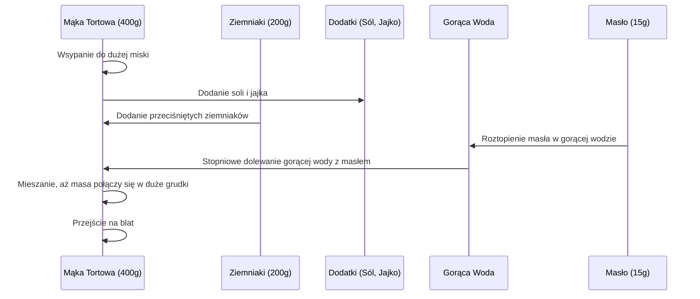

***

## DZIEDZICTWO KULTUROWE W KUCHNI: RUSKIE PIEROGI

### I. Wprowadzenie i Kontekst Dni Europy

Niniejszy odcinek specjalny został przygotowany z okazji **Dni Europy 2018**, których motywem przewodnim było **dziedzictwo kulturowe**.

Dziedzictwo kulturowe dzieli się na dwie główne kategorie:

1.  **Dziedzictwo materialne:**
    *   Budynki, przedmioty, zabytki.
    *   Stroje, dziewaszczuki (przedmioty codziennego użytku).
    *   Obiekty architektoniczne.
2.  **Dziedzictwo niematerialne:**
    *   Praktyki, folklor.
    *   Język i gwary.
    *   Rzemiosło, w tym rzemiosło kulinarne i przepisy.

W tym odcinku autor pragnie pokazać, czym dla niego jest dziedzictwo kulturowe właśnie w kuchni. Przepisy przekazywane są od pokoleń, goszcząc w naszych kuchniach dzięki babciom i mamom. Celem jest, aby smak tradycyjnych, wspaniałych polskich potraw nigdy się nie zatracił.

> Świat się zmienia, zmienia się też sposób przekazywania informacji. Dlatego dzisiaj wykorzystam kanał YouTube, aby zaprezentować **ruskie pierogi z przepisu mojej babci**.

### II. Ruskie Pierogi: Cechy i Historia Nazwy

Ruskie pierogi to danie proste, a przede wszystkim niesamowicie smakowe, będące prawdziwą polską potrawą.

**Charakterystyka pierogów:**

*   **Ciasto:** Świetne, sprężyste.
*   **Farsz:** Ziemniaki, biały ser i cebulka smażona na tłuszczu.

**Historia nazwy:**

Przez długi czas danie to nazywało się **pierogami polskimi**. Nazwa została zmieniona na **ruskie** po II wojnie światowej, kiedy tereny Galicji Wschodniej, z których się wywodzą, zostały przyłączone do Ukrainy. Nazwa "ruskie" pochodzi od regionu **Rusi Czerwonej**.

### III. Informacje Techniczne i Zaproszenia

Wszystkie składniki, kalorie i makrosy (nawet na jednego pieroga) będą dokładnie podane.

**Ważne ogłoszenia i wezwania do działania (Call to Action):**

1.  **Głosowanie:** Zachęta do głosowania na ten odcinek w konkursie z okazji Dni Europy – link do głosowania znajduje się w opisie.
2.  **Piknik:** Zaproszenie do wzięcia udziału w pikniku, który odbędzie się **12 maja w Warszawie** w Miasteczku Europejskim. Autor będzie tam osobiście, co jest okazją do spotkania i "przybycia piony".

### IV. Składniki (Przepis Babci)

Składniki są podzielone na dwie części: na ciasto i na farsz. Ilości, które babcia podawała "na oko", zostały przez autora dokładnie spisane i zweryfikowane wagowo, aby gwarantować sukces za każdym razem.

#### A. Składniki na Ciasto

| Składnik | Typ/Opis | Ilość | Uwagi |
| :--- | :--- | :--- | :--- |
| **Mąka tortowa** | Typ 450 | 400 g | |
| **Ziemniaki** | Ugotowane | 200 g | |
| **Masło** | Łyżka | 15 g | |
| **Jajko** | | 1 szt. | |
| **Gorąca woda** | | Ok. 100–200 ml (pół szklanki) | Dodawana stopniowo |

#### B. Składniki na Farsz

| Składnik | Typ/Opis | Ilość | Uwagi |
| :--- | :--- | :--- | :--- |
| **Ziemniaki** | | 600 g | |
| **Twaróg** | Półtłusty | 500 g | Minimalnie mniej niż ziemniaków (stosunek ok. 600:500) |
| **Cebula** | Spora | 1 szt. | Autor lubi, gdy jest jej więcej |
| **Masło klarowane** | Do smażenia cebuli | 20 g | |
| **Przyprawy** | | | Sól, pieprz ziołowy, pieprz biały, świeżo mielony pieprz czarny |

> **Uwaga:** Wszystkie składniki są podane w opisie pod filmem. Można je spisać lub zrobić zrzut ekranu.

***

## V. Proces Przygotowania Ciasta (Zajebiste Ciasto)

Proces przygotowania ciasta jest kluczowy dla sukcesu pierogów. Ciasto ma być jednolite i sprężyste.

### 1. Przygotowanie Ziemniaków

1.  Ziemniaki (200 g) wrzucić do **zimnej, lekko słonej wody**.
2.  Gotować około **15–20 minut**, aż ziemniak będzie miękki.
3.  Odcedzić i poczekać, aż ostygną.
4.  Przecisnąć, sprasować lub ugnieść ziemniaki.

### 2. Mieszanie Składników i Wyrabianie

Poniższy schemat przedstawia sekwencję łączenia składników ciasta:

### 3. Wyrabianie i Formowanie

1.  **Wyrabianie:** Ciasto należy wyrabiać na blacie posypanym mąką, aby się nie kleiło. Wyrabianie powinno trwać **8–10 minut**.
2.  **Cel:** Ciasto musi być jednolite, sprężyste i pozbawione grudek.
3.  **Wskazówka (dla Panów):** Dobre ciasto to podstawa. Jeśli ciasto jest dobre, można włożyć dowolny farsz (owocowy, mięsny, z owocami morza) i każdy pieróg wyjdzie.

> Po 8 minutach formowania ciasto jest niesamowicie sprężyste.

### 4. Wałkowanie i Wycinanie

1.  **Podział:** Urwać około **jednej trzeciej** całości ciasta. Resztę odłożyć do miski pod przykryciem, aby nie wyschło.
2.  **Wałkowanie:** Rozwałkować ciasto na grubość **około 2 mm** (im cieńsze, tym lepiej).
3.  **Wycinanie:** Używać narzędzia z ostrymi krawędziami do wycinania kółek.

***

## VI. Proces Przygotowania Farszu (Kozak Smak)

Farsz jest prosty, ale wymaga odpowiedniego przygotowania cebuli, aby nadać mu wyrazistości.

### 1. Gotowanie Ziemniaków

1.  Ziemniaki (600 g) wrzucić do **zimnej, osolonej wody**.
2.  Gotować do miękkości.
3.  Odcedzić i ugnieść w garnku, w którym się gotowały.

### 2. Przygotowanie Cebuli

1.  Cebulę obrać i pokroić w **bardzo drobną kosteczkę**.
2.  Na patelni rozpuścić **20 g masła klarowanego**.
3.  Smażyć cebulę **bardzo mocno**, aż uzyska brązowy kolor – prawie ją przypalić. Ten stan nadaje farszowi niesamowitego smaku.

### 3. Mieszanie i Doprawianie

1.  Do rozgniecionych ziemniaków dodać **500 g twarogu półtłustego** (wcześniej odsączonego z płynu).
2.  Dodać przyprawy (po pół łyżeczki):
    *   Pieprz ziołowy.
    *   Pieprz biały.
    *   Świeżo mielony pieprz czarny.
    *   Sól.
3.  Dokładnie wymieszać i sprawdzić smak.
4.  Dodać przysmażoną cebulkę wraz z masłem klarowanym.
5.  Wymieszać całość.

> **Weryfikacja smaku:** Farsz jest tak dobry, że spokojnie można by go zjeść bez ciasta.

***

## VII. Klejenie i Gotowanie Pierogów

### 1. Klejenie (Lepienie)

*   **Przygotowanie wody:** Przed rozpoczęciem klejenia należy nastawić dużą ilość wody i doprowadzić ją do wrzenia.
*   **Ilość farszu:** Autor preferuje **solidnie naładowane** pierogi. Minimalna ilość farszu to **łyżka stołowa** na jedno kółko ciasta.
*   **Technika klejenia:**
    *   Nałożyć farsz na środek kółka.
    *   Sklejać rękoma (nie używać narzędzi do klejenia).
    *   Delikatnie naciągać ciasto, aby zamknąć pieroga.
*   **Kluczowa zasada:** Pieróg nie może mieć **żadnych widocznych szczelin**. Woda wejdzie w szczelinę, co spowoduje, że pieróg się rozwali.
*   **Wskazówka:** Jeśli farszu jest dużo, trzeba uważać, aby zbyt mocno nie naciągnąć cienkiego ciasta, gdyż może się ono przerwać.

### 2. Gotowanie

1.  Do wrzącej wody dodać szczyptę soli.
2.  Wrzucać pierogi partiami.
3.  Pierogi opadają na dno, po czym należy czekać, aż **wypłyną** na powierzchnię.
4.  Od momentu wypłynięcia na górę, należy liczyć dokładnie **1,5 minuty**.
5.  Po tym czasie pierogi są gotowe do wyławiania.

> **Uwaga:** Czasem pierogi mogą przyklejać się do dna naczynia, należy je delikatnie odkleić.

## VIII. Podsumowanie i Wnioski

Gotowe pierogi ruskie charakteryzują się świetnym ciastem i doskonałym farszem.

**Sposób podania:**

Autor uwielbia pierogi podawane ze **skwarkami** (dosyć przypalonymi/przyjarzonymi).

**Ocena smaku:**

Pieróg jest solidny, ma swoją wagę, a ilość nadzienia jest satysfakcjonująca. Smak jest **epicki**.

> "To jest prawdziwe dziedzictwo kulturowe. Zadbajcie moi widzowie o to, aby ten przepis nigdy się nie zatracił."

**Informacje końcowe:**

*   Za chwilę pojawią się makrosy i kalorie na jednego pieroga (w tekście nie podano konkretnych wartości, jedynie zapowiedziano).
*   Prośba o łapkę w górę i komentarze.
*   Przypomnienie o głosowaniu w konkursie z okazji Dni Europy.