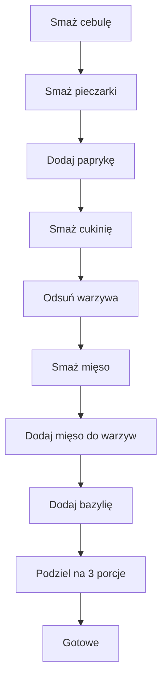

---

## 1. Wstęp  
*Witajcie szkodrodzy widzowie!*  
Dzisiaj przygotowujemy **wieprzowinę** w postaci **polędwicy wieprzowej** z warzywami – idealną do zrobienia trzech boxów na lunch.  
Mamy tu trzy potrawy, a do każdego boksu potrzebujemy **150 g** polędwicy (cała w sumie 450 g, choć wspomniano 45 g w tekście – pozostaje w oryginale).  
Z mięsem przyjdzie nam dość – 150 g to sporo, bo wieprzowina nie paruje tak jak kurczak.

---

## 2. Składniki (na trzy porcje)  

| **Składnik**          | **Ilość**   | **Uwagi**                      |
|-----------------------|-------------|--------------------------------|
| Polędwica wieprzowa   | 45 g (150 g na box) | Główny składnik |
| Papryka czerwona      | 1 duża      | Dodatkowy aromat                |
| Cebula                 | 1 duża      | Smażona na początku             |
| Cukinia (cukinia)     | 1 średnia   | Pokrojona w plasterki, potem w kostkę |
| Pieczarki              | 250 g       | Pokrojone w plasterki            |
| Bazylia świeża         | Do smaku   | Dodajemy na koniec              |
| Sól, pieprz            | Do smaku   | W trakcie smażenia              |
| Olej do smażenia      | 2 × 30 ml   | Na różne etapy gotowania        |

---

## 3. Przygotowanie warzyw  

1. **Cebula** – pokrój w drobną kostkę, wrzuć na rozgrzany olej i smaż, aż będzie szklista.  
2. **Pieczarki** – kroj w plasterki, dopraw solą i pieprzem, a następnie dodaj do cebuli.  
3. **Papryka** – pokrój w kostkę, podziel się z warzywami na patelni.  
4. **Cukinia** – pokrój na plasterki, a następnie na mniejsze kawałeczki (ok. 5 mm), dopraw solą i pieprzem, i smaż na tej samej patelni, aż będą lekko chrupiące.  

Po usmażeniu warzyw wyjmij je z patelni i odłóż na bok; pozostaw patelnię do dalszego użycia.

---

## 4. Przygotowanie mięsa  

1. **Polędwicę** – pokrój w paski o grubości ~5 mm, potem w mniejsze kawałeczki.  
2. Na rozgrzanym oleju smaż mięso po kilka minut z każdej strony – ma być soczyste i lekko złociste.  

---

## 5. Łączenie i porcjowanie  

1. Do patelni z warzywami wrzuć smażone mięso.  
2. Mieszaj wszystko razem jeszcze kilka minut, aby smaki się połączyły.  
3. Na koniec dodaj świeżą bazylię i dokładnie wymieszaj.  
4. Gotowe danie podziel na **trzy równe porcje** (boxy).  

**Uwaga:** jeśli masz już ugotowany ryż, możesz go podać obok – każdy boks składa się z mięsa, warzyw i ryżu.

---

## 6. Podsumowanie i dodatkowe informacje  

- **Szybkie i proste**: całość gotuje się w ciągu około 20–25 minut.  
- **Smak**: pieprz, sól, bazylia i aromatyczne warzywa tworzą harmonijny profil.  
- **Zalecenie**: idealne na trzy dni lunchowe, po prostu podgrzej i podawaj.  
- **Makroskładniki i kalorie** zostaną podane w kolejnym odcinku – **do zobaczenia!**

---

## 7. Diagram przepływu (Mermaid)  

---

**Pozdrawiamy i życzymy smacznego!**  
Nie zapomnij subskrybować, zostawić łapki w górę i spróbować swoich sił z tymi boxami – na pewno się nie poddamy!