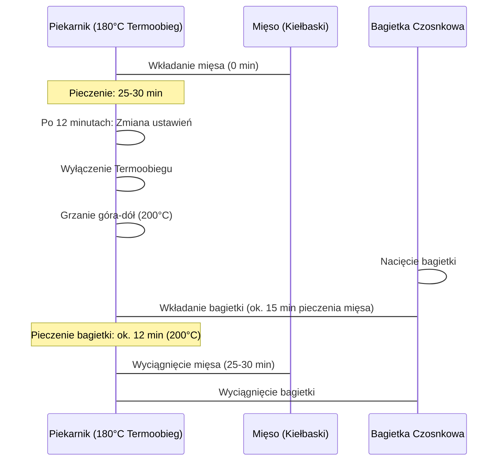

***

# CZOSN-DOG – Wersja Policzone Makrosy

Witajcie ponownie na kanale! Dzisiaj przygotowujemy kolejny srogi odcinek poświęcony internetowemu hitowi zeszłego roku: **CZOSN-DOGOWI**.

CZOSN-DOG to jedna z nielicznych pozytywnych rzeczy, które spotkały nas w 2020 roku. Polega on na wykorzystaniu popularnej bagietki z masłem i czosnkiem do zapiekania jako bułki do hot doga.

Dzisiejsza wersja jest **policzona**, co oznacza, że zastosujemy takie składniki, aby uzyskać przyzwoite makroskładniki i kalorie. W środku znajdzie się przepyszna, aromatyczna kiełbaska z **chudego wieprzowego mięsa** oraz lekki **chudy sos jogurtowy**. Jest to świeża, wiosenna odsłona dobrego CZOSN-DOGA.

## Składniki (Na Dwie Porcje)

Poniższe ilości składników na mięso i sos podawane są na dwie pełne porcje, czyli na dwa hot dogi.

### A. Baza i Mięso (Kiełbaska)

| Kategoria | Składnik | Ilość | Uwagi |
| :--- | :--- | :--- | :--- |
| **Baza** | Bagietka do zapiekania | 1 sztuka | Z masłem i czosnkiem, gwoźdź programu. |
| **Mięso** | Szynka wieprzowa (chuda) | 400 g | Na dwie kiełbaski/hot dogi. |
| **Aromaty** | Czosnek | 4 ząbki | Do kiełbaski. |
| | Cebula | Połowa małej cebuli | |
| **Łącznik** | Jajko | 1 sztuka | Do sklejenia i uformowania. |

### B. Sos Jogurtowy (Czosnkowy)

| Składnik | Ilość | Uwagi |
| :--- | :--- | :--- |
| Jogurt typu **Skyr** | 100 g | 0% tłuszczu, dodatkowe białko (**protein boost**). |
| Jogurt naturalny (zwykły) | 100 g | Do rozrzedzenia Skyra, dla lepszej konsystencji sosu. |
| Czosnek | 1 ząbek | Świeży, do sosu. |
| Koperek | Świeży | Do poszatkowania. |

### C. Dodatki i Przyprawy

| Kategoria | Składniki | Uwagi |
| :--- | :--- | :--- |
| **Świeże Dodatki** | Zielony ogórek | Pokrojony, naszykowany. |
| | Sałata lodowa | Pokrojona, naszykowana. |
| **Wykończenie** | Ketchup | Na górę, dla akcentu słodkości. |
| | Szczypiorek/Zielona cebulka | Na wierzch (minimalna ilość). |
| **Przyprawy do Mięsa** | Sól | Odpowiednio duża ilość. |
| | Pieprz czarny mielony | |
| | Tymianek | 1 łyżeczka | |
| | Papryka słodka | 1 łyżka | |
| | Papryka wędzona słodka | Niecała 1 łyżeczka | |
| | Pieprz cayenne chili | Szczypta | Dla nutki pikantności. |

> **Wskazówka:** Zróbcie screenshota składników i zaczynamy!

***

## Przygotowanie Kiełbasek Wieprzowych

Zaczynamy od szykowania mięsa. W tym czasie należy rozgrzać piekarnik do **180 stopni Celsjusza** (Termoobieg).

### 1. Przygotowanie Aromatycznej Bazy

1.  **Cebula:** Połowę małej cebuli szatkujemy w drobną kostkę. Zalecane jest przecięcie cebuli wzdłuż (około trzy razy), a dopiero potem krojenie w kostkę.
2.  Pokrojoną cebulę dodajemy bezpośrednio do miski z mięsem (400 g chudej szynki wieprzowej).
3.  **Czosnek:** Obieramy 4 ząbki czosnku i przeciskamy je przez praskę prosto do miski z mięsem.
4.  Dodajemy 1 jajko, które pomoże w uformowaniu i sklejeniu masy.

> Mimo że używamy chudej wieprzowiny, dzięki czosnkowi i przyprawom mięso będzie niesamowicie aromatyczne.

### 2. Mieszanie i Doprawianie

1.  **Wstępne Mieszanie:** Mieszamy mięso z cebulą, czosnkiem i jajkiem. Najlepiej robić to ręką.
2.  **Doprawianie:** Dodajemy wszystkie przyprawy:
    *   Sól (odpowiednia, duża ilość, aby mięso miało smak).
    *   Pieprz czarny mielony.
    *   1 łyżeczka tymianku.
    *   1 łyżka słodkiej papryki.
    *   Niecała łyżeczka wędzonej papryki słodkiej.
    *   Szczypta pieprzu cayenne chili (dla pikantności).
3.  Ponownie dokładnie mieszamy mięso z przyprawami.

### 3. Formowanie Kiełbasek

1.  Całość masy (400 g mięsa plus dodatki) dzielimy na **dwie równe części**.
2.  Formujemy kiełbaski, wydłużając je i ugniatając.
3.  **Kluczowa zasada:** Kiełbaska musi być tak samo długa jak bagietka do CZOSN-DOGA, a nawet dłuższa, ponieważ w każdym szanującym się hot dogu parówka/kiełbaska powinna wystawać.
4.  Uformowane kiełbaski delikatnie wykładamy na blachę wyłożoną papierem do pieczenia. (Nie martwcie się, jeśli masa wydaje się rwać; po upieczeniu będzie się dobrze trzymać).

***

## Pieczenie i Synchronizacja Czasowa

Celem jest zgranie czasowe pieczenia mięsa i bagietki.

### Schemat Pieczenia

### Szczegółowe Instrukcje Pieczenia

1.  **Mięso:** Kiełbaski wsuwamy do nagrzanego piekarnika (180°C, Termoobieg). Pieczemy łącznie **25–30 minut**.
2.  **Zmiana Ustawień:** Po około **12 minutach** pieczenia kiełbasek, wyłączamy termoobieg i zmieniamy grzanie na **góra-dół** oraz podnosimy temperaturę do **200 stopni Celsjusza**.
3.  **Bagietka:** W tym momencie (po 12 minutach pieczenia mięsa) wkładamy bagietkę do zapiekania.
    *   ***Ważna sprawa:*** Zanim bagietka trafi do piekarnika, należy zrobić w niej **nacięcie** na wkład (na kiełbaskę i dodatki).
4.  Bagietkę pieczemy w 200°C (góra-dół) przez około **12 minut**, aby była chrupka z zewnątrz i miękka w środku.

> Po wyjęciu z piekarnika zapach jest świetny!

***

## Przygotowanie Świeżego Sosu Jogurtowo-Czosnkowego

W czasie pieczenia mięsa przygotowujemy sos.

1.  Mieszamy 100 g jogurtu naturalnego ze 100 g jogurtu typu **Skyr** (dla dodatkowego białka i gęstości).
2.  Szatkujemy **koperek** i dodajemy do jogurtów. Ilość koperku powinna być umiarkowana, aby nie przyćmił smaku czosnku, który jest kluczowy.
3.  Przez praskę przeciskamy **1 ząbek świeżego czosnku**.
4.  Doprawiamy delikatną ilością soli i szczyptą pieprzu mielonego do smaku.

Sos jest gotowy, czekamy na upieczone mięso i bagietkę.

## Komponowanie CZOSN-DOGA

Po wyjęciu chrupiącej bagietki (która prezentuje się znakomicie po 12 minutach) i upieczonej kiełbaski, przystępujemy do składania hot doga.

CZOSN-DOG w tej wersji jest dość minimalistyczny, ale świeży.

1.  **Zielona Baza:** W nacięcie bagietki wkładamy trochę zieleni – poszatkowaną **sałatę lodową**.
2.  **Ścianki na Sos:** Stosujemy "myk z ogórkiem": pokrojony świeży ogórek układamy wzdłuż nacięcia, tworząc **ścianki**, które będą trzymały sos. Jest to element wiosennej wersji.
3.  **Sos:** Wlewamy część sosu jogurtowo-czosnkowego (koperkowego).
4.  **Kiełbaska:** Wkładamy upieczoną, aromatyczną kiełbaskę wieprzową.
5.  **Akcent Słodkości:** Dodajemy **ketchup** na górę, który nada słodkiego akcentu całemu hot dogowi.
6.  **Wykończenie:** Na sam wierzch dodajemy minimalną ilość **szczypioru** (zielonej cebulki).

CZOSN-DOG w wersji policzonej jest gotowy.

## Makroskładniki i Degustacja

Przed Wami makroskładniki i kalorie na jedną taką porcję, na jednego CZOSN-DOGA.

Smak:
*   Bagietka jest chrupiąca, z wyczuwalnym masełkiem czosnkowym.
*   Mięso jest niesamowicie aromatyczne i przepyszne.

> Moi drodzy, standardowo łapa w górę, komu się odcinek podobał, kto chce więcej. Piszcie komentarze, jak smakowało!