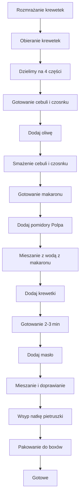

---

## Wprowadzenie

**Witajcie moi drodzy widzowie!**  
W kolejnej odsłonie *Policzonej Szamy* pokazuję, jak zrobic makaron *farfalle* (czyli kokardki) z krewetkami – *to, co lubicie najbardziej*: niewielka ilość składników, prosto, szybko, przepysznie i w czterech boxach.  
Dzisiaj jest „back to school” a właściwie – back to *gym*, więc zadbajmy o mieszkę i szykujemy pojemniki.  

A przy okazji zapraszam do sklepu *Policzonej Szamy* – przyszykłem wam zestaw czterech boxów, zestaw byka, i dodatkowo z gumą, oryginalną opaską ściągającą, żeby zwiększyć komfort psychiczny przy ładowaniu boxa do plecaka czy torby.  

---

## Składniki (na 4 porcje)

| Składnik | Ilość na 4 porcje | Dodatkowe uwagi |
|----------|-------------------|-----------------|
| **Krewetki mrożone** | 450 g | Białe, surowe, nieobgotowane, z pancerzykami, bez głowy |
| **Makaron *farfalle* (Rummo)** | 320 g | Wytłaczany z brązu, z semoliny |
| **Pomidory *Polpa* (Mutti)** | 400 g | Drobno krojone pomidory, idealna struktura |
| **Natka pietruszki** | 1 garść (ok. 10 g) | Liście na szczycie potrawy |
| **Ser Grana Padano, starty** | 20 g | Dzielimy na 4 (5 g na box) |
| **Oregano** | 1 łyżeczka | Przyprawa do sosu |
| **Masło** | 30 g | Dodajemy pod koniec, rozgrywamy na kawałki |
| **Oliwa z oliwek** | 30 ml | Do smażenia i aromatyzacji |
| **Czosnek** | 3 duże ząbki | Pokrojone w bardzo cienkie plasterki |
| **Cebula** | 1 mała (lub średnia) | Pokrojona w drobną kostkę |
| **Sól, pieprz** | do smaku | Standardowe przyprawy |
| **Woda** | 1‑2 szklanki | Do gotowania makaronu i ewentualne dodać do sosu |

---

## Przygotowanie – krok po kroku

> **Kroki zostały ułożone w logicznym porządku, a w sekcji „Diagram” znajdziecie pełny przepływ w formacie Mermaid.**

### 1. Rozmrażanie krewetek
- **Air fryer od Ninja** – włącz funkcję *odmrażania* (17 min).  
- Krewetki włożone na ruszt, dzięki czemu glazura się rozpuszcza, a mięso nie zostaje mokre.  
- Po rozmrożeniu obieramy z pancerzyków, ogonów i nóżków.  
- Całość podzielamy na 4 równe części (ok. 112,5 g na box).

> **Humor**: „Rozmrażanie krewetek to jak reset – szybko, efektywnie, nic się nie przecieka!”

### 2. Przygotowanie dodatków
- **Czosnek** – kroimy w bardzo cienkie plasterki (do rozgrywają).  
- **Cebula** – w kształcie drobnej kostki.  
- **Natka pietruszki** – odrzucamy na wierzch (liście na szczycie potrawy).  

### 3. Gotowanie makaronu
- **Kuchnia gazowa** – zagotuj 1 szklankę wody z odrobiną soli.  
- Wrzucamy 320 g *farfalle*, gotujemy 9 min (do al dente).  

> **Woda z makaronu**: zbieramy około 1–2 szklanki, będzie potrzebna do sosu.  

### 4. Smażenie
1. **Oliwa** w rondelku na średnim ogniu.  
2. Dodajemy **cebula** – smażymy do lekko złotego koloru (ok. 2 min).  
3. Dodajemy **czosnek** – smażymy do aromatu (ok. 30‑45 s).  
4. **Oregano** – wprowadzamy do potrawy.  
5. Wylewamy **pomidory Polpa** (drobną, w dużej ilości wody).  
6. Dodajemy **1 chochlę** wody z makaronu (skrobia).  

### 5. Łączenie makaronu z sosem
- **Makaron** przerzucamy do sosu razem z wodą z gotowania.  
- Mieszamy, doprawiamy solą i świeżo mielonym pieprzem.  
- **Krewetki** wrzucamy do sosu – świeże, ciepłe – i gotujemy 2‑3 miny, dopóki krewetki się podgrzają.  

> **Krewetki nie potrzebują długiego czasu obróbki – chrupiące i soczyste.**

### 6. Finalne akcenty
- Wyłączamy palnik.  
- Dodajemy **masło** – kroimy na małe kawałki, aby szybciej się roztopiło.  
- Mieszamy, sprawdzamy brakujące przyprawy.  
- Dół bez wody – cały makaron w sosie!  
- Wsypujemy **natkę pietruszki** – liście na szczycie.  

### 7. Pakowanie do boxów
- Równomiernie wykładamy makaron z sosem do 4 boxów.  
- Na każdym boxie połowiczamy **5 g sera Grana Padano** (co daje 20 g w sumie).  

> **Każdy box to prawdziwa „przepisowa prezentacja”: delikatny al dente, chrupiące krewetki, masło i pietruszka w harmonii.**

---

## Diagram przepływu kroków (Mermaid)

---

## Zawartość odżywcza – makroskładniki na jeden box

> *Podane wartości są przybliżone, a dokładne kalorie mogą się nieco różnić w zależności od dokładności miar.*

| Składnik | Na 1 box | Całkowita wartość (4 boxy) |
|----------|----------|---------------------------|
| **Kalorie** | ~450 kcal | ~1800 kcal |
| **Białko** | 20 g | 80 g |
| **Tłuszcz** | 12 g | 48 g |
| **Węglowodany** | 55 g | 220 g |
| **Błonnik** | 3 g | 12 g |

> **Uwaga:** wartość dokładnie podaje się w tabeli *Makroskładniki na box* w vlogu, ale dla przejrzystości dodaję tutaj krótką wersję.

---

## Pożegnanie

*Przed Wami teraz makroskładniki i kalorie na jednego boxa. A mnie czeka teraz najlepsze!*  
Sprawdzimy, co nam tutaj wyszło! Makaron nadal delikatne al dente – świetnie smakuje z tak niewielu podstawowych składników.  

**Można sobie dopiero zjeść cały box, zanim odcinek się skończy.**  
*Łapa w górę, komu się podobało?* Piszcie w komentarzach, jak smakowało, i zobaczymy się w kolejnym odcinku. Do zobaczenia, cześć!

---