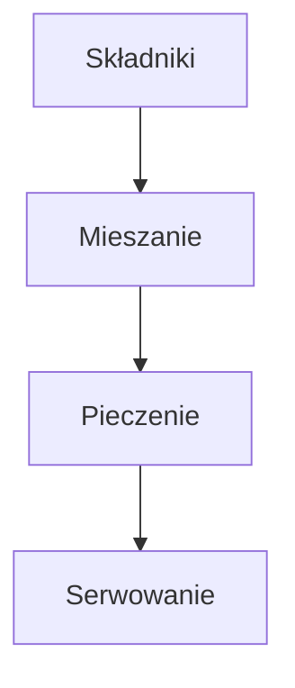

---  

## Co jem, żeby być w formie?  

> **Pancaki z czekoladą** – to nie tylko smaczne, ale i pełne energii danie, które wprowadza mnie w rytm codzienności.  

---  

## Składniki  

- **Jogurt Skyr** – 200 g  
- **Serek wiejski** – 200 g  
- **Dwa jajka**  
- **Wanilia** – 1 łyżeczka ekstraktu  
- **Mąka** – 150 g (najlepiej pszenna)  
- **Erytrol** – 2 łyżki  
- **Proszek do pieczenia** – 1 łyżeczka  
- **Czekolada** – do smaku (najlepiej kawałki lub w proszku)  
- **Owoce** – do podania (np. truskawki, borówki, banan)  
- **Olej lub masło** – do smażenia  

---  

## Przygotowanie  

1. **Wymieszanie**  
   1.1. Do miski wbij **dwa jajka**.  
   1.2. Dodaj **Jogurt Skyr** i **Serek wiejski** – mieszaj, aż powstanie gładka masa.  
   1.3. Dodaj **wanilię**, **mąkę**, **erytrol** i **proszek do pieczenia**.  
   1.4. Wymieszaj wszystko dokładnie, aby składniki połączyły się w jednolitą konsystencję.  

2. **Dodanie czekolady**  
   2.1. Rozpuść lub po prostu rozdziel kawałki czekolady w cieście, aby całość miała smak przyjemnie słodki i rozpuszczający się.  

3. **Smażenie**  
   3.1. Rozgrzej **olej** lub **masło** na patelni.  
   3.2. Wylewaj ciasto na foremki do pancjów (lub bez form, po prostu łopatką).  
   3.3. Smaż **z obu stron** aż będą **piękne i polchniutkie** – czyli złociste i miękkie w środku.  

4. **Serwowanie**  
   4.1. Na talerzu ułóż smażone pancaki.  
   4.2. Posyp świeżymi **owocami**, aby dodać więcej błonnika i koloru.  
   4.3. Życz sobie i smacznego – to prawdziwa radość na talerzu.  

---  

## Oświadczenie smakowe  

> **To najlepsze pancji, jakie w życiu jadłem.**  
>  
> **Yeah.**  

---  

## Diagram przepływu przepisu  

---  

**Pamiętaj:** zachowaj wszystkie detale – od składu po humorystyczne zakończenie, by przywołać smak i przyjemność każdego posiłku.