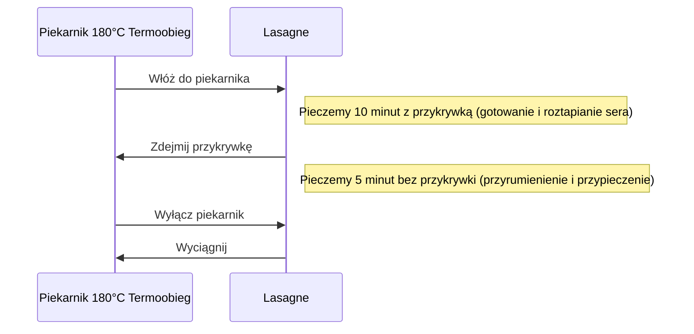

***

## LASAGNE BOLOGNESE – WERSJA EKSPRESOWA (STUDENCKA)

Yo yo yo drodzy widzowie! Witajcie w długo oczekiwanym odcinku, w którym przygotowujemy naprawdę zajebiste danie: **Lasagne Bolognese**. Jest to szybka, prosta i ekspresowa wersja, tzw. studencka, wykorzystująca niewiele składników, która będzie jednocześnie prosta i zajebiście smaczna.

### Poziom Trudności

Potrawa będzie miała **dwie nóżki trudności**. Będziemy musieli poradzić sobie z makaronem do lasagne oraz stworzyć równe warstwy. Uwierzcie jednak: jeśli nigdy nie robiliście lasagne, zacznijcie właśnie od tej wersji – jest zajebiście prosta!

***

## WYMAGANE SKŁADNIKI

Do przygotowania lasagne potrzebujemy następujących produktów:

| Kategoria | Składnik | Ilość/Uwagi |
| :--- | :--- | :--- |
| **Mięso Mielone** | Mięso wołowe mielone | 0,5 kg |
| | Mięso z szynki wieprzowej mielone | 0,5 kg (Łącznie 1 kg mięsa) |
| **Ser** | Ser żółty | 250 g (jedna kostka sera) |
| **Sos Pomidorowy** | Passata (przecier pomidorowy) | 700 g (cała butelka), najlepiej już z ziołami |
| **Aromaty** | Cebula | Jedna mała albo pół średniej |
| | Czosnek | Połowa główki (parę ząbków – spora ilość) |
| **Przyprawy** | Bazylia suszona | Dużo, nie żałować (dwie duże łyżki) |
| | Oregano suszone | Dużo, nie żałować (dwie duże łyżki) |
| | Sól, Pieprz | Do smaku (spora ilość) |
| **Makaron** | Makaron do lasagne | Dowolny rodzaj płatów |
| **Tłuszcz** | Olej z pestek winogron lub inny do smażenia | Do smażenia i smarowania naczynia |

***

## PRZYGOTOWANIE SOSU BOLOGNESE (MIĘSNEGO)

Zaczynamy od przygotowania bazy sosu.

### Krok 1: Przygotowanie Aromatów

1.  **Siekamy** cebulę w drobną kostkę.
2.  **Traktujemy** czosnek przez praskę (połowa główki, czyli parę ząbków).
3.  Na patelni (dosyć sporej) rozgrzewamy łyżkę oleju (np. z pestek winogron).
4.  Wrzucamy posiekaną cebulę i sporą ilość czosnku do zeszklenia. *Uwaga: Spokojnie, czosnek nie będzie aż tak bardzo wyczuwalny.*

### Krok 2: Smażenie i Doprawianie Mięsa

1.  Po chwili dodajemy nasze mięso mielone (wołowe i z szynki wieprzowej).
2.  **Nie musimy dodawać już oleju**, ponieważ mięso wołowe ma odpowiednią ilość tłuszczu, by usmażyć całość.
3.  Smażymy mięso dokładnie.
4.  Gdy mięso nie jest już surowe, doprawiamy:
    *   Spora ilość **soli**.
    *   Spora ilość **pieprzu**.
    *   **Bazylia** (dwie duże łyżki).
    *   **Oregano** (dwie duże łyżki).
5.  Dokładnie wszystko mieszamy.
6.  Czekamy, aż woda odparuje, a mięso będzie dokładnie usmażone.

### Krok 3: Duszenie Sosu

1.  Gdy mięso nie ma już wody, wlewamy całą butelkę przecieru pomidorowego (700 g passaty, najlepiej już z ziołami).
2.  Teraz na dosyć wolnym ogniu **dusimy sos**.
3.  Czekamy, aż smaki się dobrze "przejedzą" i sos zgęstnieje.
4.  Mieszamy od czasu do czasu. Minimum to **10 minut** duszenia.
5.  *W przepisie użyto:* Równo 12 minut. Sos jest fajnie gęsty, a nadmiar wody wyparował.
6.  Korygujemy smak (nie bójcie się dołożyć soli, to musi smakować).

***

## PRZYGOTOWANIE PŁATÓW MAKARONU

**UWAGA!** Niezależnie od tego, co piszą na opakowaniu makaronu, że można go od razu wkładać do piekarnika, aby bezpiecznie zjeść lasagne bez surowego i twardego makaronu, należy go wcześniej przygotować.

1.  W garnku przygotowujemy małą ilość wrzącej wody (osolonej).
2.  Wkładamy płaty makaronu (np. trzy płaty naraz).
3.  Gotujemy je we wrzącej wodzie przez około **1 minutę**.
4.  Wyciągamy i dopiero wtedy kładziemy do naczynia. *Uważajcie, makarony szybko się lepią.*

***

## MONTAŻ I PIECZENIE LASAGNE

### Krok 1: Przygotowanie Naczynia

1.  Włączamy piekarnik, aby się nagrzał do **180°C (termoobieg)**.
2.  Naczynie żaroodporne smarujemy delikatnie olejem z pestek winogron (pół łyżeczki lub łyżka) na sam dół. Rozsmarowujemy olej, aby pierwsze płaty się nie przylepiły.

### Krok 2: Tworzenie Warstw

Zrobimy trzy warstwy lasagne.

| Warstwa | Elementy |
| :--- | :--- |
| **Spód (Warstwa 1)** | 3 płaty makaronu, 1/3 sosu bolognese (mniejsza 1/3), starty ser żółty. |
| **Środek (Warstwa 2)** | 3 płaty makaronu, 1/3 sosu bolognese, starty ser żółty. |
| **Góra (Warstwa 3)** | 3 płaty makaronu, pozostały sos bolognese, starty ser żółty. |

### Krok 3: Proces Pieczenia

Wrzucamy lasagne do nagrzanego piekarnika zgodnie z poniższą sekwencją:

***

## ODPOCZYNEK I DEGUSTACJA

### Odpoczynek (Kluczowy Element)

Lasagne wygląda i pachnie rewelacyjnie, ale niestety, zanim zaczniemy jeść, musimy poczekać około **10 minut**.

**Dlaczego?** Teraz jest jeszcze mocno płynna. Jeśli potniemy ją od razu, lasagne się wyleje, warstwy nie będą widoczne, a my się poparzymy.

*W przepisie:* Po 8 minutach autor nie wytrzymał i zaczął próbować.

### Serwowanie

Naczynie żaroodporne dzielimy standardowo na **6 kawałków**.

*Uwaga:* Pierwszy kawałek, który wyjmujemy, jest najbardziej podatny na uszkodzenia, ponieważ ciężko jest zahaczyć cały kawałek.

### Ocena Smaku

Lasagne jest naprawdę zajebista. Jak na tak mało składnikową i prostą do zrobienia wersję, jest rewelacyjna – jest ogień! Makaron jest idealny: nie jest rozgotowany, nie jest za twardy, jest odpowiedni, taki jak w lasagne powinien być.

***

## PODSUMOWANIE

Makrosy i kalorie zostaną podane na końcu odcinka (poza zakresem tego tekstu).

Zapraszam na kolejne odcinki! Zostawcie łapkę w górę, jeśli się podobało. Piszcie i komentujcie, czy chcecie zobaczyć bardziej "pro" i wymagającą lasagne. Jeśli jednak nie robiliście jej nigdy, zacznijcie sobie właśnie od tej: szybkiej, bardzo prostej, przyjemnej i przede wszystkim bardzo dobrej lasagne.

Do zobaczenia w kolejnym odcinku, cześć!