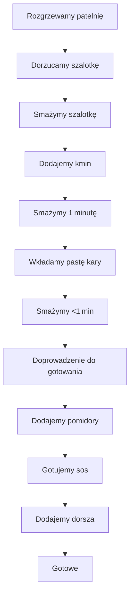

---

## 🔹 Wstęp  
- **Świe maneczko** – witajcie na kanale Policzo!  
- To **10. odcinek**, na który wielosłup czekało, więc sięgamy po **rybkę** i to nie byle jaką: przepyszne, orientalne, rybne kary.  
- Idealne urozmaicenie niecodziennej diety.  
- **Potrafa** w dalekim, sodnym klimacie, która będzie prosta i szybka do zrobienia.  
- Jedno **patelnowa**: całość wyśminitydanie na **trzy posiłki** zrobicie używając tylko jednej patelni.  
- Nie mówimy tu o gotowaniu ryżu – to robimy osobno, międzyczasie.  
- Nie pytajcie mnie, czy zastąpić rybę – ugnę się nawet osoby, które zają nie przepadają, więc zaczynamy!

---

## 🛒 Lista składników (dla trzech porcji)  

| Składnik | Ilość (gramy / mililitry) | Szczegóły |
|----------|---------------------------|-----------|
| **Filet z dorsza** | 360‑670 g | Po jednej porcji ponad 100‑120 g. Wartość zakupów w lokalnym sklepie rybnym. Pamiętajcie, aby wyjąć spore ości. |
| **Puszka krojonych pomidorów** | 400 g | Cała puszka. |
| **Mleczko kokosowe** | 200 g (≈ 200 ml) | Używamy połowy puszki. |
| **Olej z ryżu** | 1 łyżka | Z dodatkiem kminu rzymskiego mielonego. |
| **Kmin rzymski mielony** | 1 łyżeczka | Do oleju z ryżu. |
| **Pasta kary (yellow curry paste)** | 1 łyżka | Marki: Flying Goose (thajski producent). Można znaleźć w innych sklepach pod takimi nazwami jak **Tai Pride**. |
| **Red curry paste** | – | Nie zalecamy, bo zawiera szalotkę, którą już używamy świeżo. |
| **Szalotka** | 1–2 sztuki | Obieramy i kroimy w plurki. |
| **Zmienione ziarenka gorczycy, białej i kolendry** | kilka | Można je zmiażdżyć na świeżo i dorzucić. |
| **Kolendra** | świeże listki | Na koniec do dekoracji. |

> *Wszystkie składniki są łatwo dostępne, a jedyną potrawą, która może wymagać wyjazdu do większego sklepu lub zakupu online, jest pasta kary.*

---

## 🍳 Gotowanie – krok po kroku  

1. **Rozgrzewamy patelnię** z olejem z ryżu.  
2. **Dorzucamy szalotkę** – obieramy i kroimy w plurki.  
3. **Smażymy na średnim ogniu** aż szalotka straci surowość i lekko się przyrumieni.  
4. **Dodajemy łyżeczkę kminu rzymskiego** i mieszamy, smażymy jeszcze 1 minutę.  
5. **Wkładamy pastę kary** (półtorej głyszki) – smażymy niecałą minutę.  
6. **Doprowadzenie do gotowania**: dorzucamy puszkę pomidorów (400 g) i dokładnie mieszamy, poczekaj, aż sos lekko się gotuje.  
7. **Wkładamy filety z dorsza** (360‑670 g) – mieszamy i smażymy, aż ryba stanie się szklana.  
8. **Doprawiamy**: dodajemy zmiażdżone ziarenka gorczycy, białej i kolendry (jeśli używacie).  
9. **Gotowe** – po około 10‑12 minutach całość ma kremową konsystencję.  
10. **Dekorujemy** świeżymi listkami kolendry.  
11. **Podajemy**: pierwsza porcja na stół, reszta przechowujemy w pojemnikach (boksach).  
12. **Do dekoracji** podajemy świeżo ugotowany ryż **Basmati**.  

### Diagram przepływu (Mermaid)  

> *Uważajcie: w tej recepturze **nie dodajemy soli** – rybka i sos same się doprawiają.*

---

## 🍚 Podanie  

- **Pierwszą porcję** nakładamy na talerze (po 100‑120 g filetu z dorsza).  
- **Resztę przechowujemy** w pojemnikach (boksach) – gotowe do ponownego podgrzania.  
- **Dekorujemy** świeżymi listkami kolendry oraz posypujemy odrobiną zmiażdżonej kolendry.  

> *Jeśli nie możesz poczuć zapachu w mojej kuchni, możesz to wyobrazić – wszystko wyczki przerwami.*

---

## 📌 Podsumowanie, kalorie i komentarze  

- **Kalorie**: 18 g oleju kokosowego na 100 ml; dokładna liczba kalorii w tym odcinku nie jest podana, ale dajcie znać w komentarzach!  
- **Komentarze**: Piszcie, co myślicie – to jest wasze pole do zabawy, a także sprawdźcie, ile kalorii ma każda porcja.  
- **Odsłanie odcinka** nie może się zakończyć bez spróbowania tej przepysznej ryby w kary.  
- **Do dalszych wskazówek**: w końcowej części odcinka przyjmuję, że wszyscy chcą wiedzieć, jak przygotować kolejne posiłki z tego samego dania.

> *Żałujcie, że wy nie możecie poczuć teraz tego zapachu, który nosi się w mojej kuchni – ale możemy się podzielić nim w wyobraźni.*

---

📣 **Zapraszamy do dyskusji!**  
Piszcie komentarze, pytania, własne warianty na tę potrawę. A jeśli macie pomysły na dodatkowe przyprawy lub zmiany w proporcjach, dajcie znać – razem możemy zrobić kolejne wyśmienite dania!  

**Cześć** i do zobaczenia w kolejnych odcinkach!