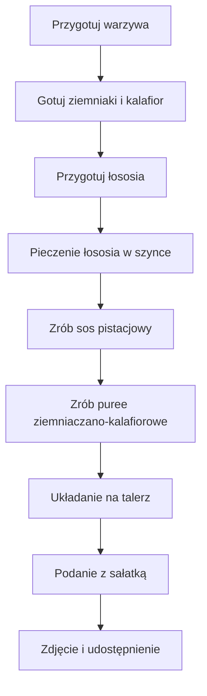

---  

## 📽️ Wprowadzenie  
huh [Muzyka]  
**Witajcie moi drodzy widzowie** w kolejnym odcinku! Dzisiaj poruszymy temat: **idealne restauracyjne danie** na romantyczną kolację – **łosoś zawinięty w szynkę**, podany z puree ziemniaczanym i kalafiorowym oraz **sos pistacjowy, miętowy i cytrynowy**. Całość komponuje się niezwykle smacznie, a ja, jak zwykle, pokażę to prosto, szybko i policzone. Zapraszam!  

---

## 📋 Składniki (na jedną porcję)

| Składnik | Ilość | Dodatkowe uwagi |
|----------|-------|-----------------|
| **Łosoś** | **300 g** | Solidny kawałek, do podwójną ilość na dwie osoby |
| **Szynka** | Ilość potrzebna do zawinięcia | Prosta szynka, nie musisz jej rozkładać |
| **Ziemniaki** | **? g** | Obrane, przyrządzone do gotowania |
| **Kalafior** | **125 g** | Równowartość połowy wagi ziemniaków |
| **Oliwa z oliwek** | **50 ml** | 1 × 50 ml = 50 g (przybliżona masa) |
| **Pistacje (obrane)** | **25 g** | Dobrze obrać, by nie zanieczyścić sosu |
| **Sok z cytryny** | **25 ml** | Pół ilości oliwy |
| **Liście mięty** | Kilka | Do smaku |
| **Mieszanka sałat** | Do podania | Rukola, pomidorki cherry, itd. |
| **Śmietana** | Mała garść | Do sosu, jeśli potrzebna |

> **Uwaga:** Jeśli robicie kolację dla dwóch osób, podwajaj wszystkie składniki.

---

## 🔧 Niezbędne sprzęty

- Naczynie na parę  
- Płyta grzewcza / piekarnik  
- Blender  
- Deska do krojenia  
- Szpatułka  
- Rękawice kuchenne (opcjonalnie)  

---

## 👩‍🍳 Instrukcje krok po kroku

### 1️⃣ Przygotowanie warzyw
1. **Ziemniaki** wrzuć do naczynia na parę.  
2. Dodaj lekko osoloną wodę.  
3. Gotuj **w połowie czasu** (ok. 10 min).  
4. **Kalafior** gotuj w tym samym naczyniu, ale na krótszy czas, bo jest mniej gęsty.  

> *Podczas gotowania możesz skupić się na przygotowaniu łososia.*

### 2️⃣ Przygotowanie łososia
1. **Łososia** delikatnie przypraw solą, pieprzem, świeżo zmielonym pieprzem.  
2. Owiń kawałek szynką – nie przejmuj się, jeśli się rozpadnie.  
3. Umieść w piekarniku (lub na blaszce) i piecz, aż zewnętrzna warstwa szynki lekko się zrumieni.  

### 3️⃣ Przygotowanie sosu pistacjowego
1. Do blendera wrzuć:  
   - **50 ml oliwy** (ok. 150 g)  
   - **25 g pistacji** (obranie z błonk)  
   - **25 ml oliwy** (pół ilości)  
   - **Sok z cytryny** (25 ml)  
   - **Kilka liści mięty**  
2. Blenduj do uzyskania jednolitej konsystencji.  
3. Dopraw do smaku, ewentualnie w zależności od preferencji gęstości.  

### 4️⃣ Przygotowanie puree ziemniaczano‑kalafiorowego
1. Po ugotowaniu zmiksuj ziemniaki i kalafior w blenderze.  
2. Dodaj:  
   - **Szczypta soli**  
   - **Gałka muszkatołowa**  
   - **Szczypta czarnego pieprzu**  
3. Blenduj, aż uzyskasz **delikatną, kremową strukturę** – bez dużych grudek.  

### 5️⃣ Układanie i podanie
1. Na talerz wyłóż przygotowane puree.  
2. Na wierzch połóż **łososia w szynce** – pięknie wypieczone i aromatyczne.  
3. Polej całość **sosem pistacjowym miętowo‑cytrynowym**.  
4. Dodaj **mieszankę sałat** – rukola, pomidorki cherry, i inne zieleniny.  
5. **Czas na zdjęcie** – screenshot, zapisz i udostępnij!  

---

## 🧑‍🍳 Makro‑kalorie (orientacyjne)

| Składnik | Kalorie (1 porcja) |
|----------|--------------------|
| Łosoś | ~600 kcal |
| Szynka | ~200 kcal |
| Puree ziemniaczano‑kalafiorowe | ~250 kcal |
| Sos pistacjowy miętowo‑cytrynowy | ~150 kcal |
| Sałatka | ~50 kcal |
| **Razem** | ~1250 kcal |

> **Uwaga:** liczby są orientacyjne, zależą od dokładnych proporcji i dodatkowych składników.

---

## 🎉 Zakończenie  
**Moi drodzy, wisienka na torcie dzisiejszego posiłku** – to właśnie ten aromatyczny sos, który dodał całości niezwykłego charakteru.  
Jeśli odcinek Ci się podobał, daj łapę w górę, napisz komentarz, podziel się opinią!  
Do zobaczenia w kolejnym odcinku. **Cześć!**

---

## 🔍 Diagram przepływu gotowania (Mermaid)

