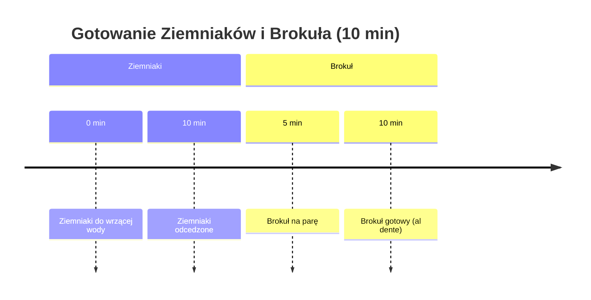

***

## MEGA BOXY 3: LETNIA EDYCJA (MEDALIONY Z INDYKA I MŁODE ZIEMNIAKI)

Witamy w odcinku poświęconym Mega Boxom 3, czyli letniej edycji przepysznych lunch boxów. Danie składa się z medalionów z indyka, młodych ziemniaczków, świeżej letniej sałatki oraz jogurtowo-koperkowego sosu.

**Charakterystyka Dania:**
*   Duże boxy, duża objętość obiadowego dania.
*   Konkretne makroskładniki i kalorie.
*   Wszystkie podane wartości są obliczone na **3 porcje** (6 kotletów).

**Uwaga dotycząca Porcji:**
Jeśli podane wartości makro i kaloryczne są zbyt duże, można podzielić wszystkie dzisiejsze składniki na **cztery porcje**. Wówczas uzyskacie **3/4** wartości podanych przez autora.

***

## I. SKŁADNIKI

Poniżej przedstawiono składniki potrzebne do przygotowania 3 pełnych porcji obiadowych.

### 1. Składniki na Medaliony (Kotlety) – 6 sztuk

| Składnik | Ilość | Uwagi |
| :--- | :--- | :--- |
| **Polędwica z indyka** | 450 g | 150 g na porcję. |
| **Ser feta** | Cały (150 g) | |
| **Cebula czerwona** | Pół sztuki | |
| **Suszone pomidory (z oleju)** | Ponad 6 sztuk | Około 1+ sztuka na kotlecika. |
| **Brokuł** | Połowa dużego | Używamy również łodygi. |
| **Jajka** | 3 sztuki | |
| **Bułka tarta** | Niewielka ilość | Do sklejenia masy. |
| **Przyprawa do kurczaka** | 1 duża łyżka | |
| **Oregano** | 1 duża łyżka | |

### 2. Składniki na Młode Ziemniaki

| Składnik | Ilość | Uwagi |
| :--- | :--- | :--- |
| **Młode ziemniaki** | 1,2 kg | 400 g na porcję. Tylko przemyte, nie obrane. |
| **Oliwa** | 20 ml | |
| **Czosnek** | 4 ząbki | Wyciskane do oliwy. |
| **Papryka słodka** | 1 pełna łyżeczka | |
| **Papryka wędzona** | Trochę mniejsza łyżeczka | |
| **Tymianek** | 1 łyżeczka | |
| **Sól** | Nieco | |
| **Chilli** | Szczypta | Dla pikantności. |

### 3. Składniki na Sos Jogurtowo-Koperkowy

| Składnik | Ilość | Uwagi |
| :--- | :--- | :--- |
| **Skyr** | 1 cały pojemnik | Na 3 porcje. |
| **Jogurt naturalny** | 150 g | Taka sama ilość jak Skyr. |
| **Koperek** | Duża ilość | Sos ma być mocno koperkowy. |
| **Czosnek** | 1 ząbek | Wciśnięty. |
| **Pieprz** | Świeżo mielony. | |
| **Sól** | Nieco. | |

### 4. Składniki na Sałatkę Letnią

*   Mix sałat
*   Zielony, chrupiący ogórek
*   Rzodkiewka (umyta, pokrojona na 6 kawałków)

***

## II. PRZYGOTOWANIE WSTĘPNE I OBRÓBKA TERMICZNA

Przygotowanie zaczynamy od ziemniaków, które stanowią bazę czasową dla brokuła.

### 1. Gotowanie Ziemniaków i Brokuła

1.  **Ziemniaki:** Delikatnie wyszorowane i wymyte młode ziemniaki wrzucamy do wrzącej, osolonej wody.
2.  **Gotowanie:** Gotujemy przez **10 minut**.
3.  **Brokuł:** W międzyczasie kroimy brokuła z grubsza. Wykorzystujemy również łodygę, która trafi do kotlecików.
4.  **Parowanie Brokuła:** W połowie czasu gotowania ziemniaków (po 5 minutach) umieszczamy wstępnie pokrojonego brokuła na parze nad gotującymi się ziemniakami. Parujemy przez **5 minut**.
    *   *Efekt:* Brokuł jest gotowy – blanszowany, piękny zielony, chrupki i **al dente**.

#### Diagram Czasowy (Mermaid)

### 2. Przygotowanie Ziemniaków do Pieczenia

1.  **Odcedzanie:** Po 10 minutach odcedzamy ziemniaki (młode ziemniaki po tym czasie powinny być już miękkie).
2.  **Nastroszenie:** Odcedzone ziemniaki przerzucamy z powrotem do naczynia i **mocno, energicznie potrząsamy**.
    *   *Cel:* Nastroszenie ziemniaka. Lekko obity ziemniak lepiej przypieka się w piekarniku, a oliwa z przyprawami lepiej się przylepia.

***

## III. PRZYGOTOWANIE MASY NA KOTLETY

Po obróbce wstępnej warzyw, przygotowujemy farsz na medaliony.

### 1. Krojenie i Mieszanie Składników

Wszystkie składniki kroimy i wrzucamy do miski, którą wcześniej **tarujemy** na wadze, aby móc później precyzyjnie podzielić masę.

| Składnik | Sposób Krojenia | Uwagi |
| :--- | :--- | :--- |
| **Brokuł** | Drobna kostka | Nie na miazgę, kawałki muszą być wyczuwalne. |
| **Cebula czerwona** | Drobna kostka | |
| **Ser feta** | Kostka | Całe 150 g. |
| **Suszone pomidory** | Drobno | |
| **Indyk (polędwica)** | Drobno szatkujemy | Można użyć miksera/robota, ale można to zrobić nożem (wstępnie w kostkę, potem drobno). |

### 2. Dodatki i Przyprawy

Do pokrojonej masy dodajemy:

*   **Jajka:** 3 sztuki.
*   **Bułka tarta:** Trochę (dla lepszego sklejenia).
*   **Przyprawy:**
    *   1 duża łyżka przyprawy do kurczaka.
    *   1 duża łyżka oregano.

### 3. Formowanie Kotletów

1.  **Mieszanie:** Całość dokładnie mieszamy, aż masa się zlepi i będzie trzymać się razem.
2.  **Ważenie i Dzielenie:** Sprawdzamy wagę całej masy i dzielimy ją na **6 równych części** (6 kotletów na 3 porcje).
3.  **Formowanie:** Delikatnie zwilżamy ręce i formujemy kotlety.
4.  **Spłaszczanie:** Kotlety delikatnie spłaszczamy, aby mieć pewność, że mięso w środku nie będzie surowe podczas pieczenia.
5.  **Układanie:** Układamy kotlety na blasze wyłożonej papierem do pieczenia.

***

## IV. PRZYGOTOWANIE ZIEMNIAKÓW DO PIECZENIA

Przygotowujemy aromatyczną mieszankę do obtoczenia ziemniaków.

1.  **Mieszanka Oliwy:** Do 20 ml oliwy dodajemy:
    *   4 ząbki wyciśniętego czosnku.
    *   1 pełną łyżeczkę słodkiej papryki.
    *   Nieco mniejszą łyżeczkę papryki wędzonej.
    *   1 łyżeczkę tymianku.
    *   Nieco soli.
    *   Szczyptę chilli.
2.  **Obtaczanie:** Miksturę bardzo dobrze mieszamy, a następnie wlewamy całość do nastroszonych ziemniaków i dokładnie mieszamy, aż każdy ziemniak będzie obtoczony przyprawami.
3.  **Wykładanie:** Wykładamy ziemniaki na drugą połowę blachy obok uformowanych kotletów.

***

## V. PIECZENIE

### 1. Parametry Piekarnika

*   **Piekarnik:** Rozgrzewamy do **200°C**.
*   **Tryb:** Termoobieg.
*   **Umiejscowienie:** Środkowa część piekarnika.

### 2. Proces Pieczenia

1.  **Faza I:** Pieczemy przez **10 minut**.
2.  **Przerwa (Po 10 min):** Wyjmujemy blachę.
    *   Ziemniaki ładnie mieszamy.
    *   Kotlety obracamy na drugą stronę (powinny być już przyrumienione).
3.  **Faza II:** Wkładamy z powrotem do piekarnika na kolejne **10–12 minut** (w tych granicach, w zależności od piekarnika).

***

## VI. PRZYGOTOWANIE DODATKÓW

W czasie pieczenia przygotowujemy sos i sałatkę.

### 1. Sos Jogurtowo-Koperkowy

1.  Mieszamy cały Skyr i 150 g jogurtu naturalnego.
2.  Dodajemy dużą ilość świeżego koperku (sos ma być mocno koperkowy).
3.  Wciskamy 1 ząbek czosnku.
4.  Doprawiamy świeżo mielonym pieprzem i solą.

### 2. Sałatka Letnia

Sałatka jest prosta i chrupiąca:

*   Mix sałat.
*   Chrupiący zielony ogórek.
*   Umyta rzodkiewka (pokrojona na 6 kawałków).

***

## VII. FINALIZACJA I PAKOWANIE BOXÓW

Po wyjęciu z piekarnika, gorące danie pakujemy do boxów obiadowych.

1.  **Wykładanie:** Na każdy box wykładamy po **dwa kotlety** drobiowe.
2.  **Ziemniaki:** Rozdzielamy ziemniaczki po równo do boxów.
3.  **Sałatka:** Robimy miejsce na sałatkę.
4.  **Sos:**
    *   Na sałatkę nakładamy dużą łyżkę sosu.
    *   Resztę sosu wykładamy do oddzielnych pojemników/czarek.

**Gotowe boxy!**

### Makro i Kalorie

Makro i kalorie podane są na **jedną porcję** (1/3 całości), zawierającą dwa kotlety, 400 g ziemniaków, sałatkę i sos.

*Smaczek:* W kotletach wyczuwalne są chrupiące kawałki brokuła, co jest dużym atutem tego dania.