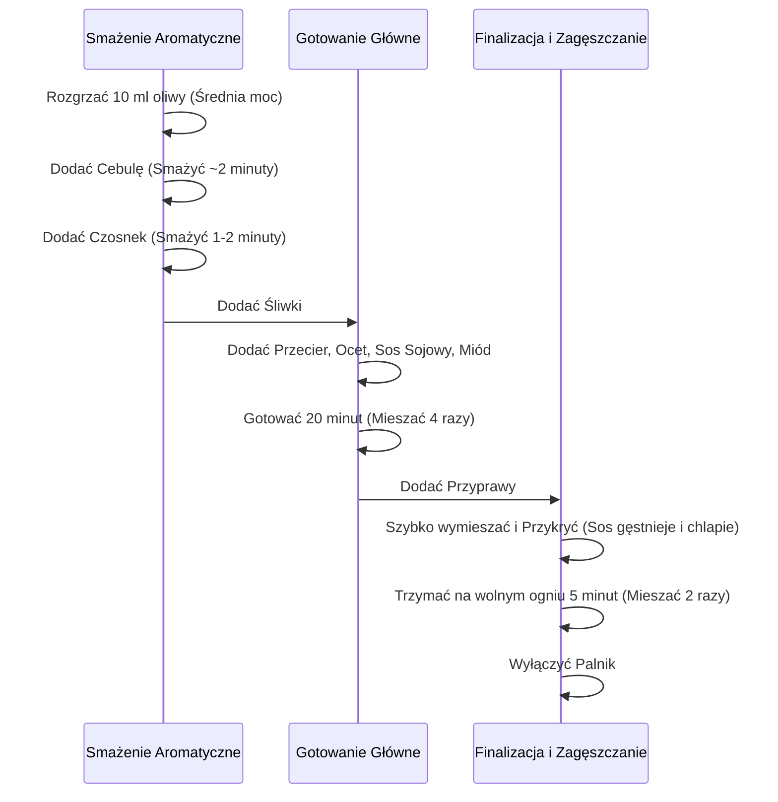

***

## Rewelacyjny Sos Barbecue: Przepis Krok po Kroku

**Witajcie Drodzy Widzowie!** Ponownie na kanale, dziś kolejny odcinek z serii "Dwuminutową" (czas nieco naciągnięty, ale było warto!). Pokażemy krok po kroku, jak zrobić **rewelacyjny sos barbecue**. Osiągniemy idealną równowagę: słodkość, pikantność, kwaskowatość i struktura – wszystko to sprawi, że sos będzie idealnym dodatkiem do waszych mięsnych dań z grilla. Zaczynamy!

### I. Wymagane Składniki

Poniżej przedstawiono wszystkie składniki potrzebne do przygotowania sosu (przepis oparty na jednym kartoniku przecieru pomidorowego).

#### A. Składniki Bazowe i Płynne

| Składnik | Ilość | Uwagi / Funkcja |
| :--- | :--- | :--- |
| **Przecier pomidorowy** | 1 kartonik | Baza sosu. |
| **Cebula** | Średnio mała | Do struktury. |
| **Czosnek** | 2 większe ząbki | Aromatyzowanie. |
| **Suszone śliwki** | 60 gramów | Dodatek smakowy. |
| **Ocet z białego wina** | 50 ml | Kwaskowatość. |
| **Miód** | 60 gramów | Jedyne źródło słodkości. |
| **Sos sojowy** | 20 ml | Odpowiada to około 3 łyżkom. |
| **Oliwa** | 10 ml | Do podsmażenia cebuli i czosnku. |

#### B. Przyprawy (Dla Dymnego Aromatu i Pikantności)

Nie ma sosu barbecue bez dymnego aromatu.

| Przyprawa | Ilość | Cel / Charakterystyka |
| :--- | :--- | :--- |
| **Wędzona papryka** | 1,5 konkretnej łyżki | Kluczowa dla dymnego aromatu. |
| **Gałka muszkatołowa** | 1/3 łyżeczki | Dla pikantności. |
| **Cynamon** | Subtelna ilość | Rewelacyjnie wzbogaca smak. |

***

### II. Przygotowanie Wstępne Składników

Czas na zrobienie screenshota listy składników! Gdy już wiecie, co kupić, przechodzimy do obróbki warzyw:

1.  **Cebula:** Obieramy. Kroimy w kostkę o szerokości mniej więcej **5 do 7 milimetrów**. Ta wielkość zapewni odpowiednią strukturę w sosie.
2.  **Czosnek:** Obieramy, kroimy, szatkujemy i delikatnie miażdżymy, aby puścił soki.
3.  **Śliwka:** Kroimy w drobną kosteczkę (drobno szatkujemy), aby uniknąć zbyt dużych kawałków.

***

### III. Proces Gotowania Sosu (30 Minut)

Poniżej przedstawiono sekwencję kroków gotowania, prowadzącą do uzyskania idealnej konsystencji.

#### A. Podsmażanie Aromatyczne

1.  Ustawiamy średnią moc palnika pod garnkiem.
2.  Wlewamy **10 mililitrów oliwy** i podgrzewamy.
3.  Wrzucamy naszą cebulę. Obrabiamy ją, aż straci surowość, dostanie lepkości i delikatnie zmięknie (trwa to mniej więcej **2 minuty**).
4.  Po tym czasie dodajemy czosnek. Obrabiamy razem maksymalnie **minutę do dwóch minut**.
5.  Dodajemy pokrojoną śliwkę i mieszamy wszystko razem.

#### B. Faza Płynna i Gotowanie Wstępne

1.  Dodajemy od razu cały karton przecieru pomidorowego (dobrze wyciskamy, aby nic się nie zmarnowało).
2.  Dodajemy ocet, sos sojowy oraz miód.
3.  Dokładnie wszystko mieszamy.
4.  **Gotowanie Główne (20 minut):** Zaczynamy odliczać czas. Spokojnie gotujemy, mieszając od czasu do czasu (autor wymieszał mus około **cztery razy**). Jest to ważne, ponieważ wszystkie ciężkie składniki pracują na dnie i należy go co jakiś czas pomieszać, aby się nie przypalił.

#### C. Zagęszczanie i Finalizacja

1.  **Dodanie Przypraw:** Po upływie 20 minut dodajemy przyprawy (wędzoną paprykę, gałkę i cynamon).
2.  Taka ilość prochu mocno zagęści sos, dlatego należy go jak najszybciej pomieszać.
3.  Sos okazał się bardzo gęsty i mocno chlapie z przyprawami, dlatego najlepiej jest **przykryć go przykrywką**.
4.  Trzymamy na wolnym ogniu jeszcze **5 minut**, mieszając w tym czasie 2 razy.
5.  Po tym czasie wyłączamy palnik.

#### Schemat Procesu Gotowania

***

### IV. Wskazówki Końcowe i Serwowanie

Mój epicki sos barbecue jest gotowy!

*   **Wygląd i Konsystencja:** Sos pięknie się prezentuje, ma idealną konsystencję i świetną strukturę dzięki kawałkom cebuli.
*   **Smak:** Smakowo osiąga **totalne 10 na 10**.
*   **Pikantność (Ważna Uwaga):** Nie przestraszcie się pikantności, gdy potrawa jest jeszcze gorąca. Pamiętajcie, że wysoka temperatura potęguje efekt ostrości.
*   **Zasada Serwowania:** Ten sos przede wszystkim niesie na **zimno**.
*   **Walory Smakowe:** Na drugi dzień, kiedy przechowacie go w lodówce, dostaje jeszcze dodatkowych walorów smakowych.

#### Alternatywna Opcja

Raz zdarzyło mi się go zblendować, aby dostać jednolitą masę, ale osobiście uważam, że "to nie to".

Przed Wami przepyszny sos barbecue, który wymagał zaledwie 30 minut pracy. Jest idealny do potraw mięsnych i grilla. Zaskoczycie rodzinę i znajomych.

Daję Wam masy kalorii na całość, którą dzisiaj przyrządziliśmy. Zostawcie łapkę w górę i piszcie komentarze. My widzimy się w kolejnym odcinku. Do zobaczenia, cześć!