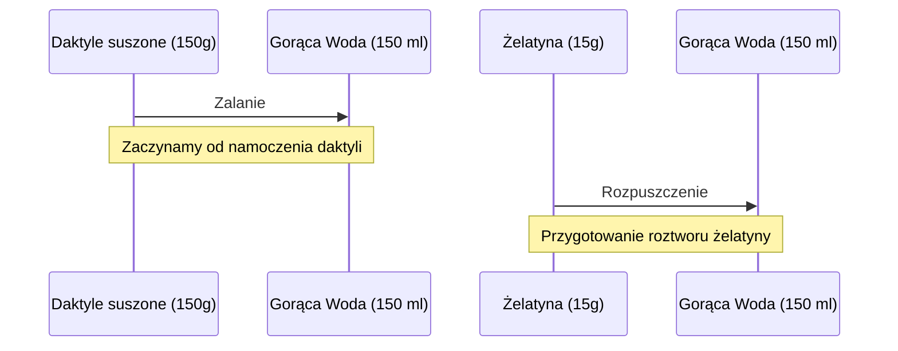

***

# SERNIK OREO Z TRUSKAWKĄ: WYSOKOBIAŁKOWY DESER MOTYWACYJNY

No siemaneczko moi drodzy! Witajcie w kolejnym odcinku. Wiem, że dawno nie było, a niektórzy długo czekali na coś słodkiego. Dzisiaj wjeżdża **sernik OREO z truskawką**!

## Charakterystyka i Walory Deseru

Ten deser łączy w sobie wyjątkowe tekstury i smaki, stanowiąc idealną kontrę dla słodyczy.

*   **Masa sernikowa:** Jest bardzo przyjemna i puszysta, charakteryzuje się dużą ilością **białka**.
*   **Ciasteczka Oreo:** Złapią wilgoć, dzięki czemu staną się miękkie i rozpływające w ustach.
*   **Truskawka:** Pełni rolę owocowego dodatku. Najlepiej, aby dodała trochę **kwaskowatości**, stanowiąc kontrę do słodkich ciastek.
*   **Spód:** Całość opiera się na sprawdzonym spodzie wykonanym z **płatków owsianych i daktyli**.

## Makroskładniki i Przeznaczenie Posiłku

Mimo że dostarczamy nieco cukrów prostych, deser ten charakteryzuje się bardzo przyjemnymi makrosami.

Jest to idealny posiłek na czas **okołotreningowy**. Nazywam go posiłkiem motywacyjnym, który ma zachęcić do wykonania dobrego treningu.

## Szczegółowa Lista Składników

Poniżej przedstawiono wszystkie składniki potrzebne do wykonania tego przepysznego deseru. Róbcie screenshota, zapisujcie i do dzieła!

### 1. Składniki do Spodu

| Składnik | Ilość | Uwagi dotyczące przygotowania |
| :--- | :--- | :--- |
| **Daktyle suszone** | 150 g | Należy je od razu zalać **150 ml gorącej wody**. |
| **Płatki owsiane błyskawiczne** | 150 g | |
| **Kakao** | 2 łyżeczki (ok. 10 g) | Dodatek do spodu. |

### 2. Składniki do Masy Sernikowej (Źródła Białka)

*   **Twarogi chude w kostce:** 2 sztuki
*   **Jogurty typu Skyr:** 2 sztuki
*   **Napój mleczny wysokobiałkowy:** 1 sztuka (o smaku waniliowym)

### 3. Dodatki, Słodziki i Elementy Wiążące

*   **Ciasteczka Oreo:** 1 cała paczka (dokładnie **16 ciasteczek**)
*   **Truskawki:** Mniej więcej **400 g**
    *   *Wskazówka:* Najlepiej wybierać mniejsze truskawki, które mają większą ilość kwaskowatości. Unikaj wielkich, zmutowanych, przedojrzałych owoców.
*   **Erytrytol:** 20 g (używamy, aby podbić nieco słodkość masy)
*   **Aromat waniliowy:** Kilka kropel
*   **Żelatyna:** 15 g
    *   *Sposób przygotowania:* Rozpuścić w **150 ml gorącej wody**.

***

## Schemat Przygotowania Bazy (Przebieg wstępny)

Poniższy schemat przedstawia sekwencję działań koniecznych do przygotowania wstępnych składników.

