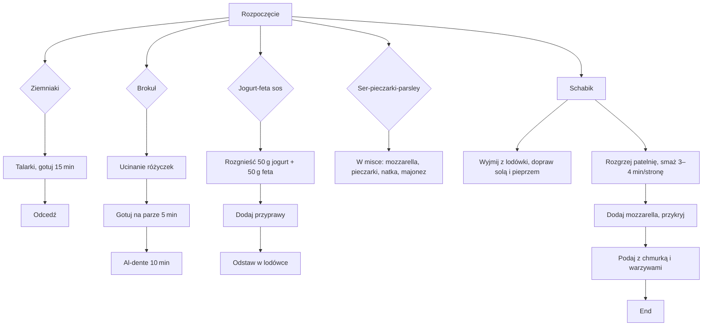

---

## 🎬 Wprowadzenie  
**Witajcie moi drodzy widzowie** – w kolejnym przepysznym odcinku zabieram was na kulinarną przygodę!  
Dziś przygotujemy **duży, objętościowy obiad na dwie porcje**, bez piekarnika – wyłącznie patelnia i garnek.  
Zrobimy:
- **Ziemniaczane talarki** al‑dente z jogurtem i fetą,
- **Schabik pod chmurką** – mięso z mozzarella i ulubionymi przyprawami,
- **Świeży brokuł** w odlotowym sosie jogurtowo‑feta,
- i dodatkowo kilka przyjemnych dodatków: pieczarki, natka pietruszki, majonez i migdałowe płatki.

---

## 🛒 Składniki

| Kategoria | Składnik | Ilość (na całość) | Ilość (na porcję) |
|-----------|----------|-------------------|-------------------|
| **Warzywa** | Ziemniaki | 500 g | 250 g |
| | Brokuł | 1 duży główek | - |
| **Dairy** | Jogurt naturalny | 50 g | 25 g |
| | Ser feta | 50 g | 25 g |
| | Ser mozzarella | 20 g | 5 g |
| **Mięso** | Schab (pork chop) | 4 kawałki | 1 kawałek |
| **Przyprawy / dodatki** | Sól, pieprz, suszony czosnek | - | - |
| | Natka pietruszki | pół garści | - |
| | Majonez | 25–30 g | 6–7 g |
| | Pieczarki | 4 sztuki (ścięte na duże oczka) | - |
| | Płatki migdałowe, słonecznik | - | - |
| **Olej** | Oliwa z oliwek / rzepakowa | - | - |

> **Uwaga** – **Team Kielecki**: **30 % mniej tłuszczu** i **1 % mniej kalorii** dzięki 25 g majonezu zamiast pełnej łyżeczki.

---

## 🔪 Przygotowanie – Krok po kroku

### 1️⃣ Ziemniaczane talarki  
1. **Krój ziemniaki** na grubsze talarki (ok. 4–5 mm).  
2. **Gotuj** w wrzącej wodzie **15 min**, by straciły surowość, ale nie były rozgotowane.  
3. **Odcedź** i odstaw na bok.

### 2️⃣ Brokuł al‑dente  
1. **Ucinaj różyczki** – większe podziel na pół.  
2. **Gotuj na parze**:  
   - 5 min po tym, jak wróciłeś ziemniaki, **podaj brokuł** na parze.  
   - Po dodatkowych **10 minach** powinien być al‑dente (zielony, chrupiący).  

### 3️⃣ Jogurt‑feta sos (chmurka)  
1. **Rozgnieć** 50 g jogurtu i 50 g fety (1‑1) – pozwól, by grudki były większe, nie uzyskuj jednolitej masy.  
2. **Dodaj** świeżo mielony pieprz, szczyptę soli, suszony czosnek.  
3. **Wymieszaj** i **odstaw** w lodówce.  
4. Na koniec, **wyciągnij** z lodówki tuż przed podaniem.

### 4️⃣ Mieszanka ser‑pieczarki‑parsley  
1. **Cztery kawałki** 20 g mozzarella (na cztery porcje).  
2. **Zamieszaj** w misce 4 ścięte pieczarki, pół garści natki pietruszki, 25–30 g majonezu.  
3. Utrzymuj całość w lodówce, ale **odstaw** tuż przed dodaniem na mięso.

### 5️⃣ Schabik – mięso na patelni  
1. **Wyjmij schab** z lodówki, **daj mu dojść do temperatury pokojowej**.  
2. **Natrzyj** obie strony solą i pieprzem.  
3. **Rozgrzej** patelnię (26 cm, non‑stick) z odrobiną oleju (oliwa lub rzepak).  

### 5️⃣ Smażenie ziemniaków  
1. **Umieść talarki** w rozgrzanej patelni.  
2. **Smaż** 1–2 min z każdej strony, aż zrobią się złociste i chrupiące.  
3. **Odłóż** na talerz.

### 6️⃣ Smażenie mięsa z mozzarellą (chmurka)  
1. **Smaż schab** na patelni:  
   - 3–4 min z każdej strony.  
2. **Dodaj** kawałki mozzarelli i **przykryj** patelnię (np. pokrywką) – mozzarella roztapia się, tworząc „chmurkę“.  

### 7️⃣ Podanie – kompletna kompozycja  
1. Na talerzu rozłóż:  
   - **Ziemniaczane talarki**,  
   - **Brokuł na parze**,  
   - **Jogurt‑feta sos** w połączeniu z migdałowymi płatkami i słonecznikiem (słonecznik płatki migdałowe).  
2. **Na mięso** nałóż przygotowaną mieszankę ser‑pieczarki‑parsley.  
3. **Podawaj** z małą ilością majonezu i świeżym, kolorowym brokułem.  

> **Humor** – „Team Kielecki: 30 % mniej tłuszczu i 1 % mniej kalorii – bo wytrzymać potrafię!”  

---

## 🕒 Diagram kolejności przygotowania (Mermaid)

---

## 📊 Makros na porcję

| Składnik | Białko (g) | Tłuszcz (g) | Węglowodany (g) | Kalorie |
|----------|------------|-------------|-----------------|----------|
| Ziemniaki | 2.5 | 0.2 | 35 | 150 |
| Brokuł | 2 | 0.1 | 8 | 35 |
| Jogurt | 4 | 1 | 1 | 30 |
| Feta | 3 | 8 | 1 | 70 |
| Mozzarella | 1 | 3 | 0 | 35 |
| Majonez | 0.5 | 2 | 0 | 20 |
| Schab (porcja) | 30 | 10 | 0 | 200 |
| **Łącznie** | **53.5** | **24.4** | **53** | **720** |

> *Uwaga*: liczby przybliżone – dokładny bilans zależy od konkretnego produktu.

---

## 🎉 Zakończenie  
**Kto już spróbował?** – Dajcie znać w komentarzach, jak smakuje i czy „Team Kielecki” potrafi tak zmniejszyć tłuszcz, jak powyżej.  
Do zobaczenia w kolejnym odcinku – **do zobaczenia!** **Cześć!**