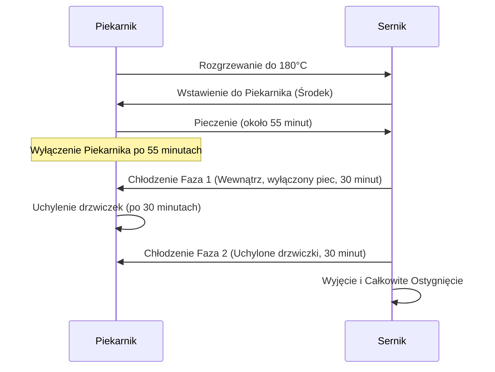

***

## WYSOKOBIAŁKOWY SERNIK LOW CARB (DWUPOZIOMOWY)

Niniejszy przepis dotyczy przygotowania prostego, szybkiego sernika o wysokiej zawartości białka i niskiej zawartości węglowodanów (low carb). Sernik ten jest celowo robiony jako **dwupoziomowy i dwukolorowy**.

### 1. Wprowadzenie i Wyposażenie

#### Charakterystyka Wypieku
Sernik charakteryzuje się:
*   Dużą ilością białka (to, co lubimy).
*   Małą ilością węglowodanów (low carb).
*   Strukturą dwupoziomową i dwukolorową.

#### Sprzęt do Pieczenia
Początkowo sernik był pieczony w naczyniu żaroodpornym, co wiązało się z pewnymi niedogodnościami:
*   Naczynie było wykładane papierem do pieczenia.
*   Kształt wypieku miał zaokrąglone krawędzie, co wizualnie średnio przypominało ciasto (choć nie przeszkadzało to autorowi).

Obecnie używana jest nowa foremka:
*   **Typ:** Foremka z blachą do pieczenia (tortownica).
*   **Funkcjonalność:** Możliwość łatwego otwarcia i dostępu do wypieku.
*   **Cena/Dostępność:** Zakupiona za około **30 zł (LD)**.
*   **Rekomendacja:** Polecana dla osób, które chcą rozpocząć pieczenie serników wysokobiałkowych low carb.

***

### 2. Składniki (Na 1 kg Twarogu)

Sernik przygotowywany jest z 1 kg twarogu. Wszystkie składniki są podzielone na dwie równe części (dwa kubki) ze względu na **ograniczenia techniczne urządzenia miksującego** (niemożność zmiksowania całości na raz).

| Składnik | Całkowita Ilość | Proporcje Twarogu | Uwagi |
| :--- | :--- | :--- | :--- |
| **Twaróg** | 1 kg | Pół na pół: 500 g chudego i 500 g półtłustego. | |
| **Jajka** | 8 sztuk | | |
| **Odżywka Białkowa** | 100 g | | Zalecany smak neutralny: wanilia, banan, ciastko, tiramisu. |
| **Stewia** | Ok. 2/3 łyżeczki | | Używana do dosłodzenia (1/3 łyżeczki na każdą połowę). |

#### Podział Składników na Warstwy

Ponieważ masa musi być miksowana dwukrotnie, wykorzystuje się ten moment do stworzenia dwóch różnych warstw smakowych:

| Warstwa | Dodatki Smakowe |
| :--- | :--- |
| **Dolny Poziom (Ciemny)** | Wiórki kokosowe i Kakao. |
| **Górny Poziom (Jasny)** | Rodzynki i Aromat waniliowy. |

***

### 3. Proces Przygotowania Masy

Cały proces miksowania musi odbywać się w dwóch turach.

#### A. Przygotowanie Warstwy Dolnej (Ciemnej)

1.  **Składniki (Połowa I):** Do miksera włożyć połowę wszystkich składników podstawowych:
    *   4 jajka.
    *   50 g odżywki białkowej.
    *   500 g twarogu (2 serki po 250 g).
    *   1/3 łyżeczki stewii.
2.  **Dodatki Smakowe:** Dodać **10 g wiórków kokosowych** oraz **kakao**.
3.  **Miksowanie:** Zmiksować składniki na gładką masę.
    *   *Uwaga:* Widoczne grudki wiórków kokosowych są akceptowalne.
4.  **Wylewanie:** Przygotowaną formę wyłożyć papierem do pieczenia. Całość zmiksowanej masy przelać na spód formy, tworząc pierwszą warstwę.

#### B. Przygotowanie Warstwy Górnej (Jasnej)

Nie jest konieczne mycie miksera po pierwszej partii.

1.  **Składniki (Połowa II):** Dodać pozostałe składniki podstawowe:
    *   4 jajka.
    *   50 g odżywki białkowej.
    *   500 g twarogu.
    *   1/3 łyżeczki stewii.
2.  **Aromat:** Dodać parę kropel **waniliowego aromatu do ciast**.
3.  **Miksowanie Wstępne:** Wymieszać masę.
4.  **Korekta:** Zrobić przerwę, aby zebrać ze ścianek naczynia składniki, które nie zostały dobrze wymieszane, a następnie włączyć urządzenie na parę sekund.
5.  **Dodanie Rodzynek:** Dodać rodzynki i włączyć mikser tylko na **3 sekundy**, aby uniknąć ich nadmiernego pocięcia.
6.  **Wylewanie:** Całość przełożyć na pierwszą (ciemną) warstwę na blasze.
7.  **Wygładzanie:** Wygładzić powierzchnię sernika.

***

### 4. Pieczenie i Chłodzenie

#### Parametry Piekarnika
*   **Temperatura:** 180°C.
*   **Tryb Grzania:** Góra-dół.
*   **Termoobieg:** BEZ termoobiegu.
*   **Umiejscowienie:** Środkowa część piekarnika.

#### Sekwencja Pieczenia i Chłodzenia

Pieczenie i studzenie jest procesem trójfazowym, mającym na celu idealne ostygnięcie sernika:

1.  **Pieczenie:** Około 55 minut (do momentu, gdy sernik jest gotowy).
2.  **Faza 1 Chłodzenia (Gorące):** Wyłączyć piec, ale pozostawić sernik w środku na **pół godziny (30 minut)**.
3.  **Faza 2 Chłodzenia (Letnie):** Uchylić drzwiczki piekarnika i pozostawić na kolejne **pół godziny (30 minut)** do ostygnięcia.
4.  **Faza 3 Chłodzenia (Końcowe):** Wyjąć sernik i poczekać, aż całkowicie ostygnie. Sernik najlepiej smakuje jedzony na zimno.

***

### 5. Prezentacja i Porcjowanie

Po ostygnięciu sernik jest gotowy do spożycia.

*   **Wygląd:** Sernik wygląda bardzo dobrze, z wyraźnie widocznymi dwiema warstwami po przekrojeniu.
*   **Smak:** Jest bardzo smaczny.
*   **Porcjowanie:** Sernik dzieli się na **8 równych kawałków**.
*   **Wielkość Porcji:** Jeden kawałek stanowi **1/8 wszystkich zużytych składników**.