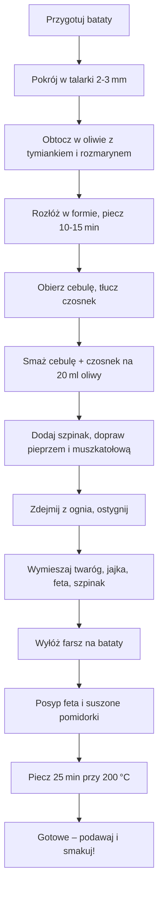

---

## 1. Wprowadzenie  
> **No witajcie moi drodzy** – witam Was w kolejnym odcinku *Policzonej Szamy*! Dzisiaj mamy **odcinek bezmięsny**, ale z odpowiednią ilością białka zwierzęcego. Zastosujemy **twaróg, jajka** i wszystko to w przepysznej, wytrawnej tarcie na batatowym spodzie.  
>  
> **Bardzo ciekawa kompozycja** – osobiste uwielbiam te smaki: świetne połączenie słodkiego ziemniaka i słonego farszu serowo‑twarogowo‑szpinakowego.  
>  
> Na kanale: prosto, szybko, niewielka liczba składników (5–6 głównych), i już gotowe. Lecimy!

---

## 2. Składniki  
> **Tarta** – forma o średnicy **26–28 cm**.

| Składnik | Ilość | Uwagi |
|----------|-------|-------|
| **Bataty** (na podłoże i ścianki) | ~500 g | Nie obieramy, tylko dokładnie myjemy i szorujemy; końcówki odcinamy. |
| **Twaróg półtłusty** | 250 g | Cały wlewamy w farsz. |
| **Jajka** | 3 | Dla uzyskania chrupiącego wierzchu. |
| **Feta** | 100 g | Użyjemy 2/3 do farszu, 1/3 do posypania. |
| **Szpinak** | 100 g | Zazwyczaj połowa paczki. |
| **Cebula** | 1 średnia | Obieramy, kroimy w drobną kostkę. |
| **Czosnek** | 2 ząbki | Obieramy, tłuczymy patelnią. |
| **Suszone pomidorki** | 4–5 | Kroimy, część do farszu, część na wierzch. |
| **Oliwa** | 10 ml (na bataty) + 20 ml (na cebulę) | Na podkład i smażenie. |
| **Przyprawy** | | |
| Tymianek, rozmaryn | 1 łyżeczka łącznie | Do batatów i cebuli. |
| Gałka muszkatołowa | Do smaku | Do farszu. |
| Świeżo mielony pieprz | Do smaku | Do farszu. |

> **Wszystkie składniki** są teraz przed Wami, gotowe do działania. Pamiętajcie, że tarta jest **26–28 cm** średnicy.

---

## 3. Przygotowanie – krok po kroku

### 3.1 Przygotowanie podłoża  
1. **Pokrój bataty** w **talarki 2–3 mm** – nie za grube, bo chcemy cienkie plastry, które tworzą bazę tarty.  
2. **Wymieszaj** 10 ml oliwy (≈ 2 łyżki niepełne) z tymiankiem i rozmarynem.  
3. **Obtocz** plastry w oliwie i przyprawach, staraj się jak najwięcej złożyć.  
4. **Rozłóż** w formie, dbając o zakładki, żeby nie było widocznego dna.  
5. **Piecz** w piekarniku przy **200 °C (grzanie góra‑dół)** przez **10–15 min** – bataty lekko zrumienią się, a tarta będzie gotowa do farszu.

### 3.2 Przygotowanie farszu (szpinakowo‑serowego)  
1. **Obierz i pokrój** cebulę w drobną kostkę; **tłucz** czosnek.  
2. Na **patelni** rozgrzej 20 ml oliwy, **smaż** cebulę do zeszklenia (1–2 min), następnie dodaj czosnek, smaż kolejne minuty.  
3. **Dodaj szpinak** – pozostaw do zwiotczenia, dopraw świeżo mielonym pieprzem i gałką muszkatołową.  
4. **Zdejmij z ognia** – niech ostygnie trochę, aby nie rozpuścił twarogu.  

### 3.3 Złożenie farszu  
1. **Wymieszaj** twaróg, jajka, pokrojoną feto (2/3), suszone pomidorki oraz przygotowany szpinak.  
2. **Wlej** farsz na wyjęte bataty, **rozdziel** równomiernie.  
3. **Posyp** wierzch 1/3 fety oraz pokrojonymi suszonymi pomidorkami.

### 3.4 Pieczenie końcowe  
1. Włącz piekarnik ponownie na **200 °C (grzanie góra‑dół)**.  
2. Piecz przez **25 min**, aż wierzch lekko się zarumieni, a całe danie będzie gotowe do podania.  

### 3.5 Serwowanie  
1. Wyjmij tartę, **pokrój** w **4 równe części**.  
2. Podawaj na talerze – **słodki batat** połącza się z wytrawnym, serowym środkiem.  
3. **Smacznie** próbujcie! Zapachy i smaki **stanowią** to, co sprawia, że odcinek jest tak udany.

---

## 4. Makroskładniki i kalorie  
> **Makrosy i kalorie na jedną porcję (1/4 całości)** oraz na **całość** przedstawiamy poniżej.  
>  
> *W tekście oryginalnym nie podano konkretnych wartości, dlatego zostawiamy miejsce na wprowadzenie własnych obliczeń.*

| Porcja | Kalorie | Białko (g) | Tłuszcze (g) | Węglowodany (g) |
|--------|---------|------------|--------------|-----------------|
| **1/4 całości** | *do obliczenia* | *do obliczenia* | *do obliczenia* | *do obliczenia* |
| **Całość** | *do obliczenia* | *do obliczenia* | *do obliczenia* | *do obliczenia* |

---

## 5. Podsumowanie i zaproszenie  
> **Makrosy i kalorie** – już na jedną porcję i na całość przed Wami.  
>  
> **Standardowo**: szybki i smakowy hit – słodki ziemniak z wytrawnym środkiem, standardowo szybko znika!  
>  
> **Makrosy i kalorie** – w jednej porcji (1/4 całości) oraz na całość – *podane, ale nie podane konkretny wartości*.  
>  
> **Komu się odcinek podobał?**  
> - łapę w górę 👍  
> - piszcie komentarze, jak smakowało, kto próbował, kto zrobił!  
>  
> **I widzimy się w kolejnym odcinku** – do zobaczenia, cześć!

---

## 6. Diagram przepływu przygotowania (opcjonalny)  

---

**Dziękuję za uwagę!** Jeśli odcinek Wam się podobał, dajcie łapę w górę, piszcie komentarze – smak, który smakowało, kto próbował, kto zrobił! Do zobaczenia w kolejnym odcinku. **Cześć!**