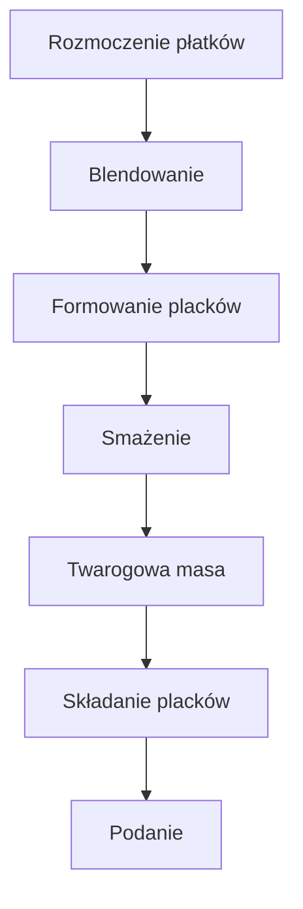

**📺 Witajcie na kanale *Policzona Szama* – a ja jestem Mateusz!**  
Dziś z serii „5 składników” podaję **śniadaniowego niszczyciela**: podwójny placek z płatków jaglanych, a'la Snickers, pełen słodkości i ponad **1000 kcal** w jednej misce!  
Jedną połówkę możesz spróbować już dziś – drugą zostaw na drugie śniadanie, podwieczorek lub nawet na zimno – bo smakują tak samo pysznie!  
Zaczynamy? Nie ma na co czekać – **startujemy!**

---

## 🔍 Składniki (gotowe do podania)

| Składnik | Ilość | Uwagi |
|----------|-------|-------|
| **2 jajka** | 2 | Najważniejszy element – nie przejmuj się ilością, bo zawsze przyspieszą cię w kuchni! |
| **Płatki jaglane błyskawiczne** | 100 g | Dzięki nim budyń (czyli masa płatkowa) zyskuje puszystość – pamiętaj, że tylko 80 g wchłonie mleko, a 20 % zostawiasz na końcu. |
| **Mleko 1,5 %** | 150 ml | 1,5 % tłuszczu = idealna baza do rozmoczenia płatków. |
| **Chudy twaróg** | 125 g (połowa kostki) |  | 
| **Nutwhey Hazelnut** | 1‑2 łyżki (ok. 30‑35 g) | Orzech laskowy – mój absolutny favorit! |
| **Nutwhey Karmel** | 1‑2 łyżki | Karmelowy smak (fistaszki karmelowe) – podwójny składnik, ale możesz użyć tylko jednego. |
| **Prażone orzeszki ziemne (krojone)** | opcjonalnie | Dzięki nim placki nabierają chrupkości typu Snickers. |

> **Pamiętaj:** Użyj kodu **PoliczonaSzama** – daje 10 % rabatu w sklepie **SFD**!  
> Rób screenshota i zapisuj – wszystko pod kontrolą!

---

## 👩‍🍳 Przygotowanie – krok po kroku

> **Uwaga:** U mnie całość waży 350 ml i jest podzielona na dwie połówki (100 g płatków, 1 jajko w każdym).  

### 1️⃣ Rozmoczenie płatków
1. Do **mleka 150 ml 1,5 %** wrzuć **płatki jaglane błyskawiczne 100 g**.  
2. Rozmień je lekko, żeby dostali odpowiednią objętość (80 % płatków ma być rozmyta).  
3. **80 g** rozmoczone, a **20 g** zostawiasz na później.

### 2️⃣ Blendowanie
1. Dodaj 1 jajko (z dwóch).  
2. Włóż do blendera i blenduj **kilkadziesiąt sekund** – wystarczy, by rozbić płatki i zwiększyć powierzchnię wchłaniania.  
3. Odstaw na **5‑7 min** – niech płatki wchłoną mleko, tworząc „budyń jaglany”.

### 3️⃣ Formowanie i rozdzielanie masy
1. Dwa jajka oraz **połowa** łyżeczek orzeszków (1 łyżka na każde miejsce wypełnienia) – dokładnie wymieszaj.  
2. Zważ pojemność: **350 ml** (przykład).  
3. **Połowę masy** wlej na pierwszego placka, drugą połowę na drugiego.

### 4️⃣ Smażenie placków
1. Rozgrzej patelnię i wlej **kropelkę oleju** (najlepiej ręcznikiem papierowym – bo kto nie lubi „olejów w rękach?”).  
2. Wylej **połowę masy** na środek patelni, formując placki o grubości ~1 cm.  
3. Smaż **2 min** – pierwsza strona powinna być delikatnie przyrumieniona (słowo‑puk! – „pyk!”).  
4. Obróć, smaż krócej (zwykle 1‑2 min) – druga strona powinna być równie pyszna.  
5. Przełóż na talerz, gotowe!

### 5️⃣ Maska twarogowa
1. **Czysty twaróg** – połowa kostki, czyli 125 g, w połączeniu z **Nutwhey Hazelnut** (ok. 30‑35 g).  
2. Nie musisz mieć jednolitej masy – dwukolorowy twaróg to fajny efekt wizualny.  
3. Rozsmaruj równomiernie po całej powierzchni placka.  
4. Na drugą połowę podaj **Nutwhey Karmel** – jedna łyżka, żeby uzyskać smak Snickersa.

### 6️⃣ Składanie i podanie
1. Połącz obie połówki – jedna na drugiej.  
2. Podawaj na ciepło (roztopione kremy) lub na zimno – i nie zapomnij o **reszcie prażonych orzeszków** jako chrupkości.  
3. Jeśli masz ochotę, podziel całość na dwie porcje – **ponad 1000 kcal** w jednym miejscu!

---

## 📊 Wartości odżywcze (nie podane, ale wiesz, co się liczy)

> *To są wartości odżywcze, makroskładniki i kalorie*:  
> **Niewiadome** – ale jedno jest pewne, że wypełnia pełnowartościowy i słodki cel!

---

## 🎉 Podsumowanie

- **„Niszczyciel”** gotowy, a Ty w jednej misce masz **podwójny Snickers** z płatków jaglanych!  
- Zjedz pierwszą połówkę już dziś, a drugą odstaw na podwieczorek – **zima też jest w cenie**.  
- Pamiętaj, że 1000+ kcal to nie tylko energia, ale i *ruch do komentarzy*:  
  - Kto zjadł całość? Podnieś rękę!  
  - Jak smakowało? Opowiedz w komentarzach!  

**Do zobaczenia w kolejnym odcinku** – na *Policzona Szama*! Cześć! 👋

---

## 🗺️ Diagram procesu (Mermaid)

