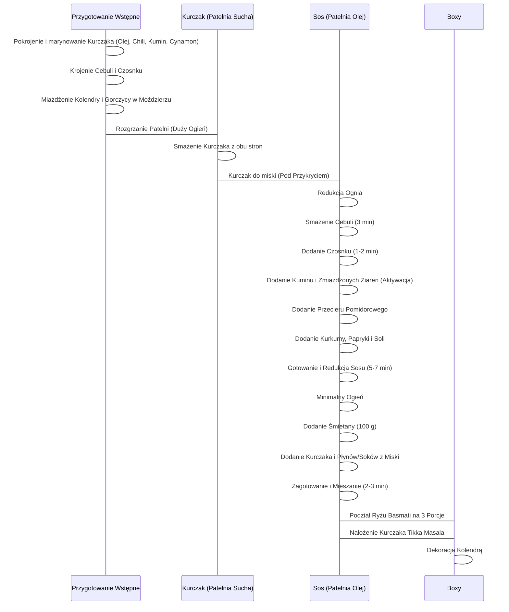

***

## Wstęp i Filozofia Dania

Witamy ponownie na kanale! Dzisiejszy odcinek poświęcony jest kolejnym **boxom obiadowym**, które cieszą się Waszą popularnością. Przygotujemy **Kurczaka Tikka Masala** – danie o indyjskich smakach i niesamowitym bogactwie aromatów, serwowane z **ryżem basmati**.

Zgodnie z mottem kanału, danie będzie: **proste, szybkie, konkretne i niesamowicie smakowe**.

**Dodatkowa informacja:** W materiale zaprezentowana zostanie **cena użytych składników** w przeliczeniu na jeden box.

***

## Zestawienie Składników (Na 3 Porcje)

Przedstawione składniki są potrzebne do przygotowania dania na **trzy pełne porcje obiadowe**.

### Główne Składniki

| Składnik | Ilość (Łącznie na 3 porcje) | Ilość na Porcję |
| :--- | :--- | :--- |
| **Kurczak** (pierś) | 600 g | 200 g |
| **Ryż Basmati** | 300 g | 100 g |
| **Śmietana** (18%) | 100 g | ok. 33 g |
| **Przecier pomidorowy** | Cały kartonik | |
| **Cebula** | 1 sztuka | Średnio-duża |
| **Czosnek** | 4-5 ząbków | |
| **Olej** (np. rzepakowy) | Do smażenia (ok. 35 ml łącznie) | |
| **Świeża kolendra** | Do dekoracji | Opcjonalnie: zielona pietruszka |

### Kluczowe Przyprawy i Aromaty

Danie bazuje przede wszystkim na intensywnych przyprawach.

| Przyprawa | Ilość | Zastosowanie |
| :--- | :--- | :--- |
| **Kumin** (kmin rzymski) | 1 duża łyżka | Sos (większość) i marynata (pół łyżeczki) |
| **Ziarna kolendry** | 1 łyżeczka | Zmiażdżone w moździerzu |
| **Biała gorczyca** | 1 łyżeczka | Zmiażdżone w moździerzu |
| **Słodka papryka** | 1 cała łyżeczka | Sos |
| **Kurkuma** | Niecała 1 łyżeczka | Sos |
| **Chili/Pieprz Cayenne** | Do smaku | Marynata (definiowanie ostrości) |
| **Cynamon** | Szczypta / Nieco | Marynata |
| **Sól i Pieprz** | Odpowiednia dawka | Do marynaty i sosu |

> **Wskazówka:** Zachęca się do zrobienia zrzutu ekranu lub zapisania listy składników.

***

## Faza I: Przygotowanie Wstępne Składników

Celem jest przygotowanie wszystkich składników, aby później jedynie wrzucić je na patelnię.

### 1. Marynowanie Kurczaka

Aby kurczak zachował soczystość, należy wyjąć go wcześniej z lodówki, by osiągnął temperaturę pokojową.

1.  **Krojenie:** Kurczaka kroimy w **grubszą kostkę**.
2.  **Olejowanie:** Wlać 15 ml oleju (ok. 2 łyżki). Dokładnie wymieszać, aby każdy kawałek piersi był nasączony.
3.  **Doprawianie (Uproszczona Garam Masala):**
    *   Chili/Pieprz Cayenne.
    *   Pół łyżeczki kuminu (pożyczone z głównej, czubatej łyżki).
    *   Szczypta cynamonu.
    *   Odpowiednia dawka świeżo mielonego pieprzu.
4.  **Oczekiwanie:** Kurczak czeka w misce, aż reszta składników zostanie przygotowana.

### 2. Przygotowanie Aromatycznej Bazy

1.  **Cebula:** Obrać i pokroić w **drobną kostkę**.
2.  **Czosnek:** Obrać i drobno poszatkować lub zmiażdżyć ręcznie.
    *   *Uwaga:* Ręczne obrobienie czosnku jest preferowane, aby puścił więcej soków. Alternatywnie można użyć praski bezpośrednio na patelnię.
3.  **Miażdżenie Nasion:** W moździerzu zmiażdżyć bardzo dokładnie po jednej łyżeczce **ziaren kolendry** i **gorczycy białej**.
    *   *Wskazówka Aromatów:* Aromat ze świeżo zmiażdżonych nasion (w przeciwieństwie do gotowych, mielonych) jest znacznie bardziej intensywny.

***

## Faza II: Proces Gotowania (Kurczak i Sos)

### A. Przygotowanie Ryżu

W międzyczasie należy ugotować **ryż basmati**:

*   **Ilość:** 300 g.
*   **Woda:** Osloona.
*   **Czas:** 11 minut.

### B. Smażenie Kurczaka

1.  **Rozgrzewanie:** Rozgrzać dużą patelnię (zalecana 30 cm).
2.  **Smażenie:** Wyłożyć kurczaka na **suchą, dobrze nagrzaną patelnię** (powinien syczeć).
3.  **Rozkładanie:** Rozłożyć kawałki na patelni, aby każdy miał swoje miejsce.
4.  **Obróbka:** Smażyć na dużym płomieniu, aby kurczak dobrze się przysmażył, zachował soczystość i szybko się obrobił.
5.  **Odpoczynek:** Po obrobieniu z obu stron, zdjąć kurczaka z patelni i przełożyć do miski **pod przykryciem**. Kurczak będzie dalej obrabiał się wewnątrz, czekając na właściwą chwilę.

### C. Tworzenie Sosu Tikka Masala

1.  **Baza Tłuszczowa:** Ponownie włączyć gaz (może być nieco mniejszy płomień). Na patelnię wlać 20 ml oleju (ok. 3 pełne łyżki).
2.  **Smażenie Cebuli:** Wrzucić cebulę. Delikatnie podsmażać do utraty surowości (ok. 3 minuty).
3.  **Dodanie Czosnku:** Dorzucić czosnek. Smażyć z cebulą przez kolejną 1-2 minuty.
4.  **Aktywacja Przypraw Sypkich:**
    *   Dodać 1 łyżkę **kuminu rzymskiego**.
    *   Dodać zmiażdżoną **gorczycę i kolendrę**.
    *   Przemieszać, aby przyprawy się zaktywowały temperaturą, **ale nie przysmażać**.
5.  **Wlanie Przecieru:** Wlać **cały kartonik przecieru pomidorowego**.
    *   Mieszać, zbierając wszystkie smaki wytworzone na dnie i ściankach patelni.
6.  **Dodanie Koloru i Smaku:**
    *   Dodać **kurkumę** (pół łyżeczki) oraz **słodką paprykę** (łyżeczkę).
    *   Doprawić sosem **solą**.
7.  **Redukcja Sosu:** Zagotować sos i redukować go przez **5-7 minut**.
    *   *Cel:* Mieszanie się smaków i lekkie zagęszczenie (sos nie może całkowicie wyparować, musi pozostać w czym moczyć ryż). W międzyczasie można przemieszać sos.

### D. Łączenie Elementów

1.  **Dodanie Śmietany:** Zmniejszyć płomień do minimum. Dodać **100 g śmietany** (18%). Wymieszać, tworząc piękny indyjski kolor.
2.  **Powrót Kurczaka:** Dorzucić gorącego kurczaka.
3.  **Dodanie Soków:** **Bardzo ważny krok:** Dodać **wszystkie soki/płyny**, które kurczak puścił w misce.
    *   *Uzasadnienie:* Stanowią one 100% smaku i żadna kropla nie może się zmarnować.
4.  **Gotowanie Końcowe:** Dokładnie wymieszać. Gotować ze śmietaną przez **2-3 minuty**, aby wszystko się wymieszało i zagotowało.
5.  **Kontrola Jakości:** Wyłączyć palnik. Sprawdzić gęstość i smak sosu (ewentualnie dodać sól lub pieprz).
    *   *Ocena:* Sos osiągnął idealną gęstość, kolor i smak. Pikantność przeszła z kurczaka.

***

## Faza III: Serwowanie i Podsumowanie

### Schemat Przygotowania Dania

Poniższy diagram przedstawia sekwencję kroków przygotowania Kurczaka Tikka Masala:

### Podział i Prezentacja Boxów

*   **Ryż:** Ryż basmati jest rozdzielany na 3 boxy.
*   **Danie Główne:** Cała zawartość patelni (Kurczak Tikka Masala) jest dzielona na 3 części.
*   **Dekoracja:** Każdy box jest dekorowany listkiem kolendry.

### Wartości Odżywcze

Tak prezentują się boxy w pełnej okazałości. Informacje dotyczące **makroskładników i kalorii** na jedną porcję zostały zaprezentowane wizualnie w materiale wideo.

| Element | Wartość (Na 1 Porcję/Box) |
| :--- | :--- |
| **Makroskładniki** | [Dane prezentowane wizualnie w materiale] |
| **Kalorie** | [Dane prezentowane wizualnie w materiale] |

### Ocena Smaku i Zakończenie

Danie charakteryzuje się **bombą smaków**, odpowiednią pikantnością i dużą ilością sosu, idealną do ryżu.

**Zdecydowana rekomendacja:** Danie jest polecane każdemu, kto jeszcze go nie próbował.