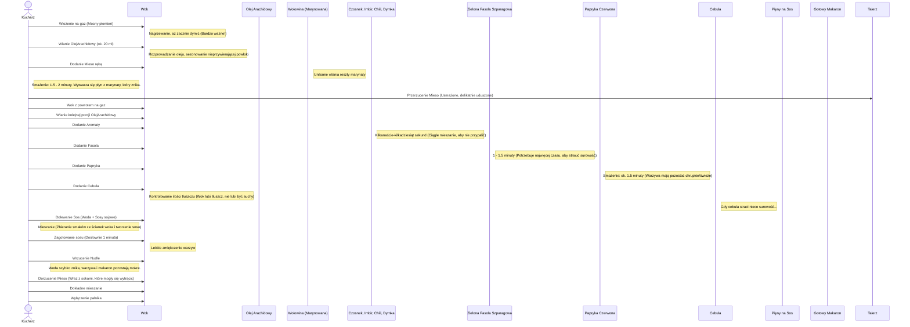

***

## WOŁOWINA PO PEKIŃSKU Z NUDLAMI (LO MEIN STIR FRY)

Witajcie na kanale! Niniejszy odcinek prezentuje przepis na **wołowinę po pekińsku z nudlami stir fry** (Lo Mein). Jest to konkretne chińskie danie charakteryzujące się dużą ilością sosu i mokrym makaronem.

### I. Wprowadzenie i Wymagania Techniczne

*   **Narzędzie:** Do przygotowania dania używany jest **chiński wok**, który jest niezastąpiony przy szybkich i intensywnych smakowo potrawach.
    *(Uwaga: Link do używanego woka jest podany na dole.)*
*   **Trudność:** Dwie "nóżki trudności".
*   **Czas pracy:** 15 minut.

***

### II. Lista Składników

Przedstawiamy wszystkie składniki potrzebne do stworzenia tego epickiego, chińskiego Lo Mein.

#### A. Mięso

| Rodzaj | Ilość | Uwagi |
| :--- | :--- | :--- |
| **Wołowina krzyżowa** | 150 g | Świetny kompromis między ceną a jakością. Jest nieco twardsza od polędwicy, ale znacznie tańsza. |
| *Wskazówka:* | - | Prosić w mięsnym (np. panią Marysię) o kawałek krzyżowej. |

#### B. Warzywa

*   **Papryka czerwona:** Połowa sztuki.
*   **Cebula:** Jedna cała (mniej więcej 80–100 g). *(Uwaga: Standardowa ilość występująca w daniach chińskich)*.
*   **Zielona fasola szparagowa:** Dodatek sezonowy (Trzeba jeść, trochę dorzucimy).

#### C. Paczuszka Aromatów

*   **Cebula dymka:** 1 sztuka.
*   **Papryczka chili:** 1 sztuka.
*   **Czosnek:** 2 ząbki.
*   **Imbir:** Kawałek.

#### D. Płyny i Tłuszcze

*   **Olej arachidowy:** Używany do smażenia, musi mieć wysoką temperaturę dymienia.
*   **Ciemny sos sojowy:** Używany do marynaty i sosu. Preferowany jest sos bez mąki, ponieważ inaczej zachowuje się na patelni.
*   **Jasny sos sojowy.**
*   **Białe wino:** Najlepiej półwytrawne lub wytrawne (jakieś resztki schowane).

#### E. Makaron

*   **Chińskie nudle z jajem:** Typowe do Chow Mein/Lo Mein.
*   **Porcja:** Jedno gniazdo nudli (55 g z paczki).
*   **Przygotowanie:** 6–7 minut we wrzącej wodzie.

*(Wskazówka: Zróbcie screenshota listy składników, zróbcie zakupy i lecimy dalej!)*

***

### III. Przygotowanie Wstępne (Mise en Place)

Pamiętajcie, że przy technice **stir fry w woku** wszystko musi być przygotowane, zanim zaczniecie rozgrzewać patelnię.

#### A. Marynowanie i Krojenie Mięsa

1.  **Temperatura:** Mięso musi mieć **temperaturę pokojową**.
2.  **Składniki marynaty:**
    *   2 łyżki **ciemnego sosu sojowego**.
    *   2 łyżki **białego wina**.
3.  **Krojenie wołowiny:**
    *   Kroimy w dosyć cienkie plastry (grubość: **5–7 mm**).
    *   Staramy się **nie kroić w poprzek włókien**.
    *   Większe i szersze kawałki kroimy jeszcze wzdłuż, aby uzyskać odpowiednią wielkość, która będzie przyjemna do jedzenia.
4.  **Proces:** Mięso wkładamy do marynaty, mieszamy i odstawiamy na bok (**nie wkładamy do lodówki**).

#### B. Krojenie Warzyw

*   **Cebula:** Przekroić na pół, a następnie każdą połówkę na 4 razy, aby uzyskać dosyć spore kawałki.
*   **Papryka:** Kroimy na prostokątne kawałki, mniej więcej tego samego rozmiaru co cebula (nie musi to być kostka).
*   **Fasola szparagowa:** Odkroić końce, a następnie pokroić na **3 części**.

*(Uwaga: Warzywa są przygotowane w kolejności pojawiania się od końca na naszym woku)*.

#### C. Przygotowanie Aromatów

*   **Czosnek (2 ząbki):** Obieramy i szatkujemy drobno w kostkę (**nie musimy miażdżyć**).
*   **Imbir:** Obieramy i szatkujemy tak samo jak czosnek.
*   **Papryczka chili (cała):** Kroimy w cienkie plasterki.
*   **Cebula dymka:**
    *   Odkroić kawałek dymki, który posłuży za **dekorację na koniec**.
    *   Całą resztę poszatkować w cienkie plasterki.
    *(Uwaga: Wszystkie te składniki wlecą razem na sam początek, zaraz po naszym mięsie)*.

#### D. Przygotowanie Płynów na Sos

Płyny należy wymieszać w osobnym naczyniu:
*   **Woda:** 50 ml.
*   **Jasny sos sojowy:** 2 łyżki.
*   **Ciemny sos sojowy:** 1 łyżka.

#### E. Makaron

Makaron wrzucamy do wrzącej, osolonej wody na **6–7 minut**.

***

### IV. Sekwencja Smażenia i Mieszania (Stir Fry)

Poniższy schemat przedstawia kolejność i czas obróbki termicznej w woku.

***

### V. Prezentacja i Podsumowanie

Gotową wołowinę po pekińsku należy przerzucić na osobny talerz lub do miski.

*   **Wygląd:** Potrawa prezentuje się "śmietanie".
*   **Dekoracja:** Przyozdabiamy na górę odłożoną wcześniej **zieloną cebulką** (dymką).
*   **Charakterystyka smaku:** Świetny smak, duża pikantność.
*   **Mięso:** Wołowina jest świetnie obrobiona i odpowiednio miękka.
*   **Wartości odżywcze:** Podane są makrosy i kalorie tej wybitnej potrawy, która urozmaici jadłospis i dietę.

Trzymajcie się, do zobaczenia w kolejnym odcinku! Piszcie komentarze, zostawiajcie łapę w górę, komu się podobało. Cześć!