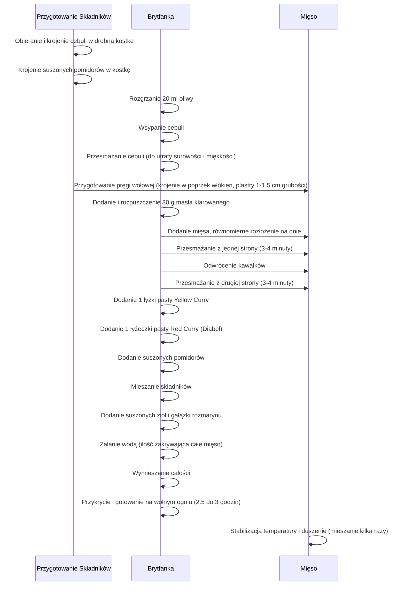

***

## Epicka Wołowina Duszona z Curry i Rozmarynem

Witamy na kanale! W tym odcinku przedstawiony zostanie przepis na **epicką wołowinę**, która rozpływa się w ustach, zanurzona w przepysznym, aromatycznym sosie własnym.

### Dlaczego Pręga Wołowa?

Do przygotowania dania użyta zostanie **pręga wołowa**, która jest idealna do duszenia ze względu na swoją strukturę.

*   **Tkanka Łączna i Kolagen:** Pręga zawiera dużo tkanki łącznej i kolagenu.
*   **Sos:** Kolagen rozpuści się w sosie, zagęszczając go nieco.
*   **Regeneracja:** Co najważniejsze, poprawi regenerację w stawach, co czyni to danie **rewelacyjną opcją dla sportowców**.

Autor zapewnia, że potrawa ta trafi na **Top 3** wszystkich dotychczasowych odcinków. Przepis jest bardzo prosty, choć wymaga długiego duszenia, aby uzyskać miękkie mięso.

### Filozofia Żywieniowa: Bilans Kaloryczny

W trakcie przygotowywania dania, które będzie długo duszone, przygotowane zostaną również pieczone ziemniaki i fasolka dla **dwóch wariantów kaloryczności boksów**.

Często pojawiają się pytania, czy dany posiłek można jeść "na redukcję" czy "na masę".

| Zasada | Opis |
| :--- | :--- |
| **Uniwersalność Posiłku** | Każdy posiłek można spożywać w obu przypadkach (redukcja/masa), pod warunkiem że odpowiednio wpasuje się w dzienny bilans kaloryczności i makroskładników. |
| **Charakterystyka Posiłków** | Posiłki bardziej charakterystyczne dla **redukcji** cechuje większa objętość przy mniejszej kaloryczności. |
| **Przykład Dziś** | Dziś pokazane zostaną boxy o podobnej objętości, ale z inną kalorycznością, osiągniętą poprzez zmianę dodatku węglowodanowego i dodatkowego tłuszczu. |

**Ważna Rada:** Kontrolowanie jedzenia powinno stać się stylem życia, który sprawia przyjemność i zapewnia dobre samopoczucie. Nie należy pozwolić, aby dieta była czymś nieprzyjemnym lub robionym z przymusu, ponieważ osiągnięcie efektów będzie wtedy bardzo trudne.

***

## Składniki na Mięso (4 Porcje)

Poniżej przedstawiono wszystkie składniki potrzebne do przygotowania epickiej pręgi wołowej.

### Główne Składniki

*   **Pręga Wołowa:** 600 g (czyli po 150 g na porcję).
*   **Cebula:** 1 duża cebula (ok. 220 g).
*   **Suszone Pomidory:** 12–15 suszonych pomidorów (wyciągnięte z oleju, mocno odciśnięte, ale mimo to dodamy dodatkowy tłuszcz).
*   **Olej (dodatkowy):** Około 10 ml (do suszonych pomidorów).

### Pasty Curry (Składniki "Diabelskie")

Użyte zostaną dwie pasty curry, które są podobne, ale różnią się składem (pierwszymi składnikami), dzięki czemu dobrze się uzupełniają.

1.  **Pasta Curry Yellow:** 1 duża łyżka (Składniki: szalotka, trawa cytrynowa).
2.  **Pasta Curry Red (Pikantna):** 1 łyżeczka (Charakteryzuje się mocną pikantnością i dużą ilością chili – "to jest naprawdę diabeł").

*(Uwaga: Linki do pasty zostaną udostępnione w opisie pod filmem.)*

### Tłuszcze i Przyprawy

*   **Tłuszcze do Smażenia:**
    *   Oliwa: 20 ml.
    *   Masło Klarowane: 30 g.
*   **Przyprawy Suszone:**
    *   Tymianek: 1 łyżeczka.
    *   Liść Laurowy: 3 sztuki.
    *   Ziele Angielskie: 3 kuleczki.
    *   Czarny Pieprz: Kilka/kilkanaście ziaren.
*   **Przyprawy Świeże:**
    *   Rozmaryn: 1 gałązka świeżego.

*(Zachęta: Zrobić zrzut ekranu, zapisać i iść na zakupy.)*

***

## Przygotowanie Wołowiny Długo Duszonej

Wołowina będzie dusić się długo, a w międzyczasie przygotowane zostaną warzywa.

### Sekwencja Przygotowania Mięsa

Proces przygotowania wołowiny jest sekwencyjny i obejmuje wstępne smażenie oraz długie duszenie.

### Końcowe Etapy Duszenia

*   **Czas Duszenia:** Po około 1.5–2 godzinach duszenia.
*   **Doprawianie:** Dodajemy **pół łyżeczki soli**.
*   **Kontrola Smaku:** Należy posmakować i sprawdzić, czy czegoś nie brakuje. (Pamiętaj, że pasta curry jest już słona).
*   **Płyn:** Wody nie dolewamy, chyba że mięso jest za mało zanurzone w płynach.
*   **Gotowość:** Po upływie około 2.5 godziny sprawdzamy mięso łopatką – jeśli się rozpada, jest gotowe.

***

## Przygotowanie Dodatków i Warianty Kaloryczne

W czasie, gdy wołowina się dusi, przygotowujemy ziemniaki i fasolkę. Poniżej przedstawiono skład i kaloryczność dwóch wariantów boksów (dla 1 porcji).

### Porównanie Składników Dodatkowych

| Dodatek | Box „Na Masę” | Box „Na Redukcję” | Uwagi |
| :--- | :--- | :--- | :--- |
| **Ziemniaki** | 300 g (w łódeczki) | 100 g (w łódeczki) | Użyte młode polskie ziemniaki. |
| **Fasolka** | 50 g | 150 g | Fasolka została przygotowana w nieco większej ilości, aby uwzględnić obcinane końcówki. |

### Przygotowanie Ziemniaków (Łódeczki)

1.  **Mycie:** Ziemniaki myjemy i wycieramy do sucha ręcznikiem (pieczemy ze skórką).
2.  **Krojenie:** Kroimy w łódeczki (jeden ziemniak to zazwyczaj około 6 łódeczek).
3.  **Przyprawianie:** Przekładamy do miski.
    *   Oliwa: 10 ml.
    *   Papryka: Pełna łyżeczka papryki słodkiej.
4.  **Mieszanie:** Dokładnie mieszamy, aby oliwa i przyprawy dobrze pokryły ziemniaki.

### Przygotowanie Fasolki

1.  **Mycie i Suszenie:** Fasolkę myjemy, odsączamy i delikatnie przecieramy.
2.  **Obróbka:** Odcinamy końcówki ("nikt nie chce mieć włosów").
3.  **Przyprawianie:** Fasolka trafia do miski.
    *   Oliwa: Wystarczy 5 ml oliwy (dokładnie rozsmarowujemy).

### Pieczenie

1.  **Blacha:** Wykładamy blachę papierem do pieczenia.
2.  **Rozkładanie:** Ziemniaki rozkładamy równomiernie po całej blasze.
3.  **Fasolka:** Fasolkę dzielimy osobno do naczynia żaroodpornego.
4.  **Piekarnik:** Wkładamy na ruszt do piekarnika rozgrzanego do **200°C (góra/dół)**.
    *   Ziemniaki: Na górny poziom.
    *   Fasolka: Na dolny poziom.
5.  **Czas Pieczenia:** 45–60 minut. Najlepiej wsunąć warzywa w takim momencie, aby były gotowe w tym samym czasie, gdy skończy się dusić wołowina.

***

## Serwowanie i Makroskładniki

### Komponowanie Boksów

Po upływie 2.5 godziny, gdy ziemniaki są pięknie przypieczone, fasolka gotowa, a mięso się rozpada, przystępujemy do pakowania.

1.  **Mięso:** Wykładamy mięso i sos na **4 boxy**.
    *   *Uwaga:* W dzisiejszym przykładzie białko (mięso) jest dzielone na **równe części** w obu wariantach kaloryczności.
2.  **Dodatki:** Rozdajemy pieczone ziemniaki i dorzucamy odpowiednią ilość fasolki, zgodnie z wariantem (patrz tabela powyżej).

### Wariant "Na Masę" (Wzbogacenie Tłuszczem)

Do boksu "Na Masę" dodajemy jeszcze **łyżkę świeżej oliwy** na fasolkę.

*   *Komentarz Autora:* Jako osoba, która lubi lub je niskowęglowodanowo, autor osobiście chętnie zjadłby box z prawej (box na redukcję), ale podbity dużą ilością tłuszczu na fasolce (co zmieniłoby rozkład makroskładników i kalorii).

### Makroskładniki i Kalorie

Poniżej przedstawiono makroskładniki i kalorie dla gotowych boksów (dane prezentowane w oryginalnym materiale wideo):

| Wariant | Makroskładniki (B/T/W) | Kalorie |
| :--- | :--- | :--- |
| **Box „Na Masę”** | [Wartości z prezentacji] | [Wartości z prezentacji] |
| **Box „Lite” (Redukcja)** | [Wartości z prezentacji] | [Wartości z prezentacji] |

**Podsumowanie:** Głównym celem było przekazanie przepisu na tę przepyszną i prostą wołowinę z sosem, który "niszczy podniebienie". Mięso to można łączyć z ulubionymi dodatkami.

Zachęcamy do pisania komentarzy i subskrybowania kanału. Do zobaczenia w kolejnym odcinku!