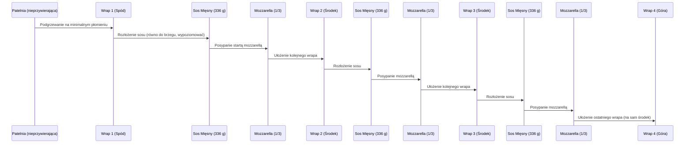

***

## I. Wstęp i Prezentacja Dania

Yo yo yo byki! Witajcie w kolejnym odcinku **Policzonej Szamy**.

Dziś prezentowane jest proste, szybkie i niesamowicie smaczne danie: **Wrapo Lasagne**.

**Kluczowe cechy dania:**
*   Niewielka ilość łatwo dostępnych składników.
*   Świetne makroskładniki na porcję.
*   Jest to jedna z lepszych rzeczy, które autor ostatnio jadł.

***

## II. Składniki na Wrapo Lasagne

Poniżej znajduje się lista składników potrzebnych do przygotowania całości dania.

| Kategoria | Składnik | Ilość / Uwagi |
| :--- | :--- | :--- |
| **Mięso** | Pierś z indyka (zmielona) | 600 g. Zaleca się mielenie w domu, aby mieć pewność co do pochodzenia mięsa. |
| **Baza** | Passata pomidorowa | Kupić passatę lepszej jakości, ponieważ od niej zależy smak całości. |
| **Węglowodany** | Wrapy / Tortille | 4 sztuki. Użyto wersji pełnoziarnistej. Będą stanowić 3 warstwy z sosem. |
| **Ser** | Mozzarella (kostka) | 100 g. |
| **Aromaty** | Cebula | 1 sztuka (do sosu). |
| **Aromaty** | Czosnek | 3 ząbki (do sosu). |
| **Wykończenie** | Parmezan | 10–20 g. Do starcia na wierzch po przygotowaniu. |
| **Wykończenie** | Natka pietruszki | Do posypania na koniec (nie jest widoczna na liście, ale użyta). |
| **Tłuszcz** | Oliwa | 20 ml. Do przesmażenia całości. |
| **Przyprawy (Zioła)** | Oregano | 1–1,5 łyżki. |
| **Przyprawy (Zioła)** | Bazylia | 1 łyżeczka (mniej więcej połowa ilości oregano). |
| **Przyprawy (Aromatyczne)** | Liście laurowe | Kilka liści (dla szybkiego wydobycia smaku). |
| **Przyprawy (Papryki)** | Papryka słodka | 1 łyżeczka. |
| **Przyprawy (Papryki)** | Chilli | Szczypta (dla delikatnej pikantności). |
| **Przyprawy (Standard)** | Sól, Pieprz | Standardowo (do smaku). |

**(Wskazówka):** Zaleca się wykonanie zrzutu ekranu lub zapisanie listy składników przed rozpoczęciem gotowania.

***

## III. Przygotowanie Wstępne Składników

Przygotowanie składników odbywa się przed rozpoczęciem smażenia na patelni.

1.  **Cebula:**
    *   Obranie.
    *   Pokrojenie w drobną kostkę.
2.  **Czosnek:**
    *   Obranie.
    *   Poszatkowanie.
    *   Delikatne zgniecenie, aby puścił soki potrzebne do aromatyzowania sosu.
3.  **Mozzarella:**
    *   Starcie sera na grubych oczkach. (Będzie używana w trzech warstwach).

***

## IV. Gotowanie Sosu Mięsnego

Sos jest przygotowywany na patelni stalowej nierdzewnej, co jest kluczowe dla smaku.

### A. Smażenie Aromatyczne

1.  **Rozgrzewanie:** Na patelnię wlać **20 ml oliwy**.
2.  **Cebula:** Na rozgrzaną oliwę wrzucić pokrojoną cebulę. Smażyć do zeszklenia i utraty surowości (około 4 minuty), mieszając 2 razy.
3.  **Czosnek i Zioła (Aktywacja):**
    *   Dodać czosnek do zeszkolonej cebuli.
    *   Przemieszać.
    *   Po 0,5–1 minucie dodać **oregano** (1–1,5 łyżki) i **bazylię** (około 0,5 łyżki).
    *   Przemieszać, aby aromaty przypraw się aktywowały.

### B. Smażenie Indyka i Przyprawianie

1.  **Dodanie Mięsa:** Wsypać całą pierś z indyka.
2.  **Mieszanie Wstępne:** Przemieszać tylko na tyle, by wyciągnąć cebulę i czosnek z dna, zapobiegając ich przypaleniu.
3.  **Smażenie (Smażenie, nie Gotowanie):**
    *   Rozłożyć indyka po patelni.
    *   Ustawić **mocniejszy płomień**.
    *   Smażyć, aż mięso zacznie się podsmażać na dnie patelni (wytwarzają się "smaczki", które zrobią "robotę").
    *   Dopiero po podsmażeniu zacząć mieszać.
4.  **Rozdrabnianie:** Większe grudki mięsa potraktować widelcem.
5.  **Przyprawianie Wstępne:** Doprawić mięso **solą** i świeżo mielonym **czarnym pieprzem**. (Ostateczne doprawienie nastąpi po zrobieniu sosu).

### C. Redukcja Sosu

1.  **Dodanie Passaty:** Wlać całą passatę pomidorową.
2.  **Płukanie Butelki:** Dodać trochę wody do butelki po passacie, aby zebrać resztki ze ścianek, i wlać do patelni.
3.  **Dodanie Reszty Przypraw:** Dorzucić **słodką paprykę** i **liście laurowe**. Wymieszać całość.
4.  **Gotowanie i Redukcja:**
    *   Gdy sos jest dobrze wymieszany i gęsty (i zacznie bulgotać/chlapać), przykryć patelnię pokrywką.
    *   **Redukcja:** Dusić pod przykryciem, ale **uchylonym**, przez **10–15 minut**. Uchylona pokrywka pozwala na odparowanie części wody.
    *   Mieszać od czasu do czasu.
5.  **Karmelizacja:** Po 15 minutach sprawdzić dno – sos powinien być delikatnie przysmażony/skarmelizowany (nie spalony) na dnie, co tworzy pyszny smak.
6.  **Konsystencja Końcowa:** Sos musi być **mocno gęsty**, aby woda nie wypływała z Wrapo Lasagne.
7.  **Sprawdzenie Smaku:** Ostatnie minuty gotowania. Poprawić smak (w przepisie dodano jeszcze pieprz, sól była OK).

***

## V. Montaż i Zapiekanie

Po przygotowaniu sosu, należy go przełożyć na wagę, aby podzielić na równe części.

### A. Przygotowanie do Montażu

1.  **Ważenie Sosu:** Cały sos z mięsem przerzucić na tarowaną wagę, aby ustalić wagę całkowitą.
2.  **Podział:** Podzielić całkowitą wagę na trzy równe warstwy. (W tym przypadku: **336 g** na warstwę).
3.  **Patelnia:** Użyć patelni z nieprzywierającą powłoką. Ustawić **minimalny płomień** (super minimum).

### B. Sekwencja Warstw

Używamy 4 tortilli do stworzenia 3 warstw nadzienia.

### C. Zapiekanie i Odwracanie

1.  **Podsmażanie Spodu:** Delikatnie zwiększyć płomień. Podsmażyć dolną tortillę "na wyczucie", aż będzie przypieczona i chrupka.
2.  **Roztopienie Sera (Opcjonalnie):** Jeśli użyto zimnego sosu, najlepiej przykryć całość pokrywką, aby ser się roztopił.
3.  **Odwracanie:** Gdy pierwsza tortilla jest przypieczona, użyć talerza do odwrócenia całości na drugą stronę.
4.  **Druga Strona:** Smażyć krócej (około 2 minuty), ponieważ patelnia jest już mocno nagrzana.
5.  **Koniec:** Wyłączyć palnik.

***

## VI. Wykończenie, Makroskładniki i Degustacja

### A. Wykończenie Dania

1.  **Odpoczynek:** Przerzucić gotową Wrapo Lasagne na talerz. Pozostawić na kilka minut, aby wytrąciła temperaturę i nadawała się do jedzenia.
2.  **Parmezan:** Zetrzeć na górę około **10 g parmezanu** (jako przyprawa, dla słoności).
3.  **Zielenina:** Przyozdobić danie **natką pietruszki**.

### B. Makroskładniki i Podział

Autor dzieli całość Wrapo Lasagne na **4 porcje**.

*   Całość dania zapewnia bardzo przyjemne makro i kalorie w porcji.

### C. Degustacja

Po pokrojeniu dania (ukazując warstwy w środku):
*   Smak został określony jako "coś pysznego".

Łapa w górę dla tych, którym odcinek się podobał. Zachęta do pisania komentarzy na temat smaku i efektów przygotowania.