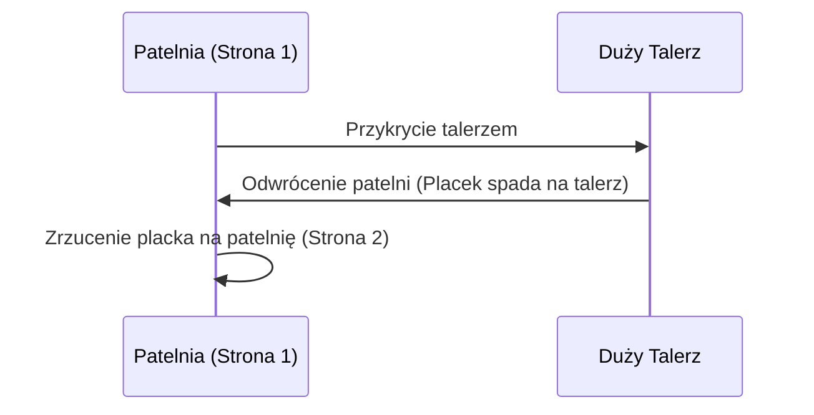

***

# Przepis na Rewelacyjny Placek Jabłkowy (Dwuminutowa Sama)

## Wstęp i Kontekst Programu

Witajcie ponownie drodzy widzowie na kanale **Policzona Sama**. Jestem **Mateusz**.

Obecnie mamy luźny odcinek. Właśnie rano przygotowuję sobie **bulion wołowy** – wartościowy, który na pewno prędzej czy później pojawi się na kanale (obiecałem wam to).

Dziś jednak wjeżdża **Dwuminutowa Sama**, bo tyle czasu wystarczy, aby przekazać wam ten przepis na rewelacyjny placek jabłkowy.

## Charakterystyka Placka i Dodatki

Ten placek charakteryzuje się zastosowaniem **jogurtu typu skyr** oraz niewielkiej ilości **płatków owsianych**.

Jest to placek:
*   Bardzo fajny i **puszysty**.
*   **Mokry** w środku.
*   **Sycący**.

Właśnie kończę ostatni kawałek. Często podbijam go dodatkowym białkiem, takim jak:
*   Twaróg.
*   Jakaś odżywka białkowa.
*   Orzechy.
*   Owoce.

Dziś skupiamy się na samej **bazie**, która, jak widzicie, posiada naprawdę **niewielką ilość kalorii**.

## Składniki i Właściwości Zdrowotne

Przed wami teraz wszystkie składniki, które będą potrzebne. Pamiętajcie o przyprawach! Tam, gdzie jabłko, musi być **cynamon**.

Ja, oprócz cynamonu, dorzucam nieco **kurkumy**, która posiada bardzo fajne właściwości zdrowotne.

### Kluczowe Właściwości Kurkumy

Dodatek kurkumy pomaga:

1.  Szybciej obniżać **poziom cukru we krwi**.
2.  Łatwiej wytwarzać **glukagon** w krwiobiegu.
3.  Szybciej rozpoczynać proces **spalania tkanki tłuszczowej**.

Mamy wszystko? Lecimy! Łapcie wszystkie składniki, które będą potrzebne (jak widzicie, nie ma tego za wiele). Robimy screenshota, zapisujemy, lecimy na zakupy i zaczynamy.

## Etapy Przygotowania Ciasta

### Faza 1: Łączenie Składników Mokrych i Namaczanie

Do jakiegoś naczynia wrzucamy na początku wszystkie mokre składniki:

*   Cały **skyr**.
*   **50 mililitrów mleka**.
*   **2 jajka**.
*   Od razu dorzucamy **przyprawy**.
*   Wrzucamy **płatki owsiane**.

Mieszam wszystko razem i **odstawiam na chwilę**. Pozwala to płatkom wchłonąć nieco wilgoci i płynów, dzięki czemu będą bardziej miękkie i łatwiej będzie nam je zblendować na gładką masę.

### Faza 2: Jabłko i Blendowanie

1.  **Przygotowanie jabłka:** Umyte jabłko ścieram razem ze **skórą** na **dużych oczkach**.
2.  **Dodanie sody:** Po tej chwili biorę mój wcześniejszy pojemnik (z namoczonymi płatkami) i dorzucam niewielką ilość sody oczyszczonej – mniej więcej **jedna trzecia łyżeczki**.
    *   *Uwaga:* Soda sprawi, że nasz placek będzie nieco bardziej **pulchny**.
3.  **Blendowanie:** Blenduję wszystko razem dosłownie **10 sekund** (więcej nie trzeba). Otrzymuję gładką masę.
    *   *Wskazówka:* Jeśli nie macie blendera, nic nie szkodzi – też wam wyjdzie, ale płatki owsiane będą bardziej wyczuwalne w konsystencji.
4.  **Ostateczne połączenie:** Wlewam to wszystko teraz do miski z **jabłkiem**. Mieszam wszystko razem.

## Instrukcja Smażenia Placka

Biorę się za podgrzewanie patelni.

### Przygotowanie Patelni

*   **Płomień:** Średni/mały płomień.
*   **Patelnia:** Teflonowa powłoka nieprzywierająca.
*   **Tłuszcz:** Mimo powłoki, nakładam minimalny film olejowy z **oleju kokosowego** na dobrze rozgrzaną patelnię.

### Smażenie Strony 1

1.  Wlewam całą masę.
2.  Rozprowadzam wszystko równo do uzyskania płaskiej powierzchni.
3.  Po kilkunastu sekundach przykrywam **przykrywką**, aby mój placek szybciej się dopiekł w całej swojej objętości.
4.  Smażę na małym/średnim płomieniu przez mniej więcej **4–5 minut**.

### Proces Obracania

**Ważne:** Trzeba smażyć placka z jednej strony na tyle długo, aby góra była już w miarę ścięta i nie była mocno płynna. To zapobiegnie wylaniu się ciasta przy przewracaniu.

Używamy teraz **dużego talerza**.

#### Sekwencja Obracania

### Smażenie Strony 2

Placek na drugiej stronie smażymy **3–4 minuty** i będzie gotowy.

## Serwowanie i Podsumowanie

Rzucam go na talerz, przewracam na drugą stronę, abyście zobaczyli, jak to wygląda. Zobaczcie – **rewelacyjnie!**

Podzielę sobie na **cztery kawałki**. Takie cztery kawałki wkładam na śniadanie, bardzo szybko, z jakimiś swoimi dodatkami.

Placek jest naprawdę bardzo sycący przy niewielkiej ilości kalorii. Przy makroskładnikach, które teraz widzicie, możecie poczuć się **pojedzeni, pełni, nasyceni**.

Pozdrawiam, widzimy się w kolejnym odcinku. Do zobaczenia! Cześć!