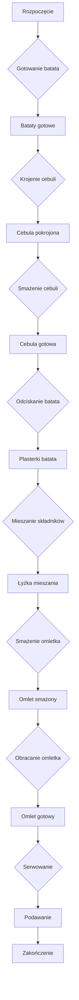

---

## 1. Wstęp
Cześć, witajcie drodzy widzowie w kolejnym odcinku!  
Dzisiaj zrobimy **hiszpańskiego omleta** – w skrócie „omlecik z batatem”. Danie to jest **rewelacyjne**, smakuje wspaniale zarówno na ciepło, jak i na zimno. Jeśli przygotujesz go dziś, możesz zabrać go do pracy na drugi dzień, a po podgrzaniu będzie smakować tak samo, jakbyś dopiero je przygotowywał. Zapraszam do szybkiego i prostego odcinka!

---

## 2. Składniki (na mój sposób)

| Składnik | Ilość | Uwagi |
|----------|-------|-------|
| **Jajka** | 6 | Najlepiej sprawdź, czy są świeże, zanim ich użyjesz. |
| **Bataty** | 1 | Umiarkowanie duży, w którym skórka będzie dobrze chrupiąca. |
| **Cebula** | 1 | Cebula biała, najlepiej do podrozdzielenia w pół. |
| **Olej** | 50 ml | Olej z piłestych winogron – idealny do smażenia. |
| **Sól** | dowolna | Dodaj w razie potrzeby, najczęściej tylko delikatna porcja. |
| **Dodatki (opcjonalne)** | | Ser parmezan, pomidor, itp. – według uznania. |

---

## 3. Sprzęt

- Patelnia teflonowa (najlepiej średniej wielkości)
- Miska na mieszanie
- Noż
- Deska do krojenia
- Łyżka do mieszania
- Talerz (do obracania omletka)
- Szczypce (do podważania i odtwarzania omletka)

---

## 4. Przygotowanie

1. **Gotowanie batata**  
   - Cały batat kroimy na cztery części.  
   - Odrzucamy “dupki” (krótsze końcówki).  
   - Gotujemy w osolonej wodzie, ale **nie** dopuszczamy do rozgotowania – chcemy, żeby miał jeszcze „twarczą strukturę”.

2. **Krojenie cebuli**  
   - Cebulę kroimy w pół, a następnie w płatki.  
   - Cebula podrozdzielona w ten sposób będzie lepiej się dusić.

3. **Smażenie cebuli**  
   - Na patelni rozgrzewamy 50 ml oleju z piłestych winogron.  
   - Dodajemy cebulę i smażymy do momentu, aż zmięknie, zniknie surowość i lekko się skarmelizuje, zachowując słodkość.  
   - Gdy cebula jest gotowa, wyłączamy ogień i odstawiamy na chwilę.

4. **Odciskanie batata**  
   - Gdy batat jest ugotowany, odcedzamy go i kładziemy na teczkę.  
   - Po chwili wyjmujemy i kroimy w plasterki o grubości ~5 mm.  
   - Skórka powinna być lekko chrupiąca, ale nie przypalona.

5. **Mieszanie składników**  
   - W misce rozbijamy 6 jajek.  
   - Dodajemy pokrojone bataty i cebulę.  
   - Delikatnie mieszamy, by składniki się połączyły.  
   - Opcjonalnie: dodaj odrobinę soli.

6. **Smażenie omletka**  
   - Na rozgrzaną patelnię rozkładamy mieszankę.  
   - **Na mocnym ogniu** smażymy ~1 minutę.  
   - Następnie zmniejszamy ogień na średni i smażymy kolejne 2 minuty.  
   - Omlet będzie jeszcze lekko płynny na górze – to w porządku.  
   - Delikatnie potrząsamy patelnią, aby płyny równomiernie się rozprowadziły.

7. **Obracanie**  
   - Przygotowujemy talerz, by gołoło obrócić omlet.  
   - Delikatnie dociskamy patelnię do talerza i odwracamy omlet na drugą stronę.  
   - Wykonujemy to w ciągu pół minuty, by nie przegrzać się i nie zostawić przyklejonych części.

8. **Drugie smażenie**  
   - Kontynuujemy smażenie na średnim ogniu przez 2‑3 minuty.  
   - Po dwóch‑trzech minutach omlet powinien być gotowy, pachnący i idealnie złoty.  

9. **Serwowanie**  
   - Podajemy omlet na talerzu.  
   - Opcjonalnie posypujemy parmezanem, dodajemy pokrojonego pomidora czy innych ulubionych dodatków.

---

## 5. Diagram procesu

---

## 6. Wskazówki i porady

- **Nie rozgotuj batata** – zbyt miękki omlet traci chrupkość.  
- **Cebula** – smaruje się pięknie, a jej naturalny cukier nadaje omletowi słodki akcent.  
- **Olej z piłestych winogron** – sprawia, że omlet nie przywiera i ma lekko orzechowy aromat.  
- **Sól** – dodaj ją w małej ilości; zbyt dużo może wypłynąć z jajek i spowodować, że omlet będzie zbyt słony.  
- **Przygotuj wszystkie składniki** – przed włożeniem jajek do mieszanki sprawdź, czy batat i cebula są już gotowe i odcedzone.  

---

## 7. Kaloryczność i makroskładniki

| Składnik | Ilość | Kalorie | Białko (g) | Tłuszcze (g) | Węglowodany (g) |
|----------|-------|---------|------------|--------------|-----------------|
| Jajka (6) | 6 szt. | ~420 | ~36 | ~30 | ~3 |
| Batat (średni) | 1 szt. | ~112 | ~1.5 | ~0.1 | ~26 |
| Cebula (1 szt.) | 1 szt. | ~45 | ~1 | ~0.1 | ~10 |
| Olej winogron | 50 ml | ~400 | 0 | ~45 | 0 |
| **Suma** | | **977** | **39.5** | **75.2** | **39** |

> *Wartości przybliżone, zależą od rzeczywistych rozmiarów i dokładnych ilości.*

---

## 8. Podsumowanie

- Omlet z batatem to **szybkie i aromatyczne danie**, które można podać na śniadanie, lunch lub kolację.  
- Jest **wszystko w jednym**: batat dla chrupkości, cebula dla słodyczy, jajka dla białka, a olej winogron dla delikatnego smaku.  
- **Można zjeść na ciepło** lub **przygotować na zapas** – po podgrzaniu zachowa się smak i konsystencja.  

---

## 9. Pożegnanie

Dziękuję, że byliście ze mną! Jeśli spróbujecie tego omletka, dajcie znać, jak wam smakuje. Można go podać „po chiżpansku” – śmiało, bo w hiszpańskim kuchni nic nie jest prostsze!  
Nie zapomnijcie subskrybować, zostawić lajka i zostawić komentarz. Do zobaczenia w następnym odcinku!