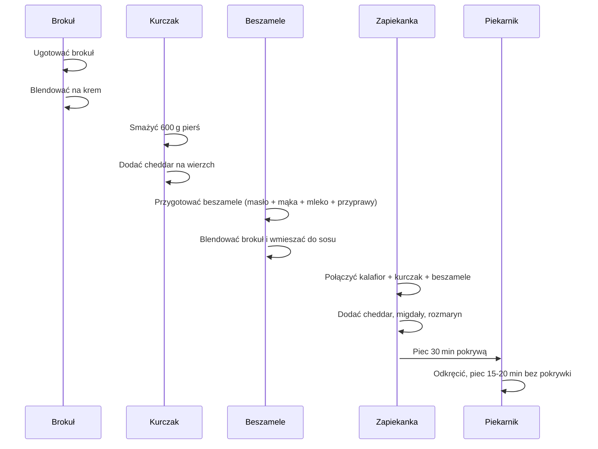

---

## **WSTĘP**

Witajcie drodzy widzowie!  
Dzisiaj przygotujemy **zapiekankę kalafiorową skurczakiem** z brokułowym beszamelem, kurczakiem i serkiem cheddar. Brzmi ciężko? Nie ma—**to niewielka ilość składników** i **bardzo szybkie** do wykonania.  

- **Porcje:** około **6‑4** (zależy od podziału).  
- **Białko:** duża ilość.  
- **Węglowodany:** niewielka ilość.  
- **Kalafior i brokuł** to główni bohaterowie.  

---

## **SKŁADNIKI**

| **Grupa** | **Składnik** | **Ilość** |
|-----------|--------------|-----------|
| **Beszamle** | Masło | 50 g |
| | Mąka | 50 g |
| | Mleko | 500 ml |
| | Sól | w całości (wyrezerwowałam całą wyrzeczkę) |
| | Pieprz | świeżo mielony |
| | Gałka muszkatołowa | pół wyrzeczki |
| | Brokuł | 600 g (ugotowany, blendowany) |
| **Kurczak** | Pierś z kropką, usunięta skórka i tłuszczyki | 600 g |
| **Kalafior** | Surowy, drobno siekany | 600 g |
| **Ser** | Cheddar, 100 g (2 kosteczki po 50 g) | 100 g |
| | Dodatkowy cheddar na wierzch | 50 g |
| **Dodatki** | Płatki migdałowe | Ilość według smaku |
| | Rozmaryn | Duża ilość |
| **Inne** | Olej do smażenia kurczaka | 2 łyszki (dwie łyszki) |

---

## **PRZYGOTOWANIE**

### 1️⃣ Przygotowanie beszamelu

1. **Rozpłynięcie masła** – masło wciąż ma w sobie mały „złoty” pierwotny smak, więc najpierw je rozpuszczamy.  
2. **Dodanie mąki** – mała kostka mąki, którą delikatnie mieszamy z rozpuszczonym masłem, tworząc *kluchę* (czyli mały kawałek ciasta).  
3. **Stopniowe wlewanie mleka** – podzielone na części, aby nie tworzyło się grudek.  
   - Pierwsza ćwiartka mleka, dokładnie wymieszana.  
   - Następna część, a potem reszta.  
4. **Mieszanie do jednolitej konsystencji** – aż sos będzie gęsty, ale nie grubo przypieczony; **przypominający beszamlowy, ale miękki**.  
5. **Przyprawianie** – sól, pieprz i gałka muszkatołowa, w całości lub według preferencji.  
6. **Blendowanie brokuła** – ugotowany brokuł blendujemy, aby uzyskać kremowy, nieziarnisty składnik do sosu.  

> *Uwaga:* „beszamy lowy sos” brzmi nieco tajemniczo, ale naprawdę nie jest to coś, co trzeba „skurczyć” – to po prostu beszamele‑z‑brokułową.

### 2️⃣ Smażenie kurczaka

- **Rozgrzewamy olej** – dwie łyszki (dwie łyszki to po prostu dwie łyżki).  
- **Drobne „przysmarowanie” kurczaka** – każdy kawałek mięsa szczupliśmy, aby się równomiernie podsmażył.  
- **Smażenie** – aż kurczak nabierze złotego koloru, ale nie przesadnego wypalenia.  
- **Ostatnie 50 g cheddar** – wrzucamy na wierzch, by podkreślić aromat serka.

### 3️⃣ Mieszanie kalafiora z kurczakiem i beszamelem

- **Kalafior i kurczak** w równych proporcjach (1 do 1) mieszamy, dodajemy beszamele i dodatkowy cheddar.  
- **Blendowany brokuł** wlewa się w całą mieszankę, aby połączyć smaki.  

### 4️⃣ Złożenie zapiekanki

1. **Łączymy kalafior i kurczaka** w żarotpornym garnku, równomiernie rozkładając składniki.  
2. **Dodajemy beszamele** – delikatnie przemieszczamy, aby sos pokrył wszystko, ale nie wymieszujemy gęsto, tylko „poruszać” jak ja.  
3. **Toppenik z cheddar** – ostatnie 50 g sera na wierzch, razem z rozmarynem i płatkami migdałowymi.  

---

## **PIECZENIE**

```
piekarnik: termoobieg 180 °C
czas z pokrywą: 30 min
czas bez pokrywki: 15‑20 min
```

1. **Pierwsze 30 min** – naczynie pokrywamy, zapiekanka zaczyna się delikatnie „obrabiać”.  
2. **Odkręcamy pokrywę** i zostawiamy 15‑20 min bez pokrywki, by góra uzyskała **rewelacyjne, złociste wypieczenie**.  

---

## **WIZUALNE MAPY CZASU (Mermaid)**



---

## **OBECNY WARTOŚCI / SENSUALNOŚĆ**

- **Po 30 minach** z pokrywą: garnek wypełniony aromatem, ser topi się, a zapiekanka zaczyna się „obrabiać”.  
- **Po 15‑20 minach bez pokrywki**: wierzch jest **złocisty i rewelacyjnie przypieczony**.  
- **Wygląd**: zielonkawy kalafior, kremowy sos, topiony cheddar na szczycie.  

> „Szrewnie jest źle” – ale w tym momencie jedzenie pachnie **rewelacyjnie**!

---

## **ZASTANIĄ SMAKÓW**

1. **Kalafior** – idealnie obrobiony, nie surowy, nie papka.  
2. **Sos** – kremowy, z nutą cheddar, gałki muszkatołowej i przypraw.  
3. **Ser cheddar na wierzchu** – chrupiący i aromatyczny.  

> **Polecam wszystkim!** To połączenie **kurczaka, kalafiora, brokuła, cheddar i rozmarynu** jest absolutnym must‑try.

---

## **NARZĄDOWE KAKTURY**

| **Portion** | **Ilość** |
|-------------|-----------|
| Cała potrawa | na 6 kawałków (porcje 1/6) |

---

## **ZADZIAŁI I KOMENTARZE**

- **Chcecie podzielić się swoimi doświadczeniami?**  
- **Kto zrobił „skurczaka” w komentarzach?**  
- **Jak wyszło?**  

Do zobaczenia w kolejnym odcinku!  

---