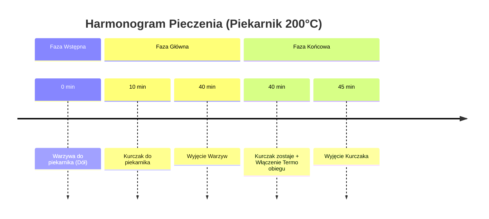

***

# Epicki Meal Prep: Trzy Pełnowartościowe Boxy

Witajcie ponownie na kanale! Dziś przygotowujemy kolejną blachę, dzięki której uzyskamy trzy pełnowartościowe zestawy obiadowe (lunch boxy).

## Charakterystyka Posiłków

*   **Białko:** Mnóstwo grillowanego kurczaka.
*   **Węglowodany:** Zdrowe węglowodany ze słodkich ziemniaków (batatów).
*   **Dodatki:** Dużo warzyw.
*   **Tłuszcze:** Niska zawartość tłuszczu.
*   **Przygotowanie:** Proste i szybkie – my tylko szatkujemy warzywa, resztę pracy wykonuje piekarnik.

Otrzymacie trzy niesamowicie smakowe porcje!

> **Wskazówka Osobista:** Osobiście do tych dań używam mojego sosu barbecue. Naprawdę "robi robotę". (Link do sosu znajdziecie poniżej).

Nie ma co gadać, zaczynamy!

***

# Składniki i Przygotowanie Wstępne

Poniżej przedstawiamy listę niezbędnych składników. Radzimy zrobić zrzut ekranu przed wyruszeniem na zakupy.

## Lista Składników (Na 3 Porcje)

| Składnik | Ilość | Uwagi |
| :--- | :--- | :--- |
| **Brokuł** | 650 g | Rzeczywiste spożycie po odcięciu młodych wyjdzie ok. 450 g. |
| **Bataty** (Słodkie ziemniaki) | 900 g | 300 g na porcję. |
| **Cebula czerwona** | 2 sztuki | Średniej wielkości. |
| **Filet z kurczaka** | 600 g | 200 g na porcję. |
| **Oliwa z oliwek** | 30 ml | Użyjemy dwukrotnie po 15 ml (raz do batatów, raz do mięsa). |
| **Masło** | 15 g | Na brokuła. |
| **Przyprawy** | Sól, świeżo mielony pieprz, słodka papryka, wędzona słodka papryka | Do smaku. |
| **Sos Barbecue** | Opcjonalnie | Link do przepisu poniżej. |

***

# Szczegółowy Proces Przygotowania

## 1. Przygotowanie Batatów

Dziś batatów **nie obieramy**.

1.  **Mycie i Suszenie:** Bataty dokładnie myjemy i szorujemy (ja używam szczotki). Następnie wycieramy je dokładnie ręcznikiem, aby miały na sobie jak najmniejszą ilość wody.
2.  **Krojenie:** Odcinamy końcówki. Bataty kroimy na dosyć duże kawałki – grube frytki.
    *   Jeśli macie małe bataty, wystarczy przekroić je na pół, a następnie każdą połówkę na 4–6 części.
3.  **Doprawianie:**
    *   Blachę wykładamy papierem do pieczenia.
    *   Rozkładamy ziemniaki równomiernie (po prawej stronie blachy).
    *   Wlewamy **15 ml oliwy** i staramy się ją dokładnie rozprowadzić po wszystkich ziemniakach.
    *   Posypujemy **słodką papryką**, starając się rozprowadzić ją po wszystkich kawałkach.

## 2. Przygotowanie Cebuli i Brokuła

### Cebula
Każdą ze średnich cebulek kroimy na **8 kawałków**. Od każdego kawałka odklejamy stwardniałą część. Cebulę przekładamy do osobnej miski.

### Brokuł
1.  Od brokuła odcinamy drzewka.
2.  Każde drzewko (różyczkę) przekrajamy jeszcze na połowę.

## 3. Układanie Warzyw na Blasze i Pieczenie Wstępne

1.  Pokrojoną cebulę przekładamy na środek blachy (pomiędzy bataty).
2.  Wsypujemy brokuła i rozkładamy go równomiernie.
3.  Na brokuła wykładamy kawałek **15 g masła**, starając się rzucić je w różnych miejscach.

### Start Pieczenia Warzyw

*   **Piekarnik:** Ustawiony na **200°C**, grzanie góra/dół.
*   **Umiejscowienie:** Warzywa wsuwamy w **dolną część** piekarnika.
*   **Czas startowy:** Warzywa mogą się obrabiać kilka minut wcześniej niż kurczak.

## 4. Przygotowanie Kurczaka

1.  **Krojenie:** Piersi z kurczaka kroimy na średnie kawałki/paski. Grube piersi przecinamy dodatkowo wzdłuż.
2.  **Temperatura pokojowa:** Należy zadbać o to, aby kurczak posiadał **temperaturę pokojową** w momencie wkładania do piekarnika. Zapobiegnie to wybrzuszeniu i zachowa soczystość.
3.  **Doprawianie:**
    *   Kawałki piersi wkładamy do naczynia żaroodpornego.
    *   Wlewamy **15 ml oliwy**.
        *   *Uwaga:* Ja do moich boxów przyjmuję tylko połowę tej wartości (około 7–8 ml), ponieważ reszta tłuszczu zostaje w płynie w naczyniu.
    *   Dodajemy **świeżo mielony pieprz**, trochę **soli** i posypujemy całość **wędzoną słodką papryką**.

## 5. Strategia Pieczenia (Warzywa i Kurczak)

Warzywa rozpoczęły pieczenie 10 minut wcześniej.

### Schemat Czasowy Pieczenia

### Ważny Tip (Ochrona Brokuła)

Naczynie z kurczakiem układamy po lewej stronie, **nad brokułami**. Daje to pełną ochronę dla brokułów pod naczyniem:

*   W tym miejscu będzie się kondensować część pary wodnej.
*   Pozostawi to brokuła bardzo fajnego i soczystego, chroniąc go przed wysuszeniem.

## 6. Dzielenie i Finalizacja Boxów

1.  **Wyjęcie Warzyw (40 minut):** Po 40 minutach wyciągamy warzywa. Sprawdzamy: brokuł powinien być elegancko obrobiony, miękki i delikatnie przypieczony, batat mięciutki.
    *   Warzywa prezentują się wybornie: skarmelizowana cebula, miękki batat, brokuł z maślanym akcentem.
2.  **Dokończenie Kurczaka:** Kurczak zostaje w piekarniku na ostatnie 5 minut. W tym czasie **dorzucamy termo obieg**.
3.  **Podział na Boxy:**
    *   Dzielimy wizualnie bataty na 3 równe porcje.
    *   Dodajemy cebulę i brokuła.
    *   Kurczak (wyborny i soczysty) jest dzielony na 3 równe części.

### Odzyskiwanie Płynu

Płyn, który pozostał w naczyniu żaroodpornym (soki z kurczaka, oliwa i przyprawy), jest bardzo smaczny.

*   Przelewamy go do osobnej szklanki.
*   Jest to część tłuszczu, która nie została wchłonięta.
*   Taki płyn można wykorzystać do innego dania, np. do suchego ryżu, dodając mnóstwo smaku.

## 7. Wartości Odżywcze i Warianty

Tak prezentują się gotowe boxy: przepyszny batat, słodka karmelizowana cebula, idealnie obrobiony brokuł i soczysty kurczak.

### Makroskładniki i Kalorie (Wersja Podstawowa – Bez Sosu)

| Makroskładnik | Ilość na 1 Box (3 Porcje) |
| :--- | :--- |
| **Kalorie** | [Wartość Kaloryczna] |
| **Białko** | [Wartość Białka] |
| **Węglowodany** | [Wartość Węglowodanów] |
| **Tłuszcze** | [Wartość Tłuszczu] |

*(Uwaga: Ponieważ dokładne wartości liczbowe nie zostały podane w tekście źródłowym, pozostawiam puste pola w nawiasach kwadratowych, zgodnie z instrukcją, by nie pomijać detali, ale też nie dodawać nowych informacji.)*

### Wariant Z Sosem Barbecue (Podbicie Smaku)

Opcjonalnie można podbić smak sosem barbecue (daje to "kropkę nad i").

*   **Dodatek:** Półtorej łyżki sosu.
*   **Wartość:** Około 40–50 kcal (głównie z węglowodanów).
*   **Efekt:** Zestaw smakowo "niszczy".

| Makroskładnik | Ilość na 1 Box (Z Sosem BBQ) |
| :--- | :--- |
| **Kalorie** | [Wartość Kaloryczna] |
| **Białko** | [Wartość Białka] |
| **Węglowodany** | [Wartość Węglowodanów] |
| **Tłuszcze** | [Wartość Tłuszczu] |

> **Podsumowanie Makro:** Bardzo dobry stosunek białka do węglowodanów przy niskiej zawartości tłuszczu. Polecam!

### Wariant na 4 Porcje (Dla Mniejszych Apetytów)

Dla osób, które uważają, że porcje na 3 boxy są za duże, istnieje wariant podziału wszystkich użytych składników na 4 części.

| Makroskładnik | Ilość na 1 Box (4 Porcje) |
| :--- | :--- |
| **Kalorie** | [Wartość Kaloryczna] |
| **Makroskładniki** | [Wartości Makroskładników] |

***

# Zakończenie

Mam nadzieję, że odcinek wam się spodobał.

**Prośba z mojej strony:**

*   Piszcie **komentarze** – kto zrobił i jak smakowało.
*   Łapa w górę!
*   **Subskrybujcie kanał** i naciskajcie **dzwoneczek**, aby być na bieżąco z kolejnymi epickimi odcinkami!

Do zobaczenia, cześć!