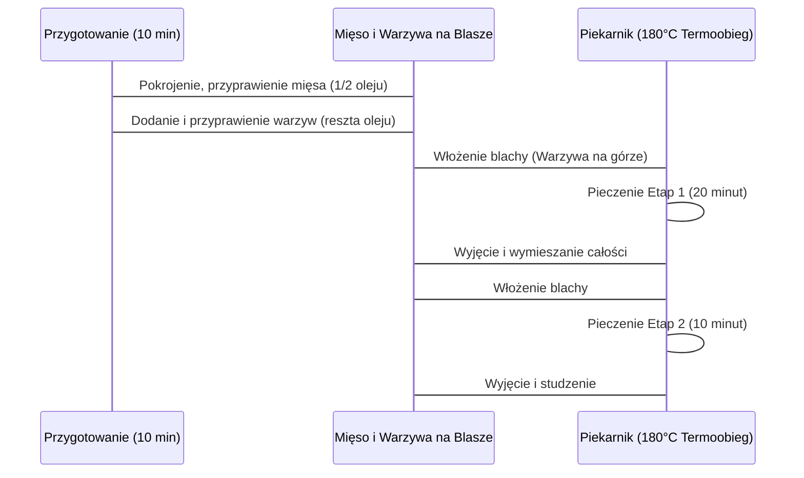

***

## KURCZAK 200 PLUS Z WARZYWAMI: PRZEPIS NA 4 DNI

Witajcie w kolejnym odcinku! Dzisiaj skupimy się na przygotowaniu **kurczaka z warzywami** – dania wyjątkowo prostego i smacznego. Całość pozwala na stworzenie **czterech posiłków** wystarczających na cztery dni.

### Poziom Trudności i Przygotowanie

*   **Poziom trudności:** Tylko jedna nóżka (bardzo łatwy).
*   **Czas przygotowania:** 10 minut.
*   **Proces:** Polega głównie na pokrojeniu warzyw i kurczaka; resztę pracy wykonuje piekarnik.

### Koncepcja Serii „Kurczak 200 Plus”

Na kanale zostaje stworzona nowa seria dań z kurczakiem oraz dedykowana playlista zatytułowana **„Kurczak 200 Plus”**.

*   **Założenie serii:** Potrawy będą zawierały kurczaka w ilości **200 g lub więcej** na jedną porcję.
*   **Cel:** Zapewnienie wysokiej zawartości białka.

Jeśli dzisiejszy odcinek się spodoba, prośba o pozostawienie łapki w górę, pisanie komentarzy (co chcielibyście oglądać) oraz subskrybowanie kanału.

***

## SKŁADNIKI NA 4 POSIŁKI

Aby przygotować cztery porcje dania **Kurczak 200 Plus z warzywami**, potrzebujemy:

### Mięso (Łącznie 1 kg)

| Składnik | Ilość | Uwagi |
| :--- | :--- | :--- |
| Mięso z udka kurczaka | 500 g | Wyższa zawartość tłuszczu, idealnie pasuje do tych warzyw. |
| Pierś kurczaka | 500 g | |

### Warzywa

*   Bakłażan (jeden spory)
*   Cukinia
*   Papryka
*   Pół cebuli

### Tłuszcz i Przyprawy

*   Olej (np. olej z pestek winogron): **60 ml** (co daje 15 ml na jedną porcję).
*   Sól i pieprz.
*   Przyprawa do kurczaka i dań zdrowotnych.
*   Tymianek.
*   Czosnek (granulowany/proszek): 1 łyżka.
*   Oregano.
*   Przyprawa do kurczaka pikantna (opcjonalnie, dla dodania ostrości).

***

## PRZYGOTOWANIE MIĘSA I MIESZANKI PRZYPRAWOWEJ

### 1. Przygotowanie Kurczaka

1.  Umyć i wysuszyć kurczaka ręcznikami papierowymi.
2.  Pokroić mięso na **małą kostkę**.
3.  Wszystko wrzucić bezpośrednio na blachę do pieczenia.
    *   *Uwaga:* Elementy tłuszczowe udka, choć większe, świetnie pasują do warzyw, dlatego nie należy się ich obawiać.

### 2. Tworzenie „Bomby Przyprawowo-Olejowej”

Przygotowujemy mieszankę przypraw i oleju, która zostanie użyta do przyprawienia zarówno mięsa, jak i warzyw (na cztery posiłki).

1.  Do 60 ml oleju dodajemy wszystkie przyprawy:
    *   Przyprawa do kurczaka i dań zdrowotnych
    *   Tymianek
    *   Czosnek (1 łyżka)
    *   Oregano
    *   Sól i Pieprz (dodane później, ale niezbędne)
    *   Pikantna przyprawa do kurczaka (opcjonalnie)
2.  Całość dokładnie mieszamy.
3.  **Połowę** przygotowanego przyprawionego oleju wylewamy na pokrojone mięso.
4.  Mięso dokładnie mieszamy, upewniając się, że jest równomiernie pokryte.
    *   *Uwaga:* Należy pamiętać, że gotowe przyprawy do kurczaka często zawierają już sól w dużej ilości.

***

## PRZYGOTOWANIE WARZYW I UKŁADANIE NA BLASZE

### 1. Krojenie Warzyw

| Warzywo | Sposób krojenia | Uwagi |
| :--- | :--- | :--- |
| Bakłażan | Paski (około 1 cm), a następnie przekrojone na **półksiężyce**. | Bakłażan był spory i gruby, stąd konieczność dodatkowego przekrojenia. |
| Cukinia | Centymetrowe kółeczka. | Nie przekrawamy kółeczek. |
| Papryka | Drobna kostka. | |
| Cebula | Kostka (około 1 cm). | |

### 2. Warstwowanie i Ostatnie Przyprawienie

1.  Pokrojone warzywa układamy warstwami na wierzchu przyprawionego mięsa.
2.  Wszystkie warzywa dokładnie mieszamy (najlepiej ręką), aby każdy kawałek był pokryty.
3.  Resztę (drugą połowę) oleju z przyprawami wylewamy na samą górę warzyw.
    *   *Ważne:* Należy upewnić się, że cukinia i bakłażan są pokryte olejem na wierzchu, co sprzyja ich zapieczeniu.

***

## PROCES PIECZENIA (DWUETAPOWY)

Przed włożeniem do piekarnika należy go rozgrzać.

### Ustawienia Piekarnika

*   **Temperatura:** 180°C
*   **Funkcja:** Termoobieg
*   **Półka:** Środkowa

### Etap 1: Zapiekanie Górnej Warstwy (20 minut)

1.  Wkładamy blachę do piekarnika.
2.  Warzywa znajdują się na górze, dzięki czemu ładnie się zgrillują i nie będą uwięzione pod kurczakiem.
3.  Pieczemy przez **20 minut**.

### Etap 2: Mieszanie i Dopiekanie (10 minut)

1.  Po 20 minutach, gdy warzywa są już ładnie przyrumienione i zgrane, otwieramy piekarnik.
2.  Szybko i dokładnie **mieszamy całość** (uwalniając kurczaka z dołu), aby sosik, olej i przyprawy połączyły się, a kawałki kurczaka mogły się przypiec.
3.  Blachę wkładamy z powrotem na **10 minut**.

### Schemat Procesu Pieczenia

***

## PORCJOWANIE I PODSUMOWANIE

### 1. Studzenie i Porcjowanie

1.  Po wyjęciu z piekarnika otwieramy go i czekamy, aż blacha chwilę ostygnie.
2.  Płyny zgęstnieją, co ułatwi nakładanie.
3.  Całość rozdzielamy równomiernie na **cztery pojemniki (boksy)**.
    *   *Zasada:* Nic nie może się zmarnować – ani przyprawy, ani smak.

### 2. Efekt Końcowy i Serwowanie

*   **Wygląd:** Danie prezentuje się bardzo apetycznie, z dużą ilością kolorów.
*   **Smak:** Bardzo dobre, szybko i prosto przygotowane.
*   **Sugestia podania:** W tym przypadku zostało podane z ugotowanym oddzielnie **ryżem Basmati**.

Polecana jest ta opcja dwuetapowego pieczenia, ponieważ zapewnia, że warzywa ładnie się zgrillują na początku, a kurczak przypiecze się na koniec (po wymieszaniu).

Jeśli odcinek się podobał, prośba o łapkę w górę i subskrypcję, aby być na bieżąco z kolejnymi odcinkami serii **Kurczak 200 Plus**. Do zobaczenia!