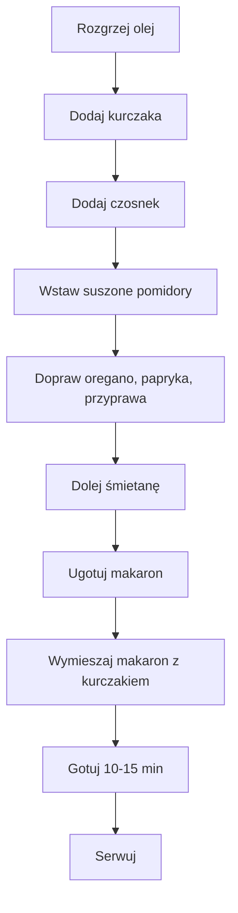

---

## Wprowadzenie  
Siemoneczko, witajcie w kolejnym odcinku. Dzisiaj robimy sobie **zajmę** z cyklu kurczaka razem z suszonymi pomidorami, w sosie śmietanowym zajmę z **kurczaka 200+**, czyli **200 g kurczaka na jedną porcję**. Robimy sobie takich porcji dzisiaj trzy. Zajmę zjubiście smakowy, jeden z moich ulubionych dany z kurczakiem, zaczynamy.

---

## Składniki (na 3 porcje)

| Składnik | Ilość | Uwagi |
|----------|-------|-------|
| Olej do smażenia | 15 ml | Do rozgrzania patelni |
| Kurczak | 600 g (3 × 200 g) | Na jedną porcję 200 g |
| Czosnek | 2‑3 duże ząbki | Dla smaku można zwiększyć do 3 |
| Suszone pomidory | 15 sztuk | 5 pomidorków na porcję |
| Oregano | duża ilość | Zastosowane w sosie |
| Papryka słodka mielona | 1 duża łyżka | Dla koloru i smaku |
| Przyprawa do kurczaka | ½ łyżki | Dodatkowa ziołowa nuta |
| Śmietana 18% | 330 g | Na sos śmietanowy |
| Makaron (np. pełnoziarnisty) | wg uznania | Wybór zależy od gustu |

---

## Przygotowanie

### 1. Przygotuj kurczaka
1. **Pokrój** kurczaka w drobną kostkę.  
2. **Osusz** mięso ręcznikiem papierowym – ważne, żeby nie było mokre, kiedy wrzucisz je na patelnię.  
3. **Dodaj** sól i pieprz, wymieszaj i odstaw.

### 2. Rozgrzej patelnię
- **Rozgrzej** 15 ml oleju na średnim ogniu.

### 3. Smażenie
1. **Wrzucaj** kawałki kurczaka na patelnię, smaż, aż lekko się zarumienią.  
2. **Dodaj** posiekany czosnek – szatkujemy na drobne kawałki i wrzucamy do kurczaka.  
3. **Wstaw** suszone pomidory – podziel je na 5 części na porcję, drobno pokrój w kwadraty o wymiarach około 1 cm.  
4. **Mieszaj** wszystko, aż pomidory rozpuszczą się w oleju, tworząc aromatyczną bazę.

### 4. Doprawianie
- **Dodaj** oregano (dużą ilość), paprykę słodką mieloną (1 duża łyżka), oraz przyprawę do kurczaka (½ łyżki).  
- **Wymieszaj** dokładnie i pozwól, by aromaty się uwolniły – kilka minut na małym ogniu.

### 5. Sos śmietanowy
1. **Dolej** 330 g śmietany 18% (w całości, bez rozdrabniania).  
2. **Rozprowadź** i gotuj jeszcze kilka minut, aż sos lekko zgęstnieje.

### 6. Makaron
- **Ugotuj** makaron według instrukcji na opakowaniu.  
- **Zalewaj** kurczaka i sos w ugotowanym makaronie, dokładnie mieszając.

### 7. Finalizacja
- **Dopraw** solą i świeżo zmielonym pieprzem do smaku.  
- **Gotuj** jeszcze 10‑15 minut na małym ogniu, aż makaron wchłonie sos.

---

## Diagram procesu (Mermaid)

---

## Wskazówki od kucharza
- Zawsze tak samo i zawsze tak samo – **zajęliście** smakuje, bo dodaliśmy dużą ilość oregano i pomidorki.  
- **Nie brakuje** misów – wszystko dobrze wypada na **trzy porcje**.  
- **Dodatkowo** podkreślam, że to danie jest proste i kaloryczne, ale jednocześnie ziołowe i pełne smaku.

---

## Makroskładniki  
Teraz wam pokażę, jakie są makrosy. Jakie są kalorii na jeden taki posiłek. Ja idę zajedać.  
*(Macronutrient values were not specified in the original text.)*

---

## Podsumowanie  
Na makaronie mamy pysznego kurczaka. Raz na trzy porcje, super, tak sobie wygląda potrawa. Próbujemy co nam wyszło – czujd pomidoras uszony z ziołami, oregano, prostota i smak.  
Teraz wam pokażę, jakie są makrosy. Jakie są kalorii na jeden taki posiłek. Ja idę zajedać.  
Wylajkujcie się, podobało piżczy komentarze. I wydzimy się w kolejnym odcinku. To zobaczenia, cześć.