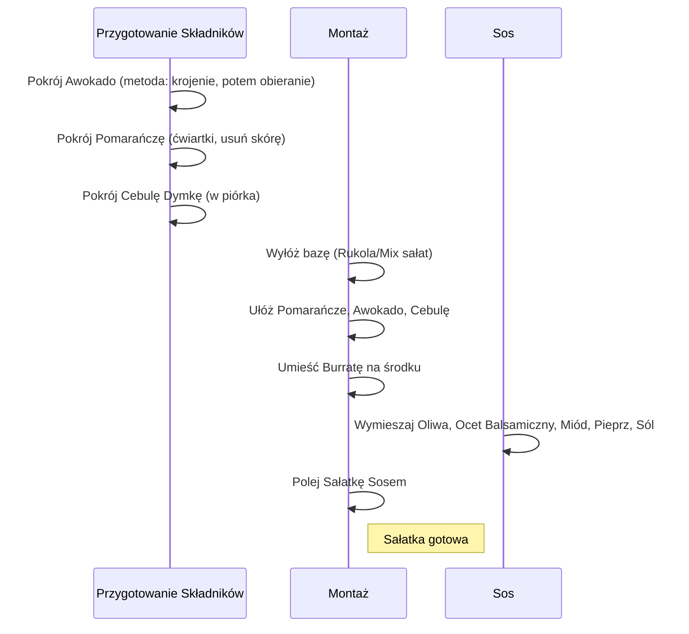

---
title: 10 przepisów na szybkie posiłki dla zapracowanych
source: https://www.youtube.com/watch?v=wIC8JJtZEso
author: '[[Michał Wrzosek]]'
published: '2024-12-11'
created: '2025-11-23'
description: Zestawienie dziesięciu szybkich i zdrowych przepisów, w tym lunch boxów,
  sałatek, dań na słodko i alternatyw fast foodów, przeznaczonych dla osób o napiętym
  grafiku, z naciskiem na kluczową rolę planowania w zdrowej diecie.
category: Fitness
length: 1392
tags:
- '#Summaries/ToRead'
---

***

# 10 Szybkich Przepisów dla Zapracowanych: Jak Szybko Ogarnąć Zdrowe Posiłki

## I. Wprowadzenie i Filozofia Planowania

Wiele osób uważa, że zdrowe odżywianie jest proste, jeśli jest się żoną dietetyka. W rzeczywistości jednak nasze życie jest tak samo **zapracowane** jak każdego innego:

*   **Michał** (dietetyk) zarządza firmą i wspiera setki osób na co dzień.
*   **Ja** (autorka) pracuję, dbam o dom, zajmuję się zakupami i planowaniem posiłków.

Przez lata nauczyłam się jednej fundamentalnej zasady: **Planowanie to klucz**. Oszczędza ono czas i energię, a przy okazji pomaga nam zdrowo się odżywiać.

### Zdrowe Odżywianie Bez Codziennego Gotowania

Wiele osób rozpoczynających przygodę z **Respo** zadaje sobie pytanie: Czy mogę zdrowo jeść i schudnąć bez codziennego gotowania?

> Odpowiedź brzmi: **Zdecydowanie tak!**

Poniżej przedstawiam przepisy, które idealnie pasują do zapracowanego trybu życia. Będzie burger, będzie pizza, będą sałatki, a na koniec pokażę, do czego wykorzystuję lody waniliowe.

***

## II. Metoda Respo: Historia Sukcesu Darka

Zaczynamy od szybkiego lunch boxu, który jest przykładem posiłku idealnego dla osób o skomplikowanym grafiku.

**Darek**, steward latający na długich dystansach, miał w swojej diecie podobny przepis. Jego praca wiązała się z:

*   Częstymi zmianami stref czasowych.
*   Brakiem czasu, miejsca i sposobu na przygotowanie posiłków.

Mimo tych utrudnień, Darek postanowił zawalczyć o siebie. Zgłosił się do **Centrum Respo** ważąc **123 kg**. Jego dieta i treningi musiały być dopasowane do hotelowych realiów.

**Rezultat Metamorfozy:**

Dzięki indywidualnym rozwiązaniom (np. szybkim posiłkom i lunch boxom), Darek osiągnął swój cel:

*   Schudł **35 kg**.
*   Swoją metamorfozą inspiruje swój zespół.

> Jeśli również potrzebujesz pomocy, link do współpracy znajdziesz w opisie. Schudnij z metodą Respo **bez wyrzeczeń, bez stresu, bez efektu jojo**. Wejdź na **centrum respo.com.pl**.

***

## III. Przepisy Ekspresowe: Lunchboxy i Kanapki

### 1. Lunch Box: Kanapki z Humusem i Szynką Drobiową

Ten posiłek jest urozmaicony, sycący i zdrowy dzięki dodatkowi warzyw i owoców.

| Składnik Główny | Dodatki |
| :--- | :--- |
| Kanapki z humusem | Szynka drobiowa |
| Warzywa | Winogrona |
| Owoce | Borówki |

**Przygotowanie:**

1.  Przygotuj kanapki.
2.  Dodaj warzywa i owoce.
3.  Zamknij pudełko z przegródkami, aby mieć pewność, że nic się nie pomiesza.

### 2. Bajgiel z Chorizo (Alternatywa dla Standardowych Kanapek)

Idealna opcja, jeśli znudziły ci się standardowe kanapki. Przepis ten jest dostosowany do gustu **Michała** (lubi mięso i ostre smaki).

**Składniki i Przygotowanie Sosu:**

W miseczce mieszamy:

*   Jogurt
*   Majonez
*   Ostry sos

**Montaż Bajgla:**

1.  Przekrój bajgla.
2.  Ułóż **rukolę** (można użyć innej sałaty, np. roszponki, wedle własnych upodobań).
3.  Dodaj **chorizo**.
4.  Dodaj plasterek **żółtego sera**.
5.  Dorzuć więcej **zielonych warzyw**.

*(Uwaga autorki: "Zrobiłam odwrotnego bajgla, ale i tak jest super!")*

Bajgiel jest gotowy – ekspresowa alternatywa na śniadanie lub lunch do pracy.

***

## IV. Sałatki – Szybkie i Na Każdą Porę Roku

Sałatki to ulubione przepisy autorki, jedzone niezależnie od pory roku (lato, wiosna, listopad).

### 3. Sałatka z Burratą, Pomarańczą i Awokado

Taka sałatka niesamowicie poprawia humor podczas jesiennej chandry.

#### Krok 1: Przygotowanie Składników

**Awokado:**

Istnieją dwie szkoły krojenia awokado:

1.  Najpierw obieramy ze skóry i kroimy.
2.  Kroimy, a potem obieramy ze skóry (to jest szkoła, do której należy autorka).

**Pomarańcza:**

1.  Pokrój pomarańczę w ćwiartki.
2.  Zdejmij skórę.

**Cebula Dymka:**

1.  Pokrój cebulę dymkę w piórka.

#### Krok 2: Układanie

1.  Wyłóż bazę: **rukola** (można użyć miksu sałat lub roszponki).
2.  Ułóż pomarańcze, cebulę i awokado.
3.  Na środek włóż **burratę**.

#### Krok 3: Przygotowanie Sosi

Sos przygotowujemy w miseczce (lub w małym słoiczku, co pozwala na zakręcenie i wymieszanie poprzez wstrząsanie).

**Składniki Sosi:**

*   Oliwa
*   Ocet balsamiczny
*   Miód
*   Pieprz
*   Sól

#### Sekwencja Przygotowania Sałatki

***

## V. Posiłki Bez Gotowania i Na Słodko

### 4. Posiłek Bez Gotowania: Serek Wiejski z Warzywami

To idealny przepis dla osób, które nie chcą stać przy garach i nie mają w ogóle czasu na gotowanie. Posiłek gotowy w jednej miseczce.

**Składniki:**

*   **Serek wiejski** (duża zawartość białka i wapnia).
*   **Warzywa:**
    *   Pomidorki koktajlowe
    *   Ogórek zielony
    *   Awokado (źródło tłuszczów)
*   **Dodatek:** Dwie kromki chleba pełnoziarnistego.

**Rezultat:** Zbilansowany posiłek bez gotowania.

### 5. Ryż z Jabłkiem i Cynamonem (Wersja na Słodko)

Coś, co kochaliśmy w dzieciństwie, w wersji sycącej.

**Składniki i Przygotowanie:**

1.  Ugotowany ryż przełóż do miseczki.
2.  Dodaj **serek wiejski** (aby ryż był sycący na długo, a nie tylko słodką przekąską).
3.  Dodaj **cynamon** (cynamonu z jabłkiem nigdy za dużo).
4.  Dodaj słodzik (np. **erytrol** – opcjonalnie).
5.  Wymieszaj.
6.  Jabłko obierz, pokrój i dodaj do dania. (Jabłka są tanie, łatwo dostępne i niedoceniane).

### 6. Owsianka Nocna Pinacolada (W Słoiczku)

Ekspresowy posiłek na słodko, który można przygotować wieczorem i rano wyjąć gotowy z lodówki. Idealna dla osób wychodzących do pracy wcześnie (np. o 6:00).

**Składniki Bazowe (na noc):**

*   Pół szklanki mleka.
*   Płatki owsiane.
*   Nasiona chia.

**Składniki Smakowe (Pinacolada):**

*   Wiórki kokosowe.
*   Puding **białkowy** waniliowy (dla pełnowartościowego śniadania).
*   Ananas.

**Przygotowanie:**

1.  Połącz mleko, płatki, nasiona chia, wiórki kokosowe i puding białkowy.
2.  Odstaw na noc do lodówki.
3.  Rano dodaj mrożonego ananasa.

***

## VI. Alternatywy Fast Food i Dania Włoskie

### 7. Pizza na Gotowym Spodzie (Tuńczyk, Oliwki, Cebula)

Alternatywa na gotowym, **pełnoziarnistym spodzie pinsa**. Idealny posiłek na dwie porcje lub dla dwóch osób (chyba że ktoś się nie lubi dzielić).

**Przygotowanie:**

1.  Nagrzej piekarnik.
2.  Posmaruj spód **passatą** z przyprawami (bazylia i oregano).
3.  Dodaj ulubione składniki (można dowolnie miksować warzywa).
    *   Czerwona cebula
    *   Oliwki (pokrój)
    *   Tuńczyk
4.  Włóż pizzę do piekarnika.

*(Anecdota: Podczas przygotowań do maratonu berlińskiego, autorka i Michał robili "ładowanie węglowodanami" pizzą **bez sera**, aby nie była tłusta, co było możliwe dzięki znalezieniu specjalnej pizzerii).*

### 8. Gnocchi ze Szpinakiem i Serkiem Śmietankowym

W tym przepisie wykorzystuje się **gotowy produkt** (gnocchi), aby zmodyfikować danie i uczynić je zdrowym. Używanie gotowców ratuje sytuację, gdy plan się "wykrzacza", a chcemy zjeść pełnowartościowy posiłek (jest to o wiele szybsze niż zamawianie jedzenia z dowozem).

**Proces Gotowania:**

1.  Ugotuj gnocchi według instrukcji na opakowaniu.
2.  Na patelni rozgrzej oliwę z oliwek.
3.  Przeciśnij **czosnek** przez praskę.
4.  Dodaj **dużo szpinaku** i smaż, aż zmięknie.
5.  Dodaj **serek śmietankowy** (jest bazą sosu, używany zamiast śmietany).
6.  Dodaj odrobinę **skórki z cytryny**.
7.  Dodaj ugotowane gnocchi i pomidorki.
8.  Dodaj starty **parmezan**.

**Porcjowanie:** Jedną porcję można zjeść od razu, a drugą zapakować do pudełka na obiad do pracy i odgrzać w mikrofali.

### 9. Domowe Burgery (Fast Food, Który Nie Zabija Diety)

Idealny dowód na to, że fast foody można jeść w czasie odchudzania, jeśli są odpowiednio przygotowane.

#### Przygotowanie Mięsa

1.  Mięso przypraw solą i pieprzem.
2.  Wymieszaj.
3.  Formuj kule, a następnie spłaszcz je na około **1 cm** burgery.

*(Wskazówka: "Dlaczego warto ćwiczyć? Można samemu otwierać słoiki").*

#### Gotowanie i Dodatki

1.  Rozgrzej suchą patelnię.
2.  Przerzuć burgery na patelnię.
3.  W międzyczasie przygotuj dodatki.

**Klucz do zdrowego fast foodu:** Odpowiednia ilość warzyw (w przeciwieństwie do burgerów na mieście, gdzie dostajemy np. dwa plasterki ogórka).

**Warzywa w Domowym Burgerze:**

*   Rukola
*   Pomidor
*   Cebula
*   Ogórek

#### Przygotowanie Sosi

Sos przygotowujemy z:

*   Keczupu
*   Wegańskiego majonezu (autorka zrezygnowała z sera na rzecz większej ilości majonezu)
*   Odrobiny musztardy

#### Montaż

1.  Krój bułki do burgerów na pół.
2.  Posmaruj sosem.
3.  Ułóż **rukolę** i pozostałe warzywa (objętościowo wyglądają na małe, ale są sycące).
4.  Ułóż usmażonego, skurczonego burgera.
5.  Dodaj pozostały sos.
6.  Przykryj górną częścią bułki.

***

## VII. Deser i Zakończenie

### 10. Lodowy Deser Proteinowy

Hit i jeden z ulubionych deserów Michała (dietetyka), stanowiący **pełnowartościowy posiłek** na bazie lodów waniliowych. Kolejny przepis, gdzie wszystkie składniki lądują w jednej misce.

**Składniki:**

*   **Lody waniliowe** (ulubione lody męża dietetyka – autorka użyła już otwartego opakowania).
*   **Puding waniliowy** (proteinowy).
*   Mieszanka **orzechów** (fajnie zagrają też pistacje).
*   **Mrożone malinki** (pięknie łączą się z pistacjami).

Deser lodowy jest już gotowy.

---
**Pamiętaj:** Linki do wszystkich przepisów, które dzisiaj zostały przygotowane, znajdziesz w opisie. Zachęcam również do subskrybowania kanału, aby znaleźć więcej szybkich i zdrowych przepisów.