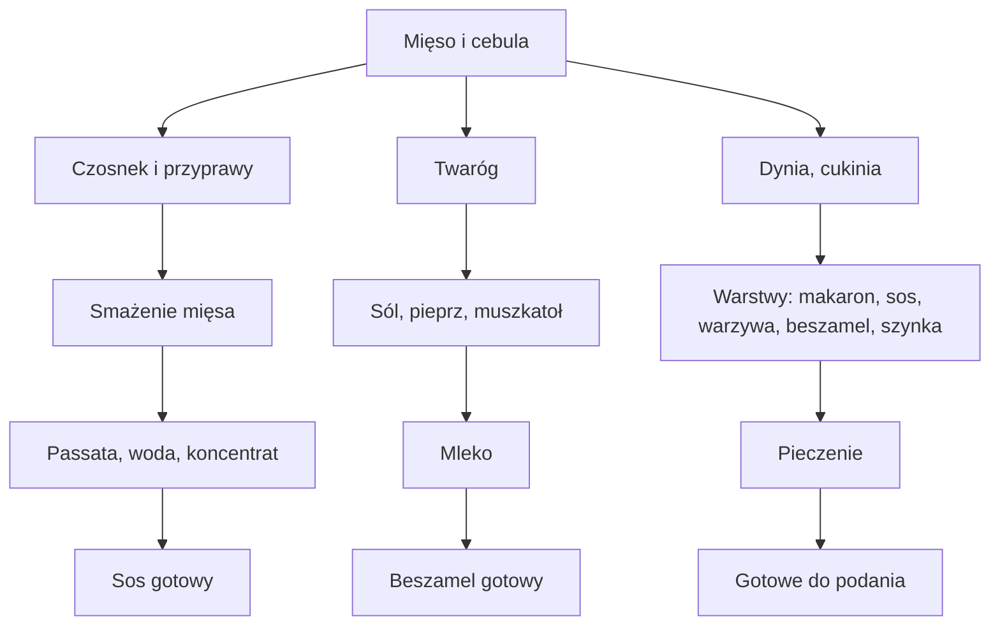

---  

## Wprowadzenie  
> **Super makrosy, świetny smak. Czego chcieć więcej? Zaczynajmy.**  

---

## Składniki

| Składnik | Ilość | Uwagi |
|----------|-------|-------|
| **Cebula** | ½ sztuki | Pokrojona w kostkę, przesmażona na oliwie |
| **Oliwa z oliwek** | – | Do smażenia cebuli |
| **Czosnek** | 2 ząbki | Dodany do cebuli, przysmażony |
| **Chuda wieprzowina** | – | Dodana po cebuli i czosnku |
| **Sól, pieprz, oregano, bazylia** | – | Dodatkowo płatki chili (kik pikantności) |
| **Passata** | – | Zalewana do mięsa |
| **Woda (butla)** | ½ butla | Do rozcieńczenia sosu |
| **Koncentrat pomidorowy** | 1½ łyżeczki | Do sosu |
| **Twaróg** | ½ kostki | Do proteinowego beszamelu |
| **Sól, pieprz, gałka muszkatołowa** | – | Dodatki do beszamelu |
| **Mleko** | – | Do regulacji konsystencji beszamelu |
| **Ser mozzarella** | – | Dodawany do beszamelu i na wierzch lazanii |
| **Dynia** | – | Pokrojona w pół plasterki |
| **Cukinia** | – | Pokrojona w pół plasterki |
| **Szynka wędzona** | – | Dobrze pokrojona, do warstwy |
| **Makaron do lazanii** | – | Do przekładania warstw |

---

## Przygotowanie (Krok po kroku)

### 1. Mięsny sos
1. **Smażenie cebuli** – rozgrzej oliwę, wrzuć pokrojoną cebulę w kostkę i smaż, aż stanie się miękka.  
2. **Dodaj czosnek** – do cebuli, smaż jeszcze chwilę, aż czosnek uwolni aromat.  
3. **Włóż wieprzowinę** – dodaj chude mięso, smaż, dopraw solą, pieprzem, oregano, bazylią i płatkami chili.  
4. **Zalej passatą** – wlej passatę, a następnie ½ butli wody i 1½ łyżeczki koncentratu pomidorowego.  
5. **Gotuj** – pozwól, aby sos dobrze się zagęścił i nabrał aromatu – potrzebujesz dużo sosu!  

### 2. Proteinowy beszamel
1. **Twaróg** – połowę kostki twarogu rozgnieć na małą masę.  
2. **Dopraw** – dodaj sól, pieprz oraz obowiązkowo gałkę muszkatołową.  
3. **Mleko** – stopniowo dolewaj mleka, aby uzyskać pożądaną konsystencję.  
4. **Ser mozzarella** – połącz beszamel z serem mozzarella, mieszając, aż ser się rozpuści.  

### 3. Warzywa i warstwy
1. **Dynia i cukinia** – pokrój w pół plasterki.  
2. **Przekładanie** – zacznij od warstwy makaronu do lazanii, nałożysz mięsnym sosem, następnie warstwę dyni i cukinii, potem beszamel, plastry mozzarelli oraz wędzoną szynkę.  
3. **Powtarzaj** – układaj kolejne warstwy w tej samej kolejności, aż zużyjesz wszystkie składniki.  

### 4. Zapiekanie
1. **Polaż** – ułóż całość w naczyniu żaroodpornym.  
2. **Pieczenie** – zapiekaj w piekarniku aż ser się roztopi, a wierzch lekko zarumieni.  

### 5. Podanie
- **Trzy porcje** – rozdziel lazanie na trzy części, gotowe do jedzenia lub podgrzania w późniejszym czasie.  

---

## Wskazówki i podkreślenia

- **Makroskładniki**: Dzięki chudemu mięsu, proteinowemu beszamelowi i warzywom lazania jest idealna na jesienne, energetyczne obiady.  
- **Smak**: Pikantność płatków chili, aromat oregano i bazylii oraz wędzona szynka sprawiają, że danie ma wielowarstwowy profil smakowy.  
- **Przechowywanie**: Świeżo zapiekana lazania zachowuje się dobrze w lodówce, a podgrzewana w mikrofalówce – to rozwiązanie na szybki posiłek.  

---

## Diagram przepływu przygotowania (Mermaid)

--- 

**Czego chcieć więcej?**  
- Jeśli masz ochotę, możesz dodać do beszamelu odrobinę szpinaku lub innych zielonych warzyw dla dodatkowego koloru i witamin.  
- Dla jeszcze bardziej kremowej konsystencji, można zastąpić część mozzarelli parmezanem lub pecorino.  

Smacznego!